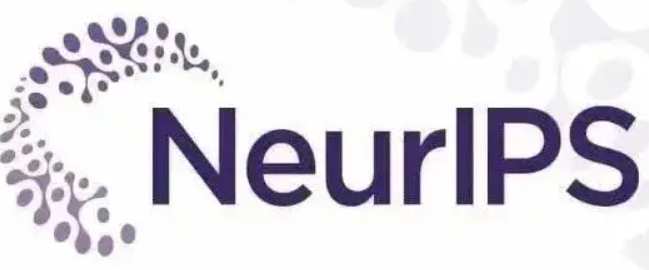
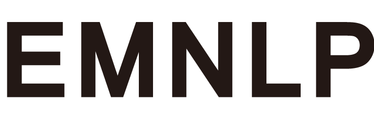
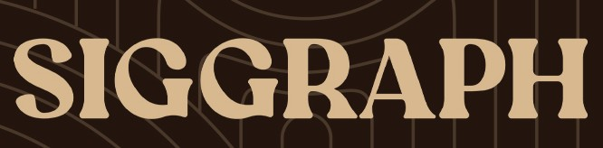

## Overview
A curated survey of OCR in the era of large language models, covering visual text parsing, understanding, benchmarks, challenges, and perspective. 

## 🎉 News
- **[2026-2-11]** 🔥 We release an open-source resource to help the community easily track recent OCR research!

## 📖 Contents
- [Overview](#overview)
- [🎉 News](#-news)
- [📖 Contents](#-contents)
- [📄 Visual Text Parsing](#-visual-text-parsing)
- [📄 Visual Text Understanding](#-visual-text-understanding)
- [📄 Benchmarks and Evaluation](#-benchmarks-and-evaluation)
- [📄 Specialized Model](#-specialized-model)
  - [📄 Document Dewarping](#-document-dewarping)
  - [📄 Physical Structure Analysis](#-physical-structure-analysis)
  - [📄 Reading Order Prediction](#-reading-order-prediction)
  - [📄 Mathematical Expression Recognition](#-mathematical-expression-recognition)
  - [📄 Geometry Problem-solving](#-geometry-problem-solving)
  - [📄 Chart Understanding](#-chart-understanding)
  - [📄 Scene Text Spotting](#-scene-text-spotting)
- [Contributing](#contributing)

## 📄 Visual Text Parsing
| Venue | Name | Primary affiliation | Title | GitHub | Date |
|:-:|:-:|:-:|:-:|:-:|:-:|
|  | `MeDocVL` | Ping An Property | MeDocVL: A Visual Language Model for Medical Document Understanding and Parsing |   | Feb. 2026 |
| - | `GLM-OCR` | Z.ai | - |  | Feb. 2026 |
|  | `Dolphin-2.0` | ByteDance | Dolphin-v2: Universal Document Parsing via Scalable Anchor Prompting |  | Feb. 2026 |
|  | `DeepSeek-OCR 2` | DeepSeek-AI | DeepSeek-OCR 2: Visual Causal Flow |  | Jan. 2026 |
|  | `Typhoon-OCR` | Typhoon, SCB 10X | Typhoon OCR: Open Vision-Language Model for Thai Document Extraction |  | Jan. 2026 |
|  | `GutenOCR` | Roots.ai | GutenOCR: A Grounded Vision-Language Front-End for Documents |  | Jan. 2026 |
|  | `OCRVerse` | Meituan | OCRVerse: Towards Holistic OCR in End-to-End Vision-Language Models |  | Jan. 2026 |
|  | `Youtu-Parsing` | Tencent | Youtu-Parsing: Perception, Structuring and Recognition via High-Parallelism Decoding |  | Jan. 2026 |
|  | `PaddleOCR-VL 1.5` | Baidu Inc. | PaddleOCR-VL-1.5: Towards a Multi-Task 0.9B VLM for Robust In-the-Wild Document Parsing |  | Jan. 2026 |
|  | `LightOnOCR` | LightOn | LightOnOCR: A 1B END-TO-END MULTILINGUAL VISION-LANGUAGE MODEL FOR STATE-OF-THE-ART OCR |  | Jan. 2026 |
|  | `Uni-Parser` | DP Technology | Uni-Parser Technical Report |  | Dec. 2025 |
|  | `TRivia` | The University of HongKong | TRivia: Self-supervised Fine-tuning of Vision-Language Models for Table Recognitio |  | Dec. 2025 |
|  | `DOCR-Inspector` | Peking University | DOCR-Inspector: Fine-Grained and Automated Evaluation of Document Parsing with VLM|  | Dec. 2025 |
|  | `UniRec-0.1B` | Fudan University | UniRec-0.1B: Unified Text and Formula Recognition with 0.1B Parameters|  | Dec. 2025 |
|  | `HunyuanOCR` | Tencent | HunyuanOCR Technical Report |  | Nov. 2025 |
|  | `MonkeyOCR v1.5` | KingSoft Office | MonkeyOCR v1.5 Technical Report: Unlocking Robust Document Parsing for Complex Patterns |  | Nov. 2025 |
|  | `Doc-Researcher` | Huawei | Doc-Researcher: A Unified System for Multimodal Document Parsing and Deep Research |  | Oct. 2025 |
|  | `OLMOCR 2` | Allen Institute for AI | olmOCR 2: Unit Test Rewards for Document OCR |  | Oct. 2025 |
| — | `Chandra v0.1.0` | Datalab | — |  | Oct. 2025 |
|  | `DeepSeek-OCR` | DeepSeek-AI | DeepSeek-OCR: Contexts Optical Compression |  | Oct. 2025 |
|  | `Infinity-Parser` | INFLY Tech | Infinity Parser: Layout Aware Reinforcement Learning for Scanned Document Parsing |  | Oct. 2025 |
|  | `Nanonets-OCR 2` | Nanonets | Transforming documents into LLM-ready structured data |  | Oct. 2025 |
|  | `PaddleOCR-VL` | Baidu Inc. | PaddleOCR-VL: Boosting Multilingual Document Parsing via a 0.9B Ultra-Compact VLM |  | Oct. 2025 |
|  | `Dolphin-1.5` | ByteDance | Dolphin: Document Image Parsing via Heterogeneous Anchor Prompting |  | Oct. 2025 |
|  | `Logics-Parsing` | Alibaba Group | Logics-Parsing Technical Report |  | Sep. 2025 |
|  | `Granite-Docling-258M` | IBM | — |  | Sep. 2025 |
| — | `Marker 1.10.1` | Datalab | — |  | Sep. 2025 |
|  | `MinerU 2.5` | Shanghai Artificial Intelligence Laboratory | MinerU2.5: A Decoupled Vision-Language Model for Efficient High-Res Document Parsing |  | Sep. 2025 |
|  | `DianJin-OCR-R1` | Qwen DianJin Team | DianJin-OCR-R1: Enhancing OCR Capabilities via a Reasoning-and-Tool Interleaved Vision-Language Model |  | Sep. 2025 |
| | `dots.ocr` | Xiaohongshu Inc. | dots.ocr: Multilingual Document Layout Parsing in a Single VLM |  | Jul. 2025 |
|  | `MonkeyOCR-Pro` | HUST | MonkeyOCR: Document Parsing with a Structure-Recognition-Relation Triplet Paradigm |  | Jul. 2025 |
|  | `OCRFlux` | ChatDOC | OCRFlux: Mastering Complex Layouts and Seamless Page Merging |  | Jun. 2025 |
| — | `MinerU2.0-2505-0.9B` | Shanghai Artificial Intelligence Laboratory | |  | Jun. 2025 |
|  | `MonkeyOCR` | HUST | MonkeyOCR: Document Parsing with a Structure-Recognition-Relation Triplet Paradigm |  | Jun. 2025 |
|  | `Dolphin` | ByteDance | Dolphin: Document Image Parsing via Heterogeneous Anchor Prompting |  | May. 2025 |
| | `GTR-VL` | Shanghai Artificial Intelligence Laborator | GTR-VL: Graph Traversal as Visual Chain of Thought for Molecular Structure Recognition | - | May. 2025 |
|  | `SmolDocling-256M` | IBM | SmolDocling: An ultra-compact vision-language model for end-to-end multi-modal document conversion |  | Mar. 2025 |
|  | `OLMOCR` | Allen Institute for AI | olmOCR: Unlocking Trillions of Tokens in PDFs with VLMs |  | Feb. 2025 |
|  | `PP-StructureV3` | Baidu Inc. | PaddleOCR 3.0 Technical Report |  | Feb. 2025 |
|  | `Ocean-OCR` | Baichuan Inc. | Ocean-OCR: Towards General OCR Application via a Vision-Language Model |  | Jan. 2025 |
| — | `MarkItDown` | Microsoft | — |  | Dec. 2024 |
|  | `GOT-OCR 2.0` | StepFun | General OCR Theory: Towards OCR-2.0 via a Unified End-to-end Model |  | Sep. 2024 |
|  | `MinerU` | Shanghai Artificial Intelligence Laboratory | MinerU: An Open-Source Solution for Precise Document Content Extraction |  | Sep. 2024 |
| — | `open-parse` | - | — |  | Mar. 2024 |
|  | `Nougat` | Meta AI | Nougat: Neural Optical Understanding for Academic Documents |  | Aug. 2023 |
|  | `unstructured` | Unstructured | Transform complex, unstructured data into clean, structured data. Securely. Continuously. Effortlessly. |  | Oct. 2022 |
| — | `RapidOCR` | Unstructured | — |  | Jul. 2022 |

## 📄 Visual Text Understanding
| Venue | Name | Primary affiliation | Title  | GitHub | Date |
|:-:|:-:|:-:|:-:|:-:|:-:|
|    | `DocDancer` | Peking University | DocDancer: Towards Agentic Document-Grounded Information Seeking | --- | Jan. 2026 |
|    | `DocLens`| Peking University | DocLens: A Tool-Augmented Multi-Agent Framework for Long Visual Document Understanding |  |Nov. 2025|
|  <a href="https://arxiv.org/abs/2511.10552">  | `URaG`| South China Univ. of Tech. | URaG: Unified Retrieval and Generation in Multimodal LLMs for Efficient Long Document Understanding |  |Nov. 2025|
|    | `Qwen3-VL`| Alibaba Group |Qwen3-VL Technical Report | |Nov. 2025|
|    | `NVIDIA Nemotron Nano V2 VL`| NVIDIA | NVIDIA Nemotron Nano V2 VL |  |Nov. 2025|
|    | `NEO`| Nanyang Technological Univ. | FROM PIXELS TO WORDS – TOWARDS NATIVE VISIONLANGUAGE PRIMITIVES AT SCALE |  |Oct. 2025|
|    | `AndesVL`| OPPO | AndesVL Technical Report: An Efficient Mobile-side Multimodal Large Language Model |  |Oct. 2025|
|    | `LLaVA-OneVision-1.5`| LLaVA Community | LLaVA-OneVision-1.5: Fully Open Framework for Democratized Multimodal Training |  |Sept. 2025|
|    | `Qwen3-Omni`| Alibaba Group | Qwen3-Omni Technical Report |  |Sept. 2025|
|    | `SAIL-VL2`| ByteDance | SAIL-VL2 Technical Report |  |Sept. 2025|
|    | `MiniCPM-V 4.5`| OpenBMB | MiniCPM-V 4.5: Cooking Efficient MLLMs via Architecture, Data, and Training Recipes |  |Sept. 2025|
|    | `HERO`| Fudan University | HERO: Rethinking Visual Token Early Dropping in High-Resolution Large Vision-Language Models | --- |Sept. 2025|
|  | `InternVL3.5`|  Shanghai AI Laboratory | InternVL3.5: Advancing Open-Source Multimodal Models in Versatility, Reasoning, and Efficiency |  |Aug. 2025|
|    | `Ovis2.5`| Alibaba | Ovis2.5 Technical Report |  |Aug. 2025|
| <a href="https://openaccess.thecvf.com/content/ICCV2025/html/Yu_DocThinker_Explainable_Multimodal_Large_Language_Models_with_Rule-based_Reinforcement_Learning_ICCV_2025_paper.html"> |`Doc Thinker` |HUST| DocThinker: Explainable Multimodal Large Language Models with Rule-based Reinforcement Learning for Document Understanding | --- |  Aug. 2025 |
|    | `X-Omni`| Tencent | X-Omni: Reinforcement Learning Makes Discrete Autoregressive Image Generative Models Great Again |  |Jul. 2025|
|    | `Gemini 2.5 Pro`| Google | Gemini 2.5: Pushing the Frontier with Advanced Reasoning, Multimodality, Long Context... | --- |Jul. 2025|
|    | `WeThink-Qwen2.5 VL`| Tencent | WeThink: Toward General-purpose Vision-Language Reasoning via Reinforcement Learning |  |Jul. 2025|
|  | `Janus` | DeepSeek-AI | Janus: Decoupling Visual Encoding for Unified Multimodal Understanding and Generation |  | Jun. 2025 |
|    | `Seed1.6-vision`| ByteDance | - | --- |Jun. 2025|
|    | `SparseMM`| Tsinghua University | SparseMM: Head Sparsity Emerges from Visual Concept Responses in MLLMs |  |Jun. 2025|
|    | `DS-VLM`| Xiamen University | DS-VLM: Diffusion Supervision Vision Language Model | --- |Jun. 2025|
|    | `Seed1.5-VL`| ByteDance | Seed1.5-VL Technical Report | --- |May. 2025|
|  | `InternVL3`|  Shanghai AI Laboratory | InternVL3: Exploring Advanced Training and Test-Time Recipes for Open-Source Multimodal Models |  |Apr. 2025|
|  | `Kimi-VL` | MoonshotAI | Kimi-VL: Vision-Language Model for Advanced Multimodal Understanding |  | Apr. 2025 |
|    | `SAIL-VL`| Bytedance | The Scalability of Simplicity: Empirical Analysis of Vision-Language Learning with a Single Transformer |  |Apr. 2025|
| | `PP-DocBee`|  Baidu | PP-DocBee: Improving Multimodal Document Understanding Through a Bag of Tricks |  |Mar. 2025|
|  | `Phi-4-Mini` | Microsoft | Phi-4-Mini Technical Report: Compact yet Powerful Multimodal Language Models via Mixture-of-LoRAs |  | Mar. 2025|
| | `OmniParser V2`| HUST | OmniParser V2: Structured-Points-of-Thought for Unified Visual Text Parsing and Its Generality to Multimodal Large Language Models |---|Feb. 2025|
|    | `ChatVLA`| Midea Group | ChatVLA: Unified Multimodal Understanding and Robot Control with Vision-Language-Action Model |  |Feb. 2025|
|    | `Qwen2.5-VL`| Alibaba | Qwen2.5-VL Technical Report |  |Feb. 2025|
|  -  | `MiniCPM-o-2.6`| OpenBMB | MiniCPM-o 2.6: A GPT-4o Level MLLM for Vision, Speech, and Multimodal Live Streaming on Your Phone |  |Jan. 2025|
| | `InternVL2.5`|  Shanghai AI Laboratory | PP-DocBee: Improving Multimodal Document Understanding Through a Bag of Tricks |  |Dec. 2024|
|  | `DeepSeek-VL2` | DeepSeek AI | DeepSeek-VL2: Mixture-of-Experts Vision-Language Models for Advanced Multimodal Understanding |  | Dec. 2024 |
|    | `Gemini 1.5 Pro`| Google | Gemini 1.5: Unlocking multimodal understanding across millions of tokens of context | --- |Dec. 2024|
|    | `M3DOCRAG`| UNC Chapel Hill | M3DOCRAG: Multi-modal Retrieval is What You Need for Multi-page Multi-document Understanding |  |Nov. 2024|
|    | `SV-RAG`| University at Buffalo | SV-RAG: LORA-CONTEXTUALIZING ADAPTATION OF MLLMS FOR LONG DOCUMENT UNDERSTANDING |  |Nov. 2024|
|  | `Pixtral-12B` | Mistral AI | Pixtral 12B: A Vision-Language Model for Advanced Multimodal Understanding |  | Oct. 2024 |
|    | `PDF-WuKong`| HUST | PDF-WuKong: A Large Multimodal Model for Efficient Long PDF Reading with End-to-End Sparse Sampling |  |Oct. 2024|
|    | `VISRAG`| Tsinghua University | VISRAG: VISION-BASED RETRIEVAL-AUGMENTED GENERATION ON MULTI-MODALITY DOCUMENTS |  |Oct. 2024|
|  | `Molmo & PixMo` | Allen Institute for AI | Molmo and PixMo: Open Weights and Open Data for State-of-the-Art Vision-Language Models |  | Sep. 2024 |
|    | `Qwen2-VL`| Alibaba | Qwen2-VL: Enhancing Vision-Language Model’s Perception of the World at Any Resolution |  |Sep. 2024|
|  | `mPLUG-DocOwl2` | Alibaba Group | mPLUG-DocOwl2: High-resolution Multi-turn Chat on Doc-images with High-compression OCR-free Visual Features |  | Sep. 2024 |
| <a href="https://openaccess.thecvf.com/content/CVPR2025/html/Liao_DocLayLLM_An_Efficient_Multi-modal_Extension_of_Large_Language_Models_for_CVPR_2025_paper.html"> |`DocLayLLM`| South China Univ. of Techn. + Alibaba Cloud|DocLayLLM: An Efficient Multi-modal Extension of Large Language Models for Text-rich Document Understanding |  | Aug. 2024 |
|  | `Cog-iDEFICS3` | Hugging Face | Cog-iDEFICS3: Scaling Multimodal Models with Integrated Field-aware Embeddings and Semantic Compositionality |  | Aug. 2024 |
|  | `Eagle-X5` | NVIDIA | Eagle-X5: Scalable Vision-Language Models with Enhanced Cross-modal Alignment and Generative Capability |  | Aug. 2024 |
|  | `LLaVA-NeXT` | ByteDance | LLaVA-NeXT: Next-Generation Large Vision-Language Models with Enhanced Multimodal Capabilities |  | Jul. 2024 |
|  | `GLM-4` | Zhipu AI | ChatGLM: A Family of Large Language Models from GLM-130B to GLM-4 All Tools |  | Jun. 2024 |
|  | `Cambrian-1` | New York University | Cambrian-1: A Fully Open, Vision-Centric Exploration of Multimodal Large Language Models |  | Jun. 2024 |
|  | `EMU2-chat` | Beijing Academy of Artificial Intelligence | EMU2-chat: Generative Multimodal Models are In-Context Learners |  | Jun. 2024 |
|   | `TextMonkey` | HUST | TextMonkey: An OCR-Free Large Multimodal Model for Understanding Document |  | May. 2024 |
|  | `Ovis` | Alibaba Group | Ovis: Structural Embedding Alignment for Multimodal Large Language Model |  | May 2024 |
|   | `Fox` | University of Chinese Academy of Sciences | Focus Anywhere for Fine-grained Multi-page Document Understanding |  |May. 2024|
|   | `TextHawk` | Zhejiang University|TextHawk: Exploring Efficient Fine-Grained Perception of Multimodal Large Language Models |  |Apr. 2024|
|  | `InternLM-XComposer2-4KHD` | Shanghai AI Laboratory | InternLM-XComposer2-4KHD: A Pioneering Large Vision-Language Model Handling Resolutions from 336 Pixels to 4K HD |  | Apr. 2024 |
|  | `TinyChart` | Alibaba Group | TinyChart: Efficient Chart Understanding with Visual Token Merging and Program-of-Thoughts Learning |  | Apr. 2024 |
|  | `Yi-VL` | 01.AI | Yi: Open Foundation Models by 01.AI — Vision-Language Model |  | Mar. 2024 |
| <a href="https://aclanthology.org/2024.findings-emnlp.175/"> |`mPLUG-DocOwl 1.5`| Alibaba Group | mPLUG-DocOwl 1.5: Unified Structure Learning for OCR-free Document Understanding |  |Mar. 2024|
|  | `DeepSeek-VL` | DeepSeek-AI | DeepSeek-VL: Towards Real-World Vision-Language Understanding |  | Mar. 2024 |
|   | `DocLLM` | JPMorgan AI Research | DocLLM: A Layout-Aware Generative Language Model for Multimodal Document Understanding| |  Jan. 2024 |
|  | `Vary`| MEGVII Technology |  Vary: Scaling up the Vision Vocabulary for Large Vision-Language Models |   |Dec. 2023|
| <a href="https://openaccess.thecvf.com/content/CVPR2024/html/Li_Monkey_Image_Resolution_and_Text_Label_Are_Important_Things_for_CVPR_2024_paper.html"> |`Monkey`| HUST |Monkey: Image Resolution and Text Label Are Important Things for Large Multi-modal Models |  | Nov. 2023 |
|  | `CogVLM` | ZaiOrg | CogVLM: Visual Expert for Pretrained Language Models |  | Nov. 2023 |
|  | `UReader` | East China Normal University | UReader: Universal OCR-free Visually-situated Language Understanding with Multimodal Large Language Model |  | Nov. 2023 |
| | `PaperOwl` | Alibaba Group | PaperOwl: Scientific Document Analysis with Multimodal Large Language Models | | Nov. 2023 |
|  | `KOSMOS-2.5`|Microsoft | KOSMOS-2.5: A Multimodal Literate Model|  | Sept. 2023|
|  | `QwenVL` | Alibaba Group | QwenVL: A Vision-Language Model for Unified Visual and Language Understanding |  | Aug. 2023 |
|  |  `mPLUG-DocOwl` | DAMO Academy, Alibaba Group |mPLUG-DocOwl: Modularized Multimodal Large Language Model for Document Understanding |   |Jul. 2023|
|  | `LLaVAR` | Georgia Tech | LLaVAR: Enhanced Visual Instruction Tuning for Text-rich Image Understanding |  | Jun. 2023 |
|  | `DocFormerv2` | AWS AI Labs |DocFormerv2: Local Features for Document Understanding |---| Jun. 2023|
|  | `LLaVA` | University of Wisconsin–Madison | Visual Instruction Tuning |  | Apr. 2023 |
|  | `Donut` | Naver CLOVA | OCR-free Document Understanding Transformer |  | Nov. 2021 |
|  | `SMA` | Northwestern Polytechnical University | Structured Multimodal Attentions for TextVQA |  | Nov. 2021 |

## 📄 Benchmarks and Evaluation
| Venue | Benchmark Name | Description  | Link | Date |
|:-:|:-:|:-:|:-:|:-:|
|  | `MonkeyDoc` | A large-scale document parsing dataset containing 4.5 million bilingual instances across more than ten document types, designed under the Structure-Recognition-Relation paradigm to support structure detection, content recognition, and relation prediction in unified end-to-end document modeling. |   | Jan. 2026 |
|  | `dots.ocr-bench` | A multilingual end-to-end document parsing benchmark introduced to measure cross-lingual generalization beyond EN/ZH-centric benchmarks, constructed from real-world documents spanning 126 languages; the paper states the benchmark will be released and reports evaluation using edit-distance and table TEDS style metrics. | — | Dec. 2025 |
|  | `DocPTBench` | A benchmark for end-to-end photographed document parsing and translation comprising over 1,300 high-resolution real-world captured documents across multiple domains. It includes eight translation scenarios with human-verified annotations for both structural parsing and translation, targeting robustness under geometric distortions and photometric variations. |   | Nov. 2025 |
|  | `TIU-Bench` | A benchmark for evaluating large multimodal models on text-rich image understanding. It covers diverse tasks that require reading and interpreting dense text content embedded in images, pushing models’ abilities beyond simple OCR to include comprehension, reasoning, and contextual extraction from visually complex scenes. | - | Nov. 2025 |
|  | `WildDoc` | A benchmark for comprehensive and robust document understanding “in the wild”, evaluating models across diverse real-world document scenarios. WildDoc is designed to stress test OCR, layout extraction, reasoning, and semantic parsing under uncontrolled, noisy, and heterogeneous document conditions. |   | Nov. 2025 |
|  | `CC-OCR` | A comprehensive OCR-centric benchmark for evaluating large multimodal models across four tracks: multi-scene text reading, multilingual text reading, document parsing, and key information extraction. It contains 39 subsets with 7,058 fully annotated images, 41% sourced from real-world applications, designed to assess fine-grained literacy, text grounding, multi-orientation robustness, and hallucination behavior. |   | Oct. 2025 |
|  | `LogicsParsingBench` | A page-level document parsing benchmark introduced for evaluating complex layout analysis and reading order inference, consisting of 1,078 PDF page images spanning 9 major document categories and more than 20 sub-categories, including challenging layouts such as multi-column newspapers, posters, chemical formulas, and handwritten Chinese text. |  | Sept. 2025 |
| — | `OpenDoc-Null-6K` | An Image-to-Text dataset curated for OCR and scanned document parsing research, containing 6,910 document-style training images in ImageFolder format. It provides raw document images without associated labels, suitable for OCR pretraining, PDF image understanding, and layout/text extraction tasks. |  | Sept. 2025 |
|  | `READoc` | A unified benchmark for realistic document structured extraction that defines DSE as converting unstructured PDFs into semantically rich Markdown. The dataset contains 3,576 real-world documents sourced from arXiv, GitHub, and Zenodo, and is paired with an evaluation suite for standardization, segmentation, and scoring to support unified comparison across DSE systems. |   | Jul. 2025 |
|  | `PublicAffairs-Layout-GNN-Bench` | A benchmark for fine-grained layout classification of text blocks in digital-born PDF documents from public affairs sources, comprising 37K PDFs with 441K pages collected from over 20 official sources. It evaluates Graph Neural Network architectures under different graph constructions and multimodal feature fusion strategies for document layout analysis. | --- | Jul. 2025 |
| — | `OpenDoc-Pdf-Preview` | A compact Image-to-Text visual preview dataset containing 6,000 high-resolution document images extracted from PDFs, designed for document OCR pretraining, layout understanding, and multimodal document analysis. The dataset is English-only and released in Parquet format for efficient large-scale training. |  | Jul. 2025 |
|  | `Dolphin-Page` | A bilingual benchmark of 210 document pages designed for complex document image parsing and natural reading order reconstruction; it includes 111 pure-text documents and additional pages with mixed/complex layouts (e.g., tables, formulas, figures) to stress layout analysis and structured extraction. |  | Jul. 2025 |
|  | `LongDocURL` | A comprehensive multimodal long document benchmark integrating understanding, reasoning, and locating abilities for large vision-language models. It evaluates models on complex long-form documents with multimodal content, requiring not only answer generation but also precise evidence localization across extended contexts. |  | Jul. 2025 |
|  | `OmniDocBench (v1.5)` | A document understanding benchmark with 1,355 PDF pages and over 100,000 fine-grained annotations (70k+ span-level, 20k+ block-level), balancing Chinese/English page ratio and increasing resolution for diverse document types, designed to evaluate OCR and structured extraction robustness. |   | Jun. 2025 |
|  | `Doc750K` | A large-scale document-level multimodal understanding dataset designed for complex multi-page document comprehension, featuring diverse document structures, extensive cross-page dependencies, and real question-answer pairs grounded in original documents. It supports evaluation of coherence, accuracy, and multi-turn reasoning in document-level multimodal models without relying on retrieval-augmented pipelines. |  | Jun. 2025 |
| — | `OCRFlux-bench-single` | A single-page PDF-to-Markdown benchmark containing 2000 bilingual (EN/ZH) PDF pages with manually verified ground-truth Markdown, designed to evaluate complex layout parsing including multi-column text, tables, figures, and formulas. |   | Jun. 2025 |
| — | `OCRFlux-bench-cross` | A cross-page PDF-to-Markdown benchmark with 1000 bilingual (EN/ZH) samples, where each sample consists of Markdown element sequences from two consecutive pages and annotated index pairs indicating elements that should be merged, targeting evaluation of cross-page table and paragraph merging. |   | Jun. 2025 |
|  | `Infinity-Doc-55K` | A large-scale scanned document parsing benchmark combining 55K high-fidelity synthetic pages with expert-filtered real-world documents, designed to evaluate layout-aware parsing including OCR accuracy, table and formula extraction, paragraph segmentation, and reading order preservation across English and Chinese documents. |  | Jun. 2025 |
|  | `GDI-Bench` | A General Document Intelligence benchmark comprising 2.3k document images across 9 scenarios and 19 document-specific tasks, designed to decouple visual complexity and reasoning complexity for graded difficulty evaluation. It enables fine-grained analysis of model weaknesses in both visual perception and reasoning within document understanding. |  | May 2025 |
|  | `olmOCR-bench` | A unit-test style OCR evaluation benchmark with 1,403 PDF documents and 7,010 machine-verifiable pass/fail test cases, designed to stress challenging document phenomena such as formulas, tables, tiny fonts, old scans, and other layout and structure preservation issues in PDF-to-text extraction. |   | Feb. 2025 |
|  | `olmOCR-mix-0225` | A large-scale PDF-to-text training dataset consisting of 260,000 pages sampled from over 100,000 crawled PDFs with diverse layouts and quality levels, including graphics, handwritten text, and low-quality scans, used to fine-tune a 7B vision-language model for structured, natural reading-order PDF extraction. |  | Feb. 2025 |
|  | `Ocean-OCR-OCR_eval_data` | An evaluation suite for OCR practical scenarios covering (1) bilingual dense document extraction with 100 English paper images and 100 Chinese paper images, (2) scene text recognition with images sampled from MSRA-TD500 and manually verified ground truth (bootstrapped from PaddleOCR), and (3) multi-granularity bilingual handwritten recognition (real and synthetic; paragraph- and line-level), with 100 samples per category. |   | Jan. 2025 |
| — | `marker_benchmark` | An overall PDF-to-Markdown evaluation set built from single PDF pages extracted from Common Crawl, paired with block-level ground truth segments for scoring. The released dataset contains 2,138 page samples with fields including rendered page image and ground-truth blocks, and is used in Marker’s “Overall PDF Conversion” benchmark with heuristic alignment and LLM-judge scoring. |   | Jan. 2025 |
|  | `OCRBench_v2` | A large-scale bilingual text-centric benchmark for evaluating LMM OCR capabilities beyond recognition, covering visual text localization and reasoning across 23 tasks and 31 diverse scenarios, with 10,000 human-verified question-answer pairs and a high proportion of difficult samples. |   | Dec. 2024 |
|  | `DocLocal4K` | A text localization and recognition evaluation benchmark for OCR-free document understanding, containing 4,250 document image samples balanced across four granularities (word, phrase, line, block). It evaluates both text grounding (IOU@0.5) and text recognition (BLEU1–BLEU4) to assess spatial preservation and fine-grained localization capability in document images. |   | Nov. 2024 |
|  | `M-LongDoc` | A multimodal super-long document understanding benchmark with 851 samples drawn from recent documents spanning hundreds of pages, requiring open-ended explanations rather than purely extractive answers. It evaluates large multimodal models under retrieval-aware settings for long-context multimodal document reasoning. | — | Nov. 2024 |
|  | `MMDocBench` | An OCR-free document understanding benchmark for evaluating fine-grained visual perception and reasoning in large vision-language models. It defines 15 tasks with 4,338 QA pairs and 11,353 supporting regions across diverse document types including research papers, receipts, financial reports, tables, charts, and infographics. |   | Oct. 2024 |
|  | `Fox-benchmark` | A bilingual fine-grained multi-page document understanding benchmark with 9 sub-tasks (page OCR, line-level OCR, color-guided OCR, region-level OCR/translation/summary, multi-page multi-region OCR, cross-page VQA). It contains 112 English pages and 100 Chinese pages (single/multi-column; >1,000 words per page), plus an additional 200 rendered interleaved pages for in-document figure caption evaluation. |  | May 2024 |
|  | `OCREval` | A document-level OCR benchmark introduced with KOSMOS-2.5, consisting of 2,297 images collected from the test sets of 13 datasets, covering mathematical content, handwritten text, design images, receipts, digitally born documents, and web pages. It evaluates document-level text recognition using F1, IOU, and normalized edit distance metrics. | — | Sep. 2023 |
|  | `MarkdownEval` | An image-to-markdown generation benchmark proposed in KOSMOS-2.5, comprising 5,693 document images across categories such as mathematical equations, academic papers, tables, general documents, and project documentation. It evaluates structural fidelity and textual accuracy using normalized edit distance and normalized tree edit distance. | — | Sep. 2023 |
|  | `OCRBench` | A comprehensive OCR evaluation benchmark for large multimodal models, covering 29 datasets across diverse text-related visual tasks including text recognition, scene text VQA, document VQA, key information extraction, and handwritten mathematical expression recognition. It evaluates multilingual, handwritten, non-semantic, and formula-level text understanding to systematically assess OCR capabilities in the LMM era. |  | May 2023 |

## 📄 Specialized Model

### 📄 Document Dewarping
| Venue | Name | Primary affiliation | Title  | GitHub | Date |
|:-:|:-:|:-:|:-:|:-:|:-:|
|  | `ForCenNet` | Qihoo 360 Technology | ForCenNet: Foreground-Centric Network for Document Image Rectification |  | Oct. 2025 |
|  | `Kumari & Das` | IIT Madras | Document Image Rectification using Stable Diffusion Transformer | --- | Jun. 2025 |
|  | `DocMatcher` | FZI & KIT | DocMatcher: Document Image Dewarping via Structural and Textual Line Matching |  | Mar. 2025 |
|  | `DocScanner` | USTC | DocScanner: Robust Document Image Rectification with Progressive Learning |  | Jan. 2025 |
|  | `DocRes` | SCUT | DocRes: A Generalist Model Toward Unifying Document Image Restoration Tasks |  | Jun. 2024 |
|  | `DocNLC` | SCUT | DocNLC: A Document Image Enhancement Framework with Normalized and Latent Contrastive Representation for Multiple Degradations |  | Feb. 2024 |
|  | `Document Registration` | XJTLU | Document Registration: Towards Automated Labeling of Pixel-Level Alignment Between Warped-Flat Documents | --- | Jan. 2024 |
|  | `UVDoc` | ETH Zurich | UVDoc: Neural Grid-based Document Unwarping |  | Oct. 2023 |
|  | `IIITrTemplate` | FZI | Template-guided illumination correction for document images with imperfect geometric reconstruction |  | Oct. 2023 |
|  | `Foreground and Text-lines Aware Model` | Harbin Institute of Technology Shenzhen, China | Foreground and text-lines aware document image rectification |  | Jun. 2023 |
### 📄 Physical Structure Analysis
| Venue | Name | Primary affiliation | Title  | GitHub | Date |
|:-:|:-:|:-:|:-:|:-:|:-:|
|  | `PP-DocLayout` | PaddlePaddle Team, Baidu | PP-DocLayout: A Unified Document Layout Detection Model to Accelerate Large-Scale Data Construction |  | Mar. 2025 |
|  | `DCEM-ViT` | Sharda University, Greater Noida, India | Devanagari character encoded mix-merge vision transformer for robust document layout analysis | --- | Mar. 2025 |
|  | `HiLEx` | Institute of Engineering and Management, Kolkata, India | HiLEx: Image-Based Hierarchical Layout Extraction from Question Papers |  | Mar. 2025 |
|  | `DocSemi` |  Technical University of Kaiserslautern, Germany | DocSemi: Efficient Document Layout Analysis with Guided Queries | --- | Feb. 2025 |
|  | `Efficient Additive Attention DLA` | Technical University of Kaiserslautern, Germany | Efficient Additive Attention for Transformer-based Semi-supervised Document Layout Analysis | --- | Feb. 2025 |
|  | `FS-QCSNet` | China University of Mining and Technology | Few-Shot Quaternion-valued Correlation Squeeze Network for Document Image Layout Segmentation | --- | Jan. 2025 |
|  | `DocLayout-YOLO` | OpenDataLab | DocLayout-YOLO: Enhancing Document Layout Analysis through Diverse Synthetic Data and Global-to-Local Adaptive Perception |  | Oct. 2024 |
|  | `LayoutLLM` | Alibaba Research | LayoutLLM: Layout Instruction Tuning with Large Language Models for Document Understanding |  | Jun. 2024 |
|  | `DocLLM` | JPMorgan AI Research | DocLLM: A Layout-Aware Generative Language Model for Multimodal Document Understanding |  | May 2024 |
|  | `SemiDocSeg` | Computer Vision Center, Barcelona, Spain | SemiDocSeg: Harnessing Semi-Supervised Learning for Document Layout Analysis | --- | Mar. 2024 |
|  | `GeoLayoutLM` | Alibaba Research | GeoLayoutLM: Geometric Pre-training for Visual Information Extraction |  | Jun. 2023 |
|  | `LayoutLMv3` | Microsoft | LayoutLMv3: Pre-training for Document AI with Unified Text and Image Masking |  | Oct. 2022 |
### 📄 Reading Order Prediction
| Venue | Name | Primary affiliation | Title  | GitHub | Date |
|:-:|:-:|:-:|:-:|:-:|:-:|
|  | `XY-cut++` | Tianjin University | XY-Cut++: Advanced Layout Ordering via Hierarchical Mask Mechanism on a Novel Benchmark | - | Apr. 2025 |
|  | `ROOR` | Fudan University | Modeling Layout Reading Order as Ordering Relations for Visually-rich Document Understanding |  | Sep. 2024 |
|  | `Reading Order Matters` | Fudan University | Reading Order Matters: Information Extraction from Visually-rich Documents by Token Path Prediction |  | Dec. 2023 |
|  | `LayoutReader` | University of California, San Diego+Microsoft Research Asia| LayoutReader: Pre-training of Text and Layout for Reading Order Detection | - | Aug. 2021 |
|  | `LayoutLMv3` | Sun Yat-sen University | LayoutLMv3: Pre-training for Document AI with Unified Text and Image Masking |  | Oct. 2022 |
### 📄 Mathematical Expression Recognition
| Venue | Name | Primary affiliation | Title  | GitHub | Date |
|:-:|:-:|:-:|:-:|:-:|:-:|
|  | `TexTeller` | Beijing University of Posts and Telecommunications | Towards Scalable Training for Handwritten Mathematical Expression Recognition |  | Aug. 2025 |
|  | `SSAN` | Inner Mongolia University | SSAN: A Symbol Spatial-Aware Network for Handwritten Mathematical Expression Recognition |   | Apr. 2025|
|  | `TAMER` | Peking University |TAMER: Tree-Aware Transformer for Handwritten Mathematical Expression Recognition |   | Apr. 2025|
|  |`VLPG`|  University of Chinese Academy of Science |Vision–language pre-training for graph-based handwritten mathematical expression recognition |   | Jan. 2025|
|  | `LattE` | Purdue University | LattE: Improving LaTeX Recognition with Iterative Refinement |   | Sep. 2024 |
|  | `SAN (Syntax-Aware Net)` | Tomorrow Advancing Life | Syntax-Aware Network for Handwritten Mathematical Expression Recognition |   | Jun. 2022 |
|  | `TSD (Tree-Structured Decoder)` | University of Science and Technology of China | A Tree-Structured Decoder for Image-to-Markup Generation |   | Jul. 2020 |
| - | `pix2tex (LaTeX-OCR)` | - | - |  | 2021 |
|  | `BTTR` | Peking University | Handwritten MER with Bidirectionally Trained Transformer |  | May 2021 |
|  | - | Technical University, 67663 Kaiserslautern, Germany | Cascade Network with Deformable Composite Backbone for Formula Detection in Scanned Document Images | - | 2021 |
|  | `PAL-v2` |  Institute of Automation of Chinese Academy of Sciences, China | Handwritten Mathematical Expression Recognition via Paired Adversarial Learning | - | 2020 |
|  | `ScanSSD` |  Rochester Institute of Technology | ScanSSD: Scanning Single Shot Detector for Mathematical Formulas in PDF Document Images |  | Mar. 2020 |
### 📄 Geometry Problem-solving
| Venue | Name | Primary affiliation | Title  | GitHub | Date |
|:-:|:-:|:-:|:-:|:-:|:-:|
|  | `GeoFocus` | HUST & Xiaomi | GeoFocus: Blending Efficient Global-to-Local Perception for Multimodal Geometry Problem-Solving |  | Feb. 2026 |
|  | `Rec-CoT` | Beihang | Concise Geometric Description as a Bridge: Unleashing the Potential of LLM for Plane Geometry Problem Solving | --- | Feb. 2026 |
|  | `AutoGPS` | Xi’an Jiaotong | AutoGPS: Automated Geometry Problem Solving via Multimodal Formalization and Deductive Reasoning |  | Jan. 2026 |
|  | `GeoLogic` | University of Science and Technology of China | Enhancing the Geometric Problem Solving Ability of Multimodal LLMs via Symbolic-Neural Integration |  | Oct. 2025 |
|  | `TR-CoT` | HUST & Baidu | Theorem-Validated Reverse Chain-of-Thought Problem Generation for Geometric Reasoning |  | Nov. 2025 |
|  | `GF-Reasoner` | The University of Hong Kong | Bridging Formal Language with Chain-of-Thought Reasoning to Geometry Problem Solving |  | Aug. 2025 |
|  | `GeoUni` | Peking University | GeoUni: A Unified Model for Generating Geometry Diagrams, Problems and Problem Solutions |  | Apr. 2025 |
|  | `GNS` | Xi’an Jiaotong | GNS: Solving Plane Geometry Problems by Neural Symbolic Reasoning with Multimodal LLMs |  | Apr. 2025 |
|  | `Geocoder` | Mila | Geocoder: Solving Geometry Problems by Generating Modular Code through Vision-Language Models | --- | Apr. 2025 |
|  | `Pi-GPS` | Beijing Normal University | Pi-GPS: Enhancing Geometry Problem Solving by Unleashing the Power of Diagrammatic Information | --- | Mar. 2025 |
|  | `DFE-GPS` | Shanghai Jiao Tong | Diagram Formalization Enhanced Multi-modal Geometry Problem Solver |  | Mar. 2025 |
|  | `alphageometry2` | Google DeepMind | Gold-Medalist Performance in Solving Olympiad Geometry with AlphaGeometry2 |  | Feb. 2025 |
|  | `GeoLogic` | University of Science and Technology of China | Enhancing the Geometric Problem Solving Ability of Multimodal LLMs via Symbolic-Neural Integration |  | Oct. 2025 |
|  | `Geo-Qwen` | University of Electronic Science and Technology of China | Geo-Qwen: A Geometry Problem Solving Method Based on Generative Large Language Models and Heuristic Reasoning | --- | Dec. 2024 |
|  | `Geo-Llava` | Huawei | Geo-LLaVA: A Large Multi-modal Model for Solving Geometry Math Problems with Meta In-Context Learning | --- | Dec. 2024 |
|  | `GeoX` | Shanghai Jiao Tong | GeoX: Geometric Problem Solving through Unified Formalized Vision-Language Pre-training |  | Dec. 2024 |
|  | `Beyond Lines and Circles` | Google | Beyond Lines and Circles: Unveiling the Geometric Reasoning Gap in Large Language Models | --- | Nov. 2024 |
|  | `Reason-and-Execute` | Guangdong Smart Education Research Institute | Reason-and-Execute Prompting: Enhancing Multimodal Large Language Models for Solving Geometry Questions |  | Oct. 2024 |
|  | `Formal Representation and Solution` | Shanghai University | Formal Representation and Solution of Plane Geometric Problems | --- | Oct. 2024 |
|  | `Two-step CoT` | University of Science and Technology of China | Multi-step Chain-of-Thought in Geometry Problem Solving | --- | Sep. 2024 |
|  | `MM-RAG` | IIIT | Advancing Multimodal LLMs: A Focus on Geometry Problem Solving Reasoning and Sequential Scoring | --- | Sep. 2024 |
|  | `GeoGPT4V` | University of Science and Technology of China | GeoGPT4V: Towards Geometric Multimodal Large Language Models with Geometric Image Generation |  | Jun. 2024 |
|  | `E-GPS` | Xi’an Jiaotong | E-GPS: Explainable Geometry Problem Solving via Top-Down Solver and Bottom-Up Generator |  | May 2024 |
|  | `FGPS` | Shanghai University | FGeo-SSS: A Search-Based Symbolic Solver for Human-Like Automated Geometric Reasoning | --- | Mar. 2024 |
|  | `AlphaGeometry` | Google DeepMind | Solving Olympiad Geometry without Human Demonstrations |  | Jan. 2024 |

### 📄 Chart Understanding
| Venue | Name | Primary affiliation | Title  | GitHub | Date |
|:-:|:-:|:-:|:-:|:-:|:-:|
|  | `ChartReLA`|University of Science, Ho Chi Minh city, Vietnam|ChartReLA: A compact vision-language model for comprehensivechart reasoning via relationship modeling|   |Jan. 2026|
|  | `SketchVL` | Xi’an Jiaotong University | SketchVL: Policy Optimization via Fine-Grained Credit Assignment for Chart Understanding and More | - | Jan. 2026 |
|  | `LLama-VL-TUG` | IIT Kanpur | TechING: Towards Real World Technical Image Understanding via VLMs | - | Jan. 2026 |
|  | `START` | University of Wisconsin-Madison | START: Spatial and Textual Learning for Chart Understanding |  | Dec. 2025 |
|  | `RefChartQA` |  Karlsruhe Institute of Technology| RefChartQA: Grounding Visual Answer on Chart Images through Instruction Tuning |  | Jan. 2025 |
|  | `ReachQA` | Fudan University | Distill Visual Chart Reasoning Ability from LLMs to MLLMs |  | Oct. 2024  |
|  | `ChartMoE` | IDEA Research | ChartMoE: Mixture of Diversely Aligned Expert Connector for Chart Understanding |  | Sep. 2024 |
|  | `C2F-CHART` | Alexandria University | C2F-CHART: A Curriculum Learning Approach to Chart Classification | - | Aug. 2024 |
|  | `OmniParser` | Alibaba | OmniParser: A Unified Framework for Text Spotting, Key Information Extraction and Table Recognition |  | Jun. 2024 |
|  | `UniChart` | York University | UniChart: A Universal Vision-language Pretrained Model for Chart Comprehension and Reasoning |  | May. 2023 |
|  | `DePlot` | Google | DePlot: One-shot visual language reasoning by plot-to-table translation |  | Jul. 2023 |
|  | `MatCha` | Google | MatCha: Enhancing Visual Language Pretraining with Math Reasoning and Chart Derendering | - | Dec. 2022 |
|  | `ChartQA` | York University | ChartQA: A Benchmark for Question Answering about Charts with Visual and Logical Reasoning |  | Jul. 2022 |
### 📄 Scene Text Spotting
| Venue | Name | Primary affiliation | Title  | GitHub | Date |
|:-:|:-:|:-:|:-:|:-:|:-:|
|  | `TiCLS` | University of Minnesota | TiCLS: Tightly Coupled Language Text Spotter |  | Feb. 2026 |
|  | `SemiETS` | Huazhong University of Science and Technology | SemiETS: Integrating Spatial and Content Consistencies for Semi-Supervised End-to-end Text Spotting |  | Apr. 2025 |
|  | `InstructOCR` | Meituan | InstructOCR: Instruction Boosting Scene Text Spotting | - | Dec. 2024 |
|  | `FastTextSpotter` | Indian Statistical Institute | FastTextSpotter: A High-Efficiency Transformer for Multilingual Scene Text Spotting |  | Aug. 2024 |
|  | `DNTextSpotter` | Soochow University | DNTextSpotter: Arbitrary-Shaped Scene Text Spotting via Improved Denoising Training |  | Aug. 2024 |
|  | `Ensemble Learning` | University of Science, VNU-HCM | Ensemble Learning for Vietnamese Scene Text Spotting in Urban Environments | - | Apr. 2024 |
|  | `Bridging Text Spotting` | South China University of Technology | EBridging the Gap Between End-to-End and Two-Step Text Spotting |  | Apr. 2024 |
|  | `TextBlockV2` | Chinese Academy of Sciences | TextBlockV2: Towards Precise-Detection-Free Scene Text Spotting with Pre-trained Language Model | - | Mar. 2024 |
|  | `Linguistic Priors` | University of Rochester | Efficiently Leveraging Linguistic Priors for Scene Text Spotting | - | Feb. 2024 |
|  | `SwinTextSpotter v2` | South China University of Technology | SwinTextSpotter v2: Towards Better Synergy for Scene Text Spotting |  | Jan. 2024 |
|  | `IATS` | University of Science and Technology Beijing | Inverse-like Antagonistic Scene Text Spotting via Reading-Order Estimation and Dynamic Sampling | - | Jan. 2024 |
|  | `WordLenSpotter` | Wuhan Institute of Technology | Word length-aware text spotting: Enhancing detection and recognition in dense text image | - | Dec. 2023 |
|  | `STEP` | Computer Vision Center, UAB | STEP -- Towards Structured Scene-Text Spotting |  | Sep. 2023 |
|  | `ESTextSpotter` | South China University of Technology | ESTextSpotter: Towards Better Scene Text Spotting with Explicit Synergy in Transformer |  | Aug. 2023 |
|  | `UNITS` | Naver Cloud | Towards Unified Scene Text Spotting based on Sequence Generation |  | Apr. 2023 |
|  | `A3S` | Fast Accounting Co., Ltd. | A3S: Adversarial learning of semantic representations for Scene-Text Spotting | - | Feb. 2023 |
|  | `SPTS v2` | Huazhong University of Science and Technology | SPTS v2: Single-Point Scene Text Spotting |  | Jan. 2023 |
|  | `ABINet++` | University of Science and Technology of China | ABINet++: Autonomous, Bidirectional and Iterative Language Modeling for Scene Text Spotting |  | Nov. 2022 |
|  | `DeepSolo` | Wuhan University | DeepSolo: Let Transformer Decoder with Explicit Points Solo for Text Spotting |  | Nov. 2022 |
|  | `TPSNet` | Institute of Information Engineering | TPSNet: Reverse Thinking of Thin Plate Splines for Arbitrary Shape Scene Text Representation |  | Nov. 2022 |
|  | `GLASS` | Technion | GLASS: Global to Local Attention for Scene-Text Spotting |  | Aug. 2022 |
|  | `SwinTextSpotter` | South China University of Technology | SwinTextSpotter: Scene Text Spotting via Better Synergy between Text Detection and Text Recognition |  | Mar. 2022 |
|  | `DEER` | Naver Clova | DEER: Detection-agnostic End-to-End Recognizer for Scene Text Spotting | - | Mar. 2022 |
|  | `SPTS` | South China University of Technology | SPTS: Single-Point Text Spotting |  | Dec. 2021 |
|  | `PAN++` | Nanjing University | PAN++: Towards Efficient and Accurate End-to-End Spotting of Arbitrarily-Shaped Text |  | May. 2021 |    
|  | `ABCNet v2` | South China University of Technology | ABCNet v2: Adaptive Bezier-Curve Network for Real-time End-to-end Text Spotting |  | May. 2021 |
|  | `MANGO` | Hikvision Research Institute | MANGO: A Mask Attention Guided One-Stage Scene Text Spotter |  | Dec. 2020 |
|  | `AE TextSpotter` | Nanjing University | AE TextSpotter: Learning Visual and Linguistic Representation for Ambiguous Text Spotting |  | Aug. 2020 |
|  | `Mask TextSpotter v3` | Huazhong University of Science and Technology | Mask TextSpotter v3: Segmentation Proposal Network for Robust Scene Text Spotting |  | Jul. 2020 |
|  | `Text perceptron` | Hikvision Research Institute | Text perceptron: Towards end-to-end arbitrary-shaped text spotting |  | Apr. 2020 |
|  | `ABCNet` | South China University of Technology | ABCNet: Real-time Scene Text Spotting with Adaptive Bezier-Curve Network |  | Feb. 2020 |

## All Thanks To Our Contributors

We welcome contributions from the community and encourage pull requests to help keep this project up to date. Suggestions, feedback, and corrections are always welcome — please feel free to share them anytime!
