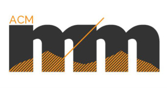
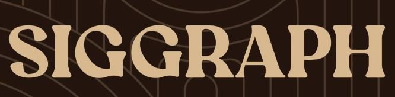

## Overview

A curated survey (coming soon) of OCR in the era of large language models, covering document parsing and understanding, visual text generation, benchmarks, challenges, and future perspectives, with a focus on research around the past five years (2021–2026).

## 🎉 News

- **[2026-2-11]** 🔥 We release an open-source resource to help the community easily track recent OCR research!

## 📖 Contents
- [Overview](#overview)
- [🎉 News](#-news)
- [📖 Contents](#-contents)
- [🔭 Daily Papers](#daily-papers-section)
- [🔍 Emerging Trends](#-emerging-trends)
- [📄 Document Parsing](#-document-parsing)
- [📄 Document Understanding](#-document-understanding)
- [📄 Visual Text Generation](#-visual-text-generation)
- [📄 Specialized Model](#-specialized-model)
- [📄 Benchmarks and Evaluation](#-benchmarks-and-evaluation)

## 🔭 Daily Papers (2026-06-24)

### Document Parsing

| Venue                                                                                                                                  | Name                  | Primary affiliation | Title                                                                                  | GitHub                                                                                                                                                                             | Date      |
|:---------------------------------------------------------------------------------------------------------------------------------------:|:---------------------:|:--------------------:|:---------------------------------------------------------------------------------------:|:------------------------------------------------------------------------------------------------------------------------------------------------------------------------------------:|:---------:|
|  | `P-MTP` | Baidu | P-MTP: Efficient Document Parsing via Multi-Token Prediction with Progressive Depth Scaling | - | Jun. 2026 |

### Document Understanding

| Venue                                                                                                                                  | Name                  | Primary affiliation | Title                                                                                  | GitHub                                                                                                                                                                             | Date      |
|:---------------------------------------------------------------------------------------------------------------------------------------:|:---------------------:|:--------------------:|:---------------------------------------------------------------------------------------:|:------------------------------------------------------------------------------------------------------------------------------------------------------------------------------------:|:---------:|
|  | `ViTexQA` | Meituan | ViTexQA: A Multi-Frame Temporal Perception Dataset for Video Text Question Answering |   | Jun. 2026 |
|  | `PreciseDoc` | Tsinghua University | An LMM for Precisely Grounding Elements in Documents | - | Jun. 2026 |

### Visual Text Generation

| Venue                                                                                                                                  | Name                  | Primary affiliation | Title                                                                                  | GitHub                                                                                                                                                                             | Date      |
|:---------------------------------------------------------------------------------------------------------------------------------------:|:---------------------:|:--------------------:|:---------------------------------------------------------------------------------------:|:------------------------------------------------------------------------------------------------------------------------------------------------------------------------------------:|:---------:|
|  | `UniTranslator` | IIE CAS | UniTranslator: A Unified Multi-modal Framework for End-to-end In-Image Machine Translation |  | Jun. 2026 |

### Benchmarks and Evaluation

| Venue                                                                                                                                  | Name                  | Primary affiliation | Title                                                                                  | GitHub                                                                                                                                                                             | Date      |
|:---------------------------------------------------------------------------------------------------------------------------------------:|:---------------------:|:--------------------:|:---------------------------------------------------------------------------------------:|:------------------------------------------------------------------------------------------------------------------------------------------------------------------------------------:|:---------:|
|  | `AGORA` | Fudan University | AGORA: An Archive-Grounded Benchmark for Agentic Workplace Document Reasoning | - | Jun. 2026 |

## 🔍 Emerging Trends

Emerging Trends (2023–2026)

- End-to-end VLM-based parsing replaces modular OCR pipelines.
- Reinforcement learning for layout and reading order modeling.
- OCR-free document understanding models.
- Scaling down: compact document VLMs under 1B parameters.
- Long-doc OCR is a scaling problem of tokens and consistency, not just context length.
- Structure (layout + logic) is the new accuracy.
- Generative OCR shifts the core risk from “misrecognition” to “hallucination”.
- Benchmarks are moving toward executable  evaluation.
- Document agents and autonomous reasoning over PDFs.
- Document Agents need recoverability, not one-shot perfection.

## 📄 Document Parsing

Document parsing focuses on converting visually complex documents into structured, machine-readable representations. In the LLM era, parsing is no longer a pipeline of isolated modules, but increasingly unified within end-to-end VLM architectures.

| Venue                                                                                                                                                                                              | Name                   | Primary affiliation                   | Title                                                                                                                             | GitHub                                                                                                                                                                                                            | Date      |
|:--------------------------------------------------------------------------------------------------------------------------------------------------------------------------------------------------:|:----------------------:|:-------------------------------------:|:---------------------------------------------------------------------------------------------------------------------------------:|:-----------------------------------------------------------------------------------------------------------------------------------------------------------------------------------------------------------------:|:---------:|
|  | `RT-DocLayout`        | Baidu                | RT-DocLayout: Real-Time End-to-End Document Layout Analysis with Reading Order in the Wild | -                                                                                                                                                                                    | Jun. 2026 |
|  | `Unlimited-OCR`       | Baidu                | Unlimited OCR Works                                                                     |          | Jun. 2026 |
|  | `Beaver`              | Microsoft Research   | Building Agent Harnesses for Scientific Curation from Multimodal Sources               | -                                                                                                                                                                                    | Jun. 2026 |
|                                                              | `Agents-K1`            | Shanghai AI Laboratory                | Agents-K1: Towards Agent-native Knowledge Orchestration                                                                           |                                                                                       | Jun. 2026 |
|                                                              | `PaddleOCR-VL-1.6`     | Baidu                                 | PaddleOCR-VL-1.6: Expanding the Frontier of Document Parsing with Under-Optimized Region Refinement and Progressive Post-Training |                                  | Jun. 2026 |
|                                                              | `PP-OCRv6`             | Baidu                                 | PP-OCRv6: From 1.5M to 34.5M Parameters, Surpassing Billion-Scale VLMs on OCR Tasks                                               |                                  | Jun. 2026 |
|                                                              | `MinerU-Popo`          | Shanghai AI Laboratory & OpenDataLab  | MinerU-Popo: Universal Post-Processing Model for Structured Document Parsing                                                      |                                          | May. 2026 |
|                                                                                                          | `RTPrune`              | DeepSeek                              | RTPrune: Reading-Twice Inspired Token Pruning for Efficient DeepSeek-OCR Inference                                                |                                                | May. 2026 |
|                                                              | `ABot-OCR`             | Alibaba                               | ABot-OCR Technical Report                                                                                                         |                                        | May. 2026 |
|                                                              | `BabelDOC`             | funstory.ai                           | BabelDOC: Better Layout-Preserving PDF Translation via Intermediate Representation                                                |                                      | May. 2026 |
|                                                              | `Consensus Entropy`    | Fudan University                      | Consensus Entropy: Harnessing Multi-VLM Agreement for Self-Verifying and Self-Improving OCR                                       |                  | May. 2026 |
|                                                              | `FastOCR`              | Tsinghua University & JD              | FastOCR: Dynamic Visual Fixation via KV Cache Pruning for Efficient Document Parsing                                              | -                                                                                                                                                                                                                 | May. 2026 |
|                                                              | `MinerU2.5-Pro`        | Shanghai AI Laboratory                | MinerU2.5-Pro: Pushing the Limits of Data-Centric Document Parsing at Scale                                                       |                                          | Apr. 2026 |
|                                                              | `PixelPrune`           | OPPO                                  | PixelPrune: Pixel-Level Adaptive Visual Token Reduction via Predictive Coding                                                     |                            | Apr. 2026 |
|                                                              | `TexOCR`               | Yale University & Zhejiang University | TexOCR: Advancing Document OCR Models for Compilable Page-to-LaTeX Reconstruction                                                 |                                                  | Apr. 2026 |
|                                                              | `Falcon OCR`           | Falcon Vision Team, TII               | Falcon Perception                                                                                                                 |                              | Mar. 2026 |
|                                                              | `MinerU-Diffusion`     | Shanghai AI Laboratory                | MinerU-Diffusion: Rethinking Document OCR as Inverse Rendering via Diffusion Decoding                                             |                                          | Mar. 2026 |
|                                                              | `Qianfan-OCR`          | Baidu                                 | Qianfan-OCR: A Unified End-to-End Model for Document Intelligence                                                                 |                                        | Mar. 2026 |
|                                                              | `dots.mocr`            | HUST                                  | Multimodal OCR: Parse Anything from Documents                                                                                     |                                | Mar. 2026 |
|  | `FireRed-OCR`          | Xiaohongshu Inc                       | FireRed-OCR Technical Report                                                                                                      |                                | Mar. 2026 |
|                                                              | `AgenticOCR`           | Shanghai AI Laboratory & OpenDataLab  | AgenticOCR: Parsing Only What You Need for Efficient Retrieval-Augmented Generation                                               |                                  | Mar. 2026 |
|                                                                                                          | `PTP`                  | Tencent                               | Efficient Document Parsing via Parallel Token Prediction                                                                          | -                                                                                                                                                                                                                 | Mar. 2026 |
|                                                              | `Logics-Parsing-Omni`  | Alibaba                               | Logics-Parsing-Omni Technical Report                                                                                              |  | Mar. 2026 |
|                                                              | `Agentar-Fin-OCR`      | Ant Group                             | Agentar-Fin-OCR                                                                                                                   | -                                                                                                                                                                                                                 | Mar. 2026 |
|                                                              | `PaddleOCR-VL`         | Baidu                                 | Boosting Document Parsing Efficiency and Performance with Coarse-to-Fine Visual Processing                                        |                                  | Mar. 2026 |
|                                                              | `DODO`                 | Amazon & Technion                     | DODO: Discrete OCR Diffusion Models                                                                                               | -                                                                                                                                                                                                                 | Feb. 2026 |
|                                                              | `HSD`                  | SCUT                | Training-Free Acceleration for Document Parsing Vision-Language Model with Hierarchical Speculative Decoding                      | -                                                                                                                                                                                                                 | Feb. 2026 |
|                                                              | `MeDocVL`              | Ping An Property                      | MeDocVL: A Visual Language Model for Medical Document Understanding and Parsing                                                   |                                            | Feb. 2026 |
|                                                              | `Dolphin-2.0`          | ByteDance                             | Dolphin-v2: Universal Document Parsing via Scalable Anchor Prompting                                                              |                                            | Feb. 2026 |
|                                                              | `GLM-OCR`              | Z.ai                                  | GLM-OCR Technical Report                                                                                                          |                                                | Feb. 2026 |
|                                                              | `OCR-Agent`            | Southwest Minzu University            | OCR-Agent: Agentic OCR with Capability and Memory Reflection                                                                      |                                  | Feb. 2026 |
|                                                              | `OmniOCR`              | Southwest Minzu University            | OmniOCR: Generalist OCR for Ethnic Minority Languages                                                                             |                                      | Feb. 2026 |
|                                                              | `PaddleOCR-VL 1.5`     | Baidu                                 | PaddleOCR-VL-1.5: Towards a Multi-Task 0.9B VLM for Robust In-the-Wild Document Parsing                                           |                                  | Jan. 2026 |
|                                                              | `OCRVerse`             | Meituan                               | OCRVerse: Towards Holistic OCR in End-to-End Vision-Language Models                                                               |                                      | Jan. 2026 |
|                                                              | `DeepSeek-OCR 2`       | DeepSeek                              | DeepSeek-OCR 2: Visual Causal Flow                                                                                                |                          | Jan. 2026 |
|                                                              | `Youtu-Parsing`        | Tencent                               | Youtu-Parsing: Perception, Structuring and Recognition via High-Parallelism Decoding                                              |                    | Jan. 2026 |
|                                                              | `Typhoon-OCR`          | Typhoon, SCB 10X                      | Typhoon OCR: Open Vision-Language Model for Thai Document Extraction                                                              |                                        | Jan. 2026 |
|                                                              | `GutenOCR`             | Roots.ai                              | GutenOCR: A Grounded Vision-Language Front-End for Documents                                                                      |                            | Jan. 2026 |
|                                                              | `LightOnOCR`           | LightOn                               | LightOnOCR: A 1B END-TO-END MULTILINGUAL VISION-LANGUAGE MODEL FOR STATE-OF-THE-ART OCR                                           |                                                                                 | Jan. 2026 |
|                                                              | `Uni-Parser`           | DP Technology                         | Uni-Parser Technical Report                                                                                                       |                                           | Dec. 2025 |
|                                                              | `TRivia`               | The University of Hong Kong           | TRivia: Self-supervised Fine-tuning of Vision-Language Models for Table Recognitio                                                |                                                | Dec. 2025 |
|                                                              | `DOCR-Inspector`       | Peking University                     | DOCR-Inspector: Fine-Grained and Automated Evaluation of Document Parsing with VLM                                                |                                        | Dec. 2025 |
|                                                              | `UniRec-0.1B`          | Fudan University                      | UniRec-0.1B: Unified Text and Formula Recognition with 0.1B Parameters                                                            |                                                          | Dec. 2025 |
|                                                              | `HunyuanOCR`           | Tencent                               | HunyuanOCR Technical Report                                                                                                       |                          | Nov. 2025 |
|                                                              | `MonkeyOCR v1.5`       | KingSoft Office                       | MonkeyOCR v1.5 Technical Report: Unlocking Robust Document Parsing for Complex Patterns                                           |                                    | Nov. 2025 |
|                                                              | `Doc-Researcher`       | Huawei                                | Doc-Researcher: A Unified System for Multimodal Document Parsing and Deep Research                                                |                                                                                                                                                                                                                   | Oct. 2025 |
|                                                              | `OLMOCR 2`             | Allen Institute for AI                | olmOCR 2: Unit Test Rewards for Document OCR                                                                                      |                                                  | Oct. 2025 |
| —                                                                                                                                                                                                  | `Chandra v0.1.0`       | Datalab                               | —                                                                                                                                 |                                          | Oct. 2025 |
|                                                              | `DeepSeek-OCR`         | DeepSeek                              | DeepSeek-OCR: Contexts Optical Compression                                                                                        |                              | Oct. 2025 |
|                                                              | `Infinity-Parser`      | INFLY Tech                            | Infinity Parser: Layout Aware Reinforcement Learning for Scanned Document Parsing                                                 |                                            | Oct. 2025 |
|                                                                              | `Nanonets-OCR 2`       | Nanonets                              | Transforming documents into LLM-ready structured data                                                                             |                                        | Oct. 2025 |
|                                                              | `PaddleOCR-VL`         | Baidu                                 | PaddleOCR-VL: Boosting Multilingual Document Parsing via a 0.9B Ultra-Compact VLM                                                 |                                  | Oct. 2025 |
|                                                              | `Dolphin-1.5`          | ByteDance                             | Dolphin: Document Image Parsing via Heterogeneous Anchor Prompting                                                                |                                            | Oct. 2025 |
|                                                              | `Logics-Parsing`       | Alibaba                               | Logics-Parsing Technical Report                                                                                                   |                                  | Sep. 2025 |
|                                                                    | `Granite-Docling-258M` | IBM                                   | —                                                                                                                                 |                                | Sep. 2025 |
| —                                                                                                                                                                                                  | `Marker 1.10.1`        | Datalab                               | —                                                                                                                                 |                                            | Sep. 2025 |
|                                                              | `MinerU 2.5`           | Shanghai AI Laboratory                | MinerU2.5: A Decoupled Vision-Language Model for Efficient High-Res Document Parsing                                              |                                          | Sep. 2025 |
|                                                             | `DianJin-OCR-R1`       | Qwen DianJin Team                     | DianJin-OCR-R1: Enhancing OCR Capabilities via a Reasoning-and-Tool Interleaved Vision-Language Model                             |                                        | Sep. 2025 |
|                                                              | `dots.ocr`             | Xiaohongshu Inc.                      | dots.ocr: Multilingual Document Layout Parsing in a Single VLM                                                                    |                                  | Jul. 2025 |
|                                                              | `MonkeyOCR-Pro`        | HUST                                  | MonkeyOCR: Document Parsing with a Structure-Recognition-Relation Triplet Paradigm                                                |                                    | Jul. 2025 |
|                                                                                        | `OCRFlux`              | ChatDOC                               | OCRFlux: Mastering Complex Layouts and Seamless Page Merging                                                                      |                                        | Jun. 2025 |
| —                                                                                                                                                                                                  | `MinerU2.0-2505-0.9B`  | Shanghai AI Laboratory                |                                                                                                                                   |                                          | Jun. 2025 |
|                                                              | `MonkeyOCR`            | HUST                                  | MonkeyOCR: Document Parsing with a Structure-Recognition-Relation Triplet Paradigm                                                |                                    | Jun. 2025 |
|                                                                                          | `Dolphin`              | ByteDance                             | Dolphin: Document Image Parsing via Heterogeneous Anchor Prompting                                                                |                                            | May. 2025 |
|                                                              | `GTR-VL`               | Shanghai AI Laboratory                | GTR-VL: Graph Traversal as Visual Chain of Thought for Molecular Structure Recognition                                            | -                                                                                                                                                                                                                 | May. 2025 |
|                                                              | `SmolDocling-256M`     | IBM                                   | SmolDocling: An ultra-compact vision-language model for end-to-end multi-modal document conversion                                |                                | Mar. 2025 |
|                                                              | `OLMOCR`               | Allen Institute for AI                | olmOCR: Unlocking Trillions of Tokens in PDFs with VLMs                                                                           |                                                  | Feb. 2025 |
|                                                           | `PP-StructureV3`       | Baidu                                 | PaddleOCR 3.0 Technical Report                                                                                                    |                                  | Feb. 2025 |
|                                                              | `Ocean-OCR`            | Baichuan Inc.                         | Ocean-OCR: Towards General OCR Application via a Vision-Language Model                                                            |                                            | Jan. 2025 |
| —                                                                                                                                                                                                  | `MarkItDown`           | Microsoft                             | —                                                                                                                                 |                                      | Dec. 2024 |
|                                                              | `GOT-OCR 2.0`          | StepFun                               | General OCR Theory: Towards OCR-2.0 via a Unified End-to-end Model                                                                |                            | Sep. 2024 |
|                                                              | `MinerU`               | Shanghai AI Laboratory                | MinerU: An Open-Source Solution for Precise Document Content Extraction                                                           |                                          | Sep. 2024 |
| —                                                                                                                                                                                                  | `open-parse`           | -                                     | —                                                                                                                                 |                                          | Mar. 2024 |
|                                                              | `Nougat`               | Meta AI                               | Nougat: Neural Optical Understanding for Academic Documents                                                                       |                                | Aug. 2023 |
|                                                                                                   | `unstructured`         | Unstructured                          | Transform complex, unstructured data into clean, structured data. Securely. Continuously. Effortlessly.                           |                      | Oct. 2022 |
| —                                                                                                                                                                                                  | `RapidOCR`             | RapidAI                          | —                                                                                                                                 |                                              | Jul. 2022 |

## 📄 Document Understanding

Document understanding extends beyond structural parsing to semantic comprehension and reasoning over visually rich documents.

| Venue                                                                                                                                                                                                                            | Name                                 | Primary affiliation                          | Title                                                                                                                              | GitHub                                                                                                                                                                                                                    | Date       |
|:--------------------------------------------------------------------------------------------------------------------------------------------------------------------------------------------------------------------------------:|:------------------------------------:|:--------------------------------------------:|:----------------------------------------------------------------------------------------------------------------------------------:|:-------------------------------------------------------------------------------------------------------------------------------------------------------------------------------------------------------------------------:|:----------:|
|                                               | `LightSTAR`  | SJTU                 | LightSTAR: Efficient Visual Document Retrieval via Lightweight Selection with Vision-Adaptive Refinement     |  | Jun. 2026 |
|  | `SciLens`    | HKUST        | SciLens: Multi-modal Scientific Claim Verification with Agentic Entailment and Grounding                     | -                                                                                                                                                                          | Jun. 2026 |
|                                                                                            | `SAFE-Cascade`                       | Walmart                                      | SAFE-Cascade: Cost-Adaptive Vision-Language Routing for Chart Question Answering                                                   | -                                                                                                                                                                                                                         | Jun. 2026  |
|                                                                                            | `UMG-RAG`                            | Purdue University                            | Uncertainty-Aware Hybrid Retrieval for Long-Document RAG                                                                           | -                                                                                                                                                                                                                         | Jun. 2026  |
|                                                                                            | `MAGE-RAG`                           | BIT                                          | MAGE-RAG: Multigranular Adaptive Graph Evidence for Agentic Multimodal RAG in Long-Document QA                                     |                                            | Jun. 2026  |
|                                                                                            | `MINARD`                             | University of Maryland                       | Helping Figures Tell their Story! Paper-Grounded Video Generation Explaining Complex Scientific Figures                            | -                                                                                                                                                                                                                         | Jun. 2026  |
|                                                                                            | `MM-BizRAG`                          | JPMorgan Chase & Co.                         | MM-BizRAG: Rethinking Multimodal Retrieval-Augmented Generation for General Purpose Enterprise Q&A                                 | -                                                                                                                                                                                                                         | Jun. 2026  |
|                                                                                            | `GeoSym127K`                         | SenseTime Research & CUHK Shenzhen           | GeoSym127K: Scalable Symbolically-verifiable Synthesis for Multimodal Geometric Reasoning                                          |                                                  | May. 2026  |
|                                                                                            | `FinAgent-RAG`                       | Zhejiang University                          | Agentic Retrieval-Augmented Generation for Financial Document Question Answering                                                   |                                | May. 2026  |
|                                                                                            | `SMART`                              | UW-Madison                                   | Your Embedding Model is SMARTer Than You Think                                                                                     |                                                    | May. 2026  |
|                                                                                            | `ReceiptBench`                       | Zhejiang University                          | From Recognition to Reasoning: Benchmarking and Enhancing MLLMs on Real-World Receipt Document Understanding                       |                                              | May. 2026  |
|                                                                                                                                         | `HiKEY`                              | Korea University                             | HiKEY: Hierarchical Multimodal Retrieval for Open-Domain Document Question Answering                                               | -                                                                                                                                                                                                                         | May. 2026  |
|                                                                                            | `UniDoc-RL`                          | DeepGlint-AI & SJTU                          | UniDoc-RL: Coarse-to-Fine Visual RAG with Hierarchical Actions and Dense Rewards                                                   |                                                | Apr. 2026  |
|                                                                                                                                         | `Doc-V*`                             | HUST                                         | Doc-V*:Coarse-to-Fine Interactive Visual Reasoning for Multi-Page Document VQA                                                     | -                                                                                                                                                                                                                         | Apr. 2026  |
|                                                                                                                                        | `DocSeeker`                          | HUST                                         | DocSeeker: Structured Visual Reasoning with Evidence Grounding for Long Document Understanding                                     |                                                    | Apr. 2026  |
|                                                                                            | `MM-Doc-R1`                          | Fudan University                             | MM-Doc-R1: Training Agents for Long Document Visual Question Answering through Multi-turn Reinforcement Learning                   | -                                                                                                                                                                                                                         | Apr. 2026  |
|                                                                                            | `VISOR`                              | Soochow University & Baidu                   | VISOR: Agentic Visual Retrieval-Augmented Generation via Iterative Search and Over-horizon Reasoning                               | -                                                                                                                                                                                                                         | Apr. 2026  |
|                                                                                            | `LiteCoST`                           | BAAI & HKUST(GZ)                             | Long-Document QA with Chain-of-Structured-Thought and Fine-Tuned SLMs                                                              |                                                 | Apr. 2026  |
|                                                                                            | `SAKE`                               | SYSU                                         | SAKE: Self-aware Knowledge Exploitation-Exploration for Grounded Multimodal Named Entity Recognition                               |                                                | Apr. 2026  |
|                                                                                            | `XEmbodied`                          | Tsinghua University                          | XEmbodied: A Foundation Model with Enhanced Geometric and Physical Cues for Large-Scale Embodied Environments                      |                                                  | Apr. 2026  |
|                                                                                            | `Visual-ERM`                         | Shanghai AI Laboratory                       | Visual-ERM: Reward Modeling for Visual Equivalence                                                                                 |                                                | Mar. 2026  |
|                                                                                            | -                                    | Johns Hopkins University                     | Reading, Not Thinking: Understanding and Bridging the Modality Gap When Text Becomes Pixels in Multimodal LLMs                     | -                                                                                                                                                                                                                         | Mar. 2026  |
|                                                                                            | `PEPO`                               | Nankai University & Kuaishou Technology      | Rethinking Token-Level Policy Optimization for Multimodal Chain-of-Thought                                                         |                                                          | Mar. 2026  |
|                                                                                            | `ECHO`                               | BUPT                                         | ECHO: Event-Centric Hypergraph Operations via Multi-Agent Collaboration for Multimedia Event Extraction                            | -                                                                                                                                                                                                                         | Mar. 2026  |
|                                                                                            | `OfficeQA Pro`                       | Databricks (Mosaic AI Research)              | OfficeQA Pro: An Enterprise Benchmark for End-to-End Grounded Reasoning                                                            |                                                | Mar. 2026  |
|                                                                                            | `SPD-RAG`                            | TOBB ETU                                     | SPD-RAG: Sub-Agent Per Document Retrieval-Augmented Generation                                                                     |                                          | Mar. 2026  |
|                                                                                            | `LatentGeo`                          | Nankai University                            | LatentGeo: Learnable Auxiliary Constructions in Latent Space for Multimodal Geometric Reasoning                                    | -                                                                                                                                                                                                                         | Mar. 2026  |
|                                                                                            | `KohakuRAG`                          | National Tsing Hua University                | KohakuRAG: A simple RAG framework with hierarchical document indexing                                                              |                                              | Mar. 2026  |
|                                                                                                                                        | `Faire`                              | ByteDance                                    | How RL Unlocks the Aha Moment in Geometric Interleaved Reasoning                                                                   |                                                    | Mar. 2026  |
|                                                                                            | `DocSage`                            | HKUST (Guangzhou)                            | DocSage: An Information Structuring Agent for Multi-Doc Multi-Entity Question Answering                                            | -                                                                                                                                                                                                                         | Mar. 2026  |
|                                                                                            | `A2PO`                               | Fudan University                             | Thinking with Constructions: A Benchmark and Policy Optimization for Visual-Text Interleaved Geometric Reasoning                   |                                                                                                               | Mar. 2026  |
|                                                                                            | `DAGverse`                           | Arizona State University                     | DAGverse: Building Document-Grounded Semantic DAGs from Scientific Papers                                                          | -                                                                                                                                                                                                                         | Mar. 2026  |
|                                                                                            | `NanoVDR`                            | Aalto University                             | NanoVDR: Distilling a 2B Vision-Language Retriever into a 70M Text-Only Encoder for Visual Document Retrieval                      | -                                                                                                                                                                                                                         | Mar. 2026  |
|                                                                                            | `See and Remember`                   | East China Normal University                 | See and Remember: A Multimodal Agent for Web Traversal                                                                             |                                        | Mar. 2026  |
|                                                                                            | `Fast and Faithful`                  | vLLM Semantic Router Project                                       | Fast and Faithful: Real-Time Verification for Long-Document Retrieval-Augmented Generation Systems                                 | -                                                                                                                                                                                                                         | Mar. 2026  |
|                                                                                            | `TopoChunker`                        | Independent Researcher                       | TopoChunker: Topology-Aware Agentic Document Chunking Framework                                                                    |                                    | Mar. 2026  |
|                                                                                            | `Wiki-R1`                            | ShanghaiTech                                 | Wiki-R1: Incentivizing Multimodal Reasoning for Knowledge-based VQA via Data and Sampling Curriculum                               | -                                                                                                                                                                                                                         | Mar. 2026  |
|                                                                                                           | -                                    | Beihang                                      | Concise Geometric Description as a Bridge: Unleashing the Potential of LLM for Plane Geometry Problem Solving                      | ---                                                                                                                                                                                                                       | Feb. 2026  |
|                                                                                                           | `GeoFocus`                           | HUST                                         | GeoFocus: Blending Efficient Global-to-Local Perception for Multimodal Geometry Problem-Solving                                    |                                                        | Feb. 2026  |
|                                                                                            | `DeepRead`                           | ICT CAS                                      | DeepRead: Document Structure-Aware Reasoning to Enhance Agentic Search                                                             |                                                  | Feb. 2026  |
|                                                                                            | `MoDora`                             | SJTU                                         | MoDora: Tree-Based Semi-Structured Document Analysis System                                                                        |                                                            | Feb. 2026  |
|                                                                                            | `SmartChunk Retrieval`               | University of Michigan & Adobe Research      | SmartChunk Retrieval: Query-Aware Chunk Compression with Planning for Efficient Document RAG                                       | -                                                                                                                                                                                                                         | Feb. 2026  |
|                                                                                            | `MLDocRAG`                           | Independent (Singapore)                      | MLDocRAG: Multimodal Long-Context Document Retrieval Augmented Generation                                                          | -                                                                                                                                                                                                                         | Feb. 2026  |
|                                                                                            | `MMLBD-C`                            | LightOn                                      | How to Train Your Long-Context Visual Document Model                                                                               |                                              | Feb. 2026  |
|                                                                                                                                                | `AutoGPS`                            | XJTU                                         | AutoGPS: Automated Geometry Problem Solving via Multimodal Formalization and Deductive Reasoning                                   |                                | Jan. 2026  |
|                                                                                            | `DocDancer`                          | Peking University                            | DocDancer: Towards Agentic Document-Grounded Information Seeking                                                                   | ---                                                                                                                                                                                                                       | Jan. 2026  |
|                                                                                                                                                                                      | `TR-CoT`                             | HUST                                         | Theorem-Validated Reverse Chain-of-Thought Problem Generation for Geometric Reasoning                                              |                                                              | Nov. 2025  |
|                                                                                            | `Qwen3-VL`                           | Alibaba Group                                | Qwen3-VL Technical Report                                                                                                          |                                                    | Nov. 2025  |
|                                                                                            | `DocLens`                            | Peking University                            | DocLens: A Tool-Augmented Multi-Agent Framework for Long Visual Document Understanding                                             |                                                    | Nov. 2025  |
|                                                                                            | `NVIDIA Nemotron Nano V2 VL`         | NVIDIA                                       | NVIDIA Nemotron Nano V2 VL                                                                                                         |                                                                                 | Nov. 2025  |
| <a href="https://arxiv.org/abs/2511.10552">                                                                                                                                           | `URaG`                               | SCUT                                         | URaG: Unified Retrieval and Generation in Multimodal LLMs for Efficient Long Document Understanding                                |                                                                | Nov. 2025  |
|                                                                                                           | `GeoFM`                              | Hunyuan                                      | GeoFM: Enhancing Geometric Reasoning of MLLMs via Synthetic Data Generation through Formal Language                                | ---                                                                                                                                                                                                                       | Oct. 2025  |
|                                                                                                                                                                                        | `GeoLogic`                           | USTC                                         | Enhancing the Geometric Problem Solving Ability of Multimodal LLMs via Symbolic-Neural Integration                                 |                                                  | Oct. 2025  |
|                                                                                            | `AndesVL`                            | OPPO                                         | AndesVL Technical Report: An Efficient Mobile-side Multimodal Large Language Model                                                 |                    | Oct. 2025  |
|                                                                                            | `NEO`                                | NTU                                          | FROM PIXELS TO WORDS – TOWARDS NATIVE VISIONLANGUAGE PRIMITIVES AT SCALE                                                           |                                              | Oct. 2025  |
|                                                                                                                                                                                   | `FGeo-Parser`                        | Shanghai University                          | FGeo-Parser: Autoformalization and Solution of Plane Geometric Problems                                                            | ---                                                                                                                                                                                                                       | Sep. 2025  |
|                                                                                                                                                                                    | `SOLIDGEO`                           | MAIS                                         | SOLIDGEO: Measuring Multimodal Spatial Math Reasoning in Solid Geometry                                                            |                                  | Sep. 2025  |
|                                                                                            | `LLaVA-OneVision-1.5`                | LLaVA Community                              | LLaVA-OneVision-1.5: Fully Open Framework for Democratized Multimodal Training                                                     |              | Sept. 2025 |
|                                                                                            | `MiniCPM-V 4.5`                      | OpenBMB                                      | MiniCPM-V 4.5: Cooking Efficient MLLMs via Architecture, Data, and Training Recipes                                                |                                                    | Sept. 2025 |
|                                                                                            | `Qwen3-Omni`                         | Alibaba Group                                | Qwen3-Omni Technical Report                                                                                                        |                                                    | Sept. 2025 |
|                                                                                            | `SAIL-VL2`                           | ByteDance                                    | SAIL-VL2 Technical Report                                                                                                          |                        | Sept. 2025 |
|                                                                                            | `HERO`                               | Fudan University                             | HERO: Rethinking Visual Token Early Dropping in High-Resolution Large Vision-Language Models                                       | ---                                                                                                                                                                                                                       | Sept. 2025 |
|                                                                                            | `InternVL3.5`                        | Shanghai AI Laboratory                       | InternVL3.5: Advancing Open-Source Multimodal Models in Versatility, Reasoning, and Efficiency                                     |                                                  | Aug. 2025  |
|                                                                                                           | `Geoint-R1`                          | CAS                                          | Geoint-R1: Formalizing Multimodal Geometric Reasoning with Dynamic Auxiliary Constructions                                         | ---                                                                                                                                                                                                                       | Aug. 2025  |
|                                                                                                           | `GF-Reasoner`                        | The University of Hong Kong                  | Bridging Formal Language with Chain-of-Thought Reasoning to Geometry Problem Solving                                               |                                      | Aug. 2025  |
| <a href="https://openaccess.thecvf.com/content/ICCV2025/html/Yu_DocThinker_Explainable_Multimodal_Large_Language_Models_with_Rule-based_Reinforcement_Learning_ICCV_2025_paper.html"> | `Doc Thinker`                        | HUST                                         | DocThinker: Explainable Multimodal Large Language Models with Rule-based Reinforcement Learning for Document Understanding         | ---                                                                                                                                                                                                                       | Aug. 2025  |
|                                                                                            | `Ovis2.5`                            | Alibaba Group                                | Ovis2.5 Technical Report                                                                                                           |                                                               | Aug. 2025  |
|                                                                                          | `WeThink-Qwen2.5 VL`                 | Tencent                                      | WeThink: Toward General-purpose Vision-Language Reasoning via Reinforcement Learning                                               |                                                  | Jul. 2025  |
|                                                                                            | `X-Omni`                             | Tencent                                      | X-Omni: Reinforcement Learning Makes Discrete Autoregressive Image Generative Models Great Again                                   |                                                  | Jul. 2025  |
|                                                                                            | `Gemini 2.5 Pro`                     | Google                                       | Gemini 2.5: Pushing the Frontier with Advanced Reasoning, Multimodality, Long Context...                                           | ---                                                                                                                                                                                                                       | Jul. 2025  |
|       | `Janus`                              | DeepSeek                                     | Janus: Decoupling Visual Encoding for Unified Multimodal Understanding and Generation                                              |                                                    | Jun. 2025  |
|                                                                            | `Seed1.6-vision`                     | ByteDance                                    | -                                                                                                                                  | ---                                                                                                                                                                                                                       | Jun. 2025  |
|                                                                                                                                | `DS-VLM`                             | Xiamen University                            | DS-VLM: Diffusion Supervision Vision Language Model                                                                                | ---                                                                                                                                                                                                                       | Jun. 2025  |
|                    | `SparseMM`                           | Tsinghua University                          | SparseMM: Head Sparsity Emerges from Visual Concept Responses in MLLMs                                                             |                                                  | Jun. 2025  |
|                                                                                            | `Seed1.5-VL`                         | ByteDance                                    | Seed1.5-VL Technical Report                                                                                                        | ---                                                                                                                                                                                                                       | May. 2025  |
|                                                                                            | `InternVL3`                          | Shanghai AI Laboratory                       | InternVL3: Exploring Advanced Training and Test-Time Recipes for Open-Source Multimodal Models                                     |                                                  | Apr. 2025  |
|                                                                                            | `Kimi-VL`                            | MoonshotAI                                   | Kimi-VL: Vision-Language Model for Advanced Multimodal Understanding                                                               |                                                  | Apr. 2025  |
|                                                                                                           | `TrustGeoGen`                        | Fudan University                             | TrustGeoGen: Scalable and Formal-Verified Data Engine for Trustworthy Multimodal Geometric Problem Solving                         |                                    | Apr. 2025  |
|                                                                                                                                                                                      | `Geocoder`                           | Mila                                         | Geocoder: Solving Geometry Problems by Generating Modular Code through Vision-Language Models                                      | ---                                                                                                                                                                                                                       | Apr. 2025  |
|                                                                                                                                                                                        | `GeoUni`                             | Peking University                            | GeoUni: A Unified Model for Generating Geometry Diagrams, Problems and Problem Solutions                                           |                                            | Apr. 2025  |
|                                                                                                                                                                                       | `GNS`                                | XJTU                                         | GNS: Solving Plane Geometry Problems by Neural Symbolic Reasoning with Multimodal LLMs                                             |                                                                | Apr. 2025  |
|                                                                                            | `SAIL-VL`                            | ByteDance                                    | The Scalability of Simplicity: Empirical Analysis of Vision-Language Learning with a Single Transformer                            |                                                | Apr. 2025  |
|                                                                                            | `PP-DocBee`                          | Baidu                                        | PP-DocBee: Improving Multimodal Document Understanding Through a Bag of Tricks                                                     |                                          | Mar. 2025  |
|                                                                                            | `Phi-4-Mini`                         | Microsoft                                    | Phi-4-Mini Technical Report: Compact yet Powerful Multimodal Language Models via Mixture-of-LoRAs                                  |                                            | Mar. 2025  |
|                                                                                                           | `Pi-GPS`                             | Beijing Normal University                    | Pi-GPS: Enhancing Geometry Problem Solving by Unleashing the Power of Diagrammatic Information                                     | ---                                                                                                                                                                                                                       | Mar. 2025  |
|                                                                                                                                                                                     | `DFE-GPS`                            | SJTU                                         | Diagram Formalization Enhanced Multi-modal Geometry Problem Solver                                                                 |                                                      | Mar. 2025  |
|                                                                                            | `OmniParser V2`                      | HUST                                         | OmniParser V2: Structured-Points-of-Thought for Unified Visual Text Parsing and Its Generality to Multimodal Large Language Models | ---                                                                                                                                                                                                                       | Feb. 2025  |
|                                                                                                           | `alphageometry2`                     | Google DeepMind                              | Gold-Medalist Performance in Solving Olympiad Geometry with AlphaGeometry2                                                         |                          | Feb. 2025  |
|                                                                                            | `ChatVLA`                            | Midea Group                                  | ChatVLA: Unified Multimodal Understanding and Robot Control with Vision-Language-Action Model                                      |                          | Feb. 2025  |
|                                                                                            | `Qwen2.5-VL`                         | Alibaba Group                                | Qwen2.5-VL Technical Report                                                                                                        |                                                        | Feb. 2025  |
| -                                                                                                                                                                                                                                | `MiniCPM-o-2.6`                      | OpenBMB                                      | MiniCPM-o 2.6: A GPT-4o Level MLLM for Vision, Speech, and Multimodal Live Streaming on Your Phone                                 |                                                    | Jan. 2025  |
|                                                                                            | `InternVL2.5`                        | Shanghai AI Laboratory                       | PP-DocBee: Improving Multimodal Document Understanding Through a Bag of Tricks                                                     |                                                  | Dec. 2024  |
|                                                                                            | `DeepSeek-VL2`                       | DeepSeek                                     | DeepSeek-VL2: Mixture-of-Experts Vision-Language Models for Advanced Multimodal Understanding                                      |                                      | Dec. 2024  |
|                                                                                                           | `Slow Perception`                    | StepFun                                      | Slow Perception: Let's Perceive Geometric Figures Step-by-step                                                                     |                          | Dec. 2024  |
|                                                                                                                                                                                       | `GeoX`                               | SJTU                                         | GeoX: Geometric Problem Solving through Unified Formalized Vision-Language Pre-training                                            |                                                  | Dec. 2024  |
|                                                                                                                                                                                  | `Geo-Qwen`                           | UESTC                                        | Geo-Qwen: A Geometry Problem Solving Method Based on Generative Large Language Models and Heuristic Reasoning                      | ---                                                                                                                                                                                                                       | Dec. 2024  |
|                                                                                                                                                                                        | `Geo-Llava`                          | Huawei                                       | Geo-LLaVA: A Large Multi-modal Model for Solving Geometry Math Problems with Meta In-Context Learning                              | ---                                                                                                                                                                                                                       | Dec. 2024  |
|                                                                                            | `Gemini 1.5 Pro`                     | Google                                       | Gemini 1.5: Unlocking multimodal understanding across millions of tokens of context                                                | ---                                                                                                                                                                                                                       | Dec. 2024  |
|                                                                                                                                                                                        | `Beyond Lines and Circles`           | Google                                       | Beyond Lines and Circles: Unveiling the Geometric Reasoning Gap in Large Language Models                                           | ---                                                                                                                                                                                                                       | Nov. 2024  |
|                                                                                            | `M3DOCRAG`                           | UNC Chapel Hill                              | M3DOCRAG: Multi-modal Retrieval is What You Need for Multi-page Multi-document Understanding                                       |                                              | Nov. 2024  |
|                                                                                            | `SV-RAG`                             | University at Buffalo                        | SV-RAG: LORA-CONTEXTUALIZING ADAPTATION OF MLLMS FOR LONG DOCUMENT UNDERSTANDING                                                   |                        | Nov. 2024  |
|                                                                                            | `Pixtral-12B`                        | Mistral AI                                   | Pixtral 12B: A Vision-Language Model for Advanced Multimodal Understanding                                                         |                               | Oct. 2024  |
|                                                                                                                                                                                    | `Formal Representation and Solution` | Shanghai University                          | Formal Representation and Solution of Plane Geometric Problems                                                                     | ---                                                                                                                                                                                                                       | Oct. 2024  |
|                                                                                                                                                                                        | `Reason-and-Execute`                 | Guangdong Smart Education Research Institute | Reason-and-Execute Prompting: Enhancing Multimodal Large Language Models for Solving Geometry Questions                            |  | Oct. 2024  |
|                                                                                            | `VISRAG`                             | Tsinghua University                          | VISRAG: VISION-BASED RETRIEVAL-AUGMENTED GENERATION ON MULTI-MODALITY DOCUMENTS                                                    |                                                          | Oct. 2024  |
|                                                                                            | `PDF-WuKong`                         | HUST                                         | PDF-WuKong: A Large Multimodal Model for Efficient Long PDF Reading with End-to-End Sparse Sampling                                |                                                  | Oct. 2024  |
|                                                                                            | `Molmo & PixMo`                      | Allen Institute for AI                       | Molmo and PixMo: Open Weights and Open Data for State-of-the-Art Vision-Language Models                                            |                                                            | Sep. 2024  |
|                                                                                                                                                                                      | `Two-step CoT`                       | USTC                                         | Multi-step Chain-of-Thought in Geometry Problem Solving                                                                            | ---                                                                                                                                                                                                                       | Sep. 2024  |
|                                                                                                                                                                                     | `MM-RAG`                             | IIIT                                         | Advancing Multimodal LLMs: A Focus on Geometry Problem Solving Reasoning and Sequential Scoring                                    | ---                                                                                                                                                                                                                       | Sep. 2024  |
|                                                                                                                                         | `mPLUG-DocOwl2`                      | Alibaba Group                                | mPLUG-DocOwl2: High-resolution Multi-turn Chat on Doc-images with High-compression OCR-free Visual Features                        |                                                | Sep. 2024  |
|                                                                                            | `Qwen2-VL`                           | Alibaba Group                                | Qwen2-VL: Enhancing Vision-Language Model’s Perception of the World at Any Resolution                                              |                                                        | Sep. 2024  |
|                                                                                            | `Eagle-X5`                           | NVIDIA                                       | Eagle-X5: Scalable Vision-Language Models with Enhanced Cross-modal Alignment and Generative Capability                            |                                                              | Aug. 2024  |
|                                                                                            | `Cog-iDEFICS3`                       | Hugging Face                                 | Cog-iDEFICS3: Scaling Multimodal Models with Integrated Field-aware Embeddings and Semantic Compositionality                       |                                                | Aug. 2024  |
| <a href="https://openaccess.thecvf.com/content/CVPR2025/html/Liao_DocLayLLM_An_Efficient_Multi-modal_Extension_of_Large_Language_Models_for_CVPR_2025_paper.html">                    | `DocLayLLM`                          | SCUT + Alibaba Cloud                         | DocLayLLM: An Efficient Multi-modal Extension of Large Language Models for Text-rich Document Understanding                        |                                                    | Aug. 2024  |
|                                                                                            | `LLaVA-NeXT`                         | ByteDance                                    | LLaVA-NeXT: Next-Generation Large Vision-Language Models with Enhanced Multimodal Capabilities                                     |                                                | Jul. 2024  |
|                                                                                            | `GLM-4`                              | Zhipu AI                                     | ChatGLM: A Family of Large Language Models from GLM-130B to GLM-4 All Tools                                                        |                                                            | Jun. 2024  |
|                                                                                                           | `GeoGPT4V`                           | USTC                                         | GeoGPT4V: Towards Geometric Multimodal Large Language Models with Geometric Image Generation                                       |                                                      | Jun. 2024  |
|                                                     | `Cambrian-1`                         | New York University                          | Cambrian-1: A Fully Open, Vision-Centric Exploration of Multimodal Large Language Models                                           |                                          | Jun. 2024  |
|                                                                                                | `EMU2-chat`                          | BAAI                                         | EMU2-chat: Generative Multimodal Models are In-Context Learners                                                                    |                                                          | Jun. 2024  |
|                                                                                            | `Ovis`                               | Alibaba Group                                | Ovis: Structural Embedding Alignment for Multimodal Large Language Model                                                           |                                                              | May 2024   |
|                                                                                            | `Fox`                                | University of CAS                            | Focus Anywhere for Fine-grained Multi-page Document Understanding                                                                  |                                                                | May. 2024  |
|                                                                                                                                                                                       | `E-GPS`                              | XJTU                                         | E-GPS: Explainable Geometry Problem Solving via Top-Down Solver and Bottom-Up Generator                                            |                                                          | May 2024   |
|                                                                                                                                       | `TextMonkey`                         | HUST                                         | TextMonkey: An OCR-Free Large Multimodal Model for Understanding Document                                                          |                                                  | May. 2024  |
|                                                                                            | `TextHawk`                           | Zhejiang University                          | TextHawk: Exploring Efficient Fine-Grained Perception of Multimodal Large Language Models                                          |                                                        | Apr. 2024  |
|                                                                                            | `InternLM-XComposer2-4KHD`           | Shanghai AI Laboratory                       | InternLM-XComposer2-4KHD: A Pioneering Large Vision-Language Model Handling Resolutions from 336 Pixels to 4K HD                   |                                | Apr. 2024  |
|                                                                                                                                       | `TinyChart`                          | Alibaba Group                                | TinyChart: Efficient Chart Understanding with Visual Token Merging and Program-of-Thoughts Learning                                |                               | Apr. 2024  |
|                                                                                         | `Yi-VL`                              | 01.AI                                        | Yi: Open Foundation Models by 01.AI — Vision-Language Model                                                                        |                                                                      | Mar. 2024  |
|                                                                                            | `DeepSeek-VL`                        | DeepSeek                                     | DeepSeek-VL: Towards Real-World Vision-Language Understanding                                                                      |                                        | Mar. 2024  |
|                                                                                                                                                                                   | `FGPS`                               | Shanghai University                          | FGeo-SSS: A Search-Based Symbolic Solver for Human-Like Automated Geometric Reasoning                                              | ---                                                                                                                                                                                                                       | Mar. 2024  |
| <a href="https://aclanthology.org/2024.findings-emnlp.175/">                                                                                                                         | `mPLUG-DocOwl 1.5`                   | Alibaba Group                                | mPLUG-DocOwl 1.5: Unified Structure Learning for OCR-free Document Understanding                                                   |                            | Mar. 2024  |
|                                                                                                           | `FGeo-DRL`                           | Shanghai University                          | FGeo-DRL: Deductive Reasoning for Geometric Problems through Deep Reinforcement Learning                                           |                                              | Feb. 2024  |
|                                                                                                                                                                                     | `AlphaGeometry`                      | Google DeepMind                              | Solving Olympiad Geometry without Human Demonstrations                                                                             |                          | Jan. 2024  |
|                                                                                                                              | `DocLLM`                             | JPMorgan Chase & Co.                         | DocLLM: A Layout-Aware Generative Language Model for Multimodal Document Understanding                                             |                                                    | Jan. 2024  |
|                                                                                                                          | `Vary`                               | MEGVII Technology                            | Vary: Scaling up the Vision Vocabulary for Large Vision-Language Models                                                            |                                                | Dec. 2023  |
|                                                                                                                                      | `PaperOwl`                           | Alibaba Group                                | PaperOwl: Scientific Document Analysis with Multimodal Large Language Models                                                       |                                                | Nov. 2023  |
| <a href="https://openaccess.thecvf.com/content/CVPR2024/html/Li_Monkey_Image_Resolution_and_Text_Label_Are_Important_Things_for_CVPR_2024_paper.html">                                | `Monkey`                             | HUST                                         | Monkey: Image Resolution and Text Label Are Important Things for Large Multi-modal Models                                          |                                                    | Nov. 2023  |
|                                                                                                                         | `CogVLM`                             | ZaiOrg                                       | CogVLM: Visual Expert for Pretrained Language Models                                                                               |                                                          | Nov. 2023  |
|                                                                                                                      | `UReader`                            | ECNU                                         | UReader: Universal OCR-free Visually-situated Language Understanding with Multimodal Large Language Model                          |                                      | Nov. 2023  |
|                                                                                                           | `FormalGeo`                          | Peking University                            | FormalGeo: An Extensible Formalized Framework for Olympiad Geometric Problem Solving                                               |                                                          | Oct. 2023  |
|                                                                                            | `KOSMOS-2.5`                         | Microsoft                                    | KOSMOS-2.5: A Multimodal Literate Model                                                                                            |                                 | Sept. 2023 |
|                                                                                            | `QwenVL`                             | Alibaba Group                                | QwenVL: A Vision-Language Model for Unified Visual and Language Understanding                                                      |                                                          | Aug. 2023  |
|                                                                                            | `mPLUG-DocOwl`                       | DAMO Academy, Alibaba Group                  | mPLUG-DocOwl: Modularized Multimodal Large Language Model for Document Understanding                                               |                               | Jul. 2023  |
|                                                                                            | `LLaVAR`                             | Georgia Tech                                 | LLaVAR: Enhanced Visual Instruction Tuning for Text-rich Image Understanding                                                       |                                                        | Jun. 2023  |
|                                                                                            | `DocFormerv2`                        | AWS AI Labs                                  | DocFormerv2: Local Features for Document Understanding                                                                             | ---                                                                                                                                                                                                                       | Jun. 2023  |
|                                                     | `LLaVA`                              | UW-Madison                                   | Visual Instruction Tuning                                                                                                          |                                                    | Apr. 2023  |
|                                                                                                       | `SMA`                                | NWPU                                         | Structured Multimodal Attentions for TextVQA                                                                                       |                                                      | Nov. 2021  |
|                                                                                                                                        | `Donut`                              | Naver CLOVA                                  | OCR-free Document Understanding Transformer                                                                                        |                                                            | Nov. 2021  |

## 📄 Visual Text Generation

Visual Text Generation focuses on generating or editing legible, visually harmonious, and semantically consistent text within images, serving as the creative inverse of OCR. In the LLM era, it is no longer a task reliant on specialized modules, but is emerging as a foundational skill for general-purpose generative models.

| Venue                                                                                                                                                                                                                           | Name                        | Primary affiliation                   | Title                                                                                                                   | GitHub                                                                                                                                                                                                      | Date      |
|:-------------------------------------------------------------------------------------------------------------------------------------------------------------------------------------------------------------------------------:|:---------------------------:|:-------------------------------------:|:-----------------------------------------------------------------------------------------------------------------------:|:-----------------------------------------------------------------------------------------------------------------------------------------------------------------------------------------------------------:|:---------:|
|  | `SteerVTE`  | ByteDance & Peking University    | SteerVTE: Seamless Video Text Editing with Style and Glyph Control   | -      | Jun. 2026 |
|                                                                                           | `DiffMath`                  | SCUT & Huawei                         | DiffMath: Symbol- and Graph-Aware Latent Diffusion Transformer for Handwritten Mathematical Expression Generation       |                                       | Jun. 2026 |
|                                                                                           | `PhyDrawGen`                | University of Dhaka                   | PhyDrawGen: Physically Grounded Diagram Generation from Natural Language                                                | -                                                                                                                                                                                                           | Jun. 2026 |
|                                                                                           | `NIV`                       | Reichman University                   | NIV: Neural Axis Variations for Variable Font Generation                                                                |                                                      | Jun. 2026 |
|                                                                                           | `Qwen-Image-2.0`            | Alibaba Group                         | Qwen-Image-2.0 Technical Report                                                                                         |                                      | May. 2026 |
|                                                                                           | `MangaFlow`                 | The University of Tokyo               | MangaFlow: An End-to-End Agentic Framework for Controllable Story to Manga Generation                                   | -                                                                                                                                                                                                           | May. 2026 |
|                                                                                           | `Wan-Image`                 | Alibaba Group                         | Wan-Image: Pushing the Boundaries of Generative Visual Intelligence                                                     | -                                                                                                                                                                                                           | Apr. 2026 |
|                                                                                                                                       | `PosterIQ`                  | PolyU                                 | PosterIQ: A Design Perspective Benchmark for  Poster Understanding and Generation                                       |    | Mar. 2026 |
|                                                                                          | `EfficientPosterGen`        | Tsinghua University                   | EfficientPosterGen: Semantic-aware Efficient Poster Generation via Token Compression and Accurate Violation Detection   |  | Mar. 2026 |
|                                                                                           | `TextFlow`                  | NJUST          | Towards Training-Free Scene Text Editing                                                                                |                                      | Mar. 2026 |
|                                                                                           | `GlyphPrinter`              | Fudan University                      | GlyphPrinter: Region-Grouped Direct Preference Optimization for Glyph-Accurate Visual Text Rendering                    |                              | Mar. 2026 |
|                                                                                           | `CTRL-S`                    | SJTU                                  | Reliable Reasoning in SVG-LLMs via Multi-Task Multi-Reward Reinforcement Learning                                       | -                                                                                                                                                                                                           | Mar. 2026 |
|                                                                                           | `LaDe`                      | Adobe Research                        | LaDe: Unified Multi-Layered Graphic Media Generation and Decomposition                                                  | -                                                                                                                                                                                                           | Mar. 2026 |
|                                                                                           | `EchoGen`                   | USTC                                  | EchoGen: Cycle-Consistent Learning for Unified Layout-Image Generation and Understanding                                | -                                                                                                                                                                                                           | Mar. 2026 |
|                                                                                           | `WebVR`                     | StepFun                               | WebVR: Benchmarking Multimodal LLMs for WebPage Recreation from Videos via Human-Aligned Visual Rubrics                 | -                                                                                                                                                                                                           | Mar. 2026 |
|                                                                                           | `AutoFigure-Edit`           | Westlake University                   | AutoFigure-Edit: Generating Editable Scientific Illustration                                                            |                        | Mar. 2026 |
|                                                                                           | `GlyphBanana`               | SJTU & Xiaohongshu Inc.               | GlyphBanana: Advancing Precise Text Rendering Through Agentic Workflows                                                 |                      | Mar. 2026 |
|                                                                                           | `InnoAds-Composer`          | JD.com                                | InnoAds-Composer: Efficient Condition Composition for E-Commerce Poster Generation                                      | -                                                                                                                                                                                                           | Mar. 2026 |
|                                                                                           | `Seeing is Improving`       | USTC                                  | Seeing is Improving: Visual Feedback for Iterative Text Layout Refinement                                               |                                              | Mar. 2026 |
|                                                                                                                                       | `PosterOmni`                | HKUST(GZ)                             | PosterOmni: Generalized Artistic Poster Creation via Task Distillation and Unified Reward Feedback                      |                                | Feb. 2026 |
|                                                                                                                                       | `TextPecker`                | HUST                                  | TextPecker: Rewarding Structural Anomaly Quantification for Enhancing Visual Text Rendering                             |                                    | Feb. 2026 |
|                                                                                           | `SSPT`                      | Tongji University                     | Space Syntax-guided Post-training for Residential Floor Plan Generation                                                 | -                                                                                                                                                                                                           | Feb. 2026 |
|                                                                                           | `ChatUMM`                   | Tsinghua University & Tencent Hunyuan | ChatUMM: Robust Context Tracking for Conversational Interleaved Generation                                              | -                                                                                                                                                                                                           | Feb. 2026 |
|                                                                                                                                       | ` PosterVerse（AAAI26 Oral）` | SCUT                                  | PosterVerse: A Full-Workflow Framework for Commercial-Grade Poster Generation with HTML-Based Scalable Typography       |                                    | Jan. 2026 |
| -                                                                                                                                                                                                                               | `GPT-Image-1.5`             | OpenAI                                | GPT-Image-1.5                                                                                                           | ---                                                                                                                                                                                                         | Dec. 2025 |
| -                                                                                                                                                                                                                               | `Gemini 3 Pro Image`        | Google DeepMind                       | Gemini 3 Pro Image (Nano Banana Pro)                                                                                    | ---                                                                                                                                                                                                         | Nov. 2025 |
| -                                                                                                                                                                                                                               | `Gemini 2.5 Flash Image`    | Google DeepMind                       | Gemini 2.5 Flash Image (Nano Banana)                                                                                    | ---                                                                                                                                                                                                         | Oct. 2025 |
|                                                                                          | `Qwen-Image`                | Qwen Team                             | Qwen-Image Technical Report                                                                                             |                                      | Sep. 2025 |
|                                                                                           | `Seedream 4.0`              | ByteDance Seed                        | Seedream 4.0: Toward Next-generation Multimodal Image Generation                                                        | ---                                                                                                                                                                                                         | Aug. 2025 |
|                                                                                          | `Postergen`                 | Stony Brook University                | Postergen: Aesthetic-aware paper-to-poster generation via multi-agent llms                                              |                        | Aug. 2025 |
|   | `UniGlyph`                  | Tsinghua University                   | UniGlyph: Unified Segmentation-Conditioned Diffusion for Precise Visual Text Synthesis                                  | ---                                                                                                                                                                                                         | Jul. 2025 |
|                                                                                          | `X-Omni`                    | Tencent Hunyuan X                     | X-Omni: Reinforcement Learning Makes Discrete Autoregressive Image Generative Models Great Again                        |                                    | Jul. 2025 |
|                                                                                          | `  DreamPoster `            | Intelligent Creation Lab, ByteDance   | DreamPoster: A Unified Framework for Image-Conditioned Generative Poster Design                                         | ---                                                                                                                                                                                                         | Jul. 2025 |
|                                                                                                                                       | `PosterCraft`               | HKUST(GZ)                             | PosterCraft: Rethinking High-Quality Aesthetic Poster Generation in a Unified Framework                                 |                        | Jun. 2025 |
|                                                                                          | `Bagel`                     | ByteDance                             | Emerging Properties in Unified Multimodal Pretraining                                                                   |                                | May. 2025 |
|                                                                                           | `FLUX-Text`                 | Amap, Alibaba Group                   | FLUX-Text: A Simple and Advanced Diffusion Transformer Baseline for Scene Text Editing                                  |                                        | May. 2025 |
|                                                                                           | `TextFlux`                  | bilibili Inc.                         | TextFlux: An OCR-Free DiT Model for High-Fidelity Multilingual Scene Text Synthesis                                     |                                      | May. 2025 |
|                                                                                           | `EasyText`                  | NUS                                   | EasyText: Controllable Diffusion Transformer for Multilingual Text Rendering                                            |                              | May. 2025 |
|                       | `Glyphmastero`              | MT Lab, Meitu Inc.                    | Glyphmastero: A glyph encoder for high-fidelity scene text editing                                                      | ---                                                                                                                                                                                                         | May. 2025 |
|                                                                                          | ` CreatiDesign `            | Fudan University                      | CreatiDesign: A Unified Multi-Conditional Diffusion Transformer for Creative Graphic Design                             |                      | May. 2025 |
| -                                                                                                                                                                                                                               | `GPT-Image-1`               | OpenAI                                | GPT-Image                                                                                                               | ---                                                                                                                                                                                                         | Apr. 2025 |
|  | `Postermaker`               | USTC                                  | Postermaker: Towards high-quality product poster generation with accurate text rendering                                |                | Apr. 2025 |
|                                                                                           | `Seedream 3.0`              | ByteDance Seed                        | Seedream 3.0 Technical Report                                                                                           | ---                                                                                                                                                                                                         | Apr. 2025 |
|                       | `POSTA`                     | HKUST(GZ)                             | POSTA: A Go-to Framework for Customized Artistic Poster Generation                                                      | ---                                                                                                                                                                                                         | Mar. 2025 |
|                                                                                           | `Seedream 2.0`              | ByteDance Seed                        | Seedream 2.0: A Native Chinese-English Bilingual Image Generation Foundation Model                                      | ---                                                                                                                                                                                                         | Mar. 2025 |
|                                              | `BizGen(Glyph-ByT5-v3)`     | Tsinghua University                   | BizGen: Advancing Article-level Visual Text Rendering for Infographics Generation                                       |                                        | Mar. 2025 |
|                                              | `RS-STE`                    | HIT                                   | Recognition-Synergistic Scene Text Editing                                                                              |                                  | Mar. 2025 |
|                                                                                           | `LeX-Art`                   | Shanghai AI Laboratory                | LeX-Art: Rethinking Text Generation via Scalable High-Quality Data Synthesis                                            |                                  | Mar. 2025 |
|                                                                                           | `LongTextAR`                | Central South University              | Beyond Words: Advancing Long-Text Image Generation via Multimodal Autoregressive Models                                 | ---                                                                                                                                                                                                         | Mar. 2025 |
|                                                                                           | `TextCrafter`               | Nanjing University                    | TextCrafter: Accurately Rendering Multiple Texts in Complex Visual Scenes                                               |                            | Mar. 2025 |
| -                                                                                                                                                                                                                               | `Cogview4`                  | Zhipu AI (Z.ai)                       | Cogview4                                                                                                                |                                          | Mar. 2025 |
|                                                                                           | `TextAtlas5M`               | CSU                                   | TextAtlas5M: A Large-scale Dataset for Dense Text Image Generation                                                      |                                      | Feb. 2025 |
|                                                                                          | `AnyText2`                  | Alibaba Group                         | Anytext2: Visual text generation and editing with customizable attributes                                               |                                        | Nov. 2024 |
| -                                                                                                                                                                                                                               | `SD3.5`                     | Stability-AI                          | Stable Diffusion 3.5                                                                                                    |                                    | Oct. 2024 |
|                                  | `FonTS`                     | PolyU                                 | FonTS: Text Rendering with Typography and Style Controls                                                                |                              | Oct. 2024 |
|                | `TextMaster`                | Taobao & Tmall Group of Alibaba       | TextMaster: A Unified Framework for Realistic Text Editing via Glyph-Style Dual-Control                                 | ---                                                                                                                                                                                                         | Oct. 2024 |
|                                                    | `TextCtrl`                  | Princeton University                  | TextCtrl: Diffusion-based Scene Text Editing with Prior Guidance Control                                                |                | Oct. 2024 |
| -                                                                                                                                                                                                                               | `Flux.1-dev`                | Black Forest Labs                     | Flux.1                                                                                                                  |                            | Aug. 2024 |
|                                                                                                       | `GlyphDraw2`                | OPPO                                  | GlyphDraw2: Automatic Generation of Complex Glyph Posters with Diffusion Models and Large Language Models               |                      | Jul. 2024 |
| -                                                                                                                                                                                                                               | `Kolors`                    | Kolors Team, Kuaishou Technology Team | Kolors                                                                                                                  |                                    | Jul. 2024 |
|                                                                                          | `Glyph-ByT5-v2`             | Microsoft                             | Glyph-ByT5-v2: A Strong Aesthetic Baseline for Accurate Multilingual Visual Text Rendering                              |                                    | Jun. 2024 |
|                                             | `Dreamtext`                 | Fudan University                      | Dreamtext: High fidelity scene text synthesis                                                                           |                                | May. 2024 |
|                                                                                                                                       | `Glyph-ByT5`                | Microsoft Research Asia               | Glyph-ByT5: A Customized Text Encoder for Accurate Visual Text Rendering                                                |                                    | Mar. 2024 |
|                                                                                                     | `UDiffText`                 | Peking University                     | UDiffText: A Unified Framework for High-quality Text Synthesis in Arbitrary Images via Character-aware Diffusion Models |                                      | Dec. 2023 |
|                                                                                                           | `Diff-Text`                 | ECNU                                  | Brush your text: Synthesize any scene text on images via diffusion model                                                |                  | Dec. 2023 |
|                                                    | `GlyphControl`              | Princeton University                  | GlyphControl: Glyph Conditional Control for Visual Text Generation                                                      |                | Nov. 2023 |
|                                                                                          | `AnyText`                   | Alibaba Group                         | AnyText: Multilingual Visual Text Generation And Editing                                                                |                                          | Nov. 2023 |
|                                                                                          | `TextDiffuser-2`            | HKUST                                 | TextDiffuser-2: Unleashing the Power of Language Models for Text Rendering                                              |               | Nov. 2023 |
|                                                    | `TextDiffuser`              | HKUST                                 | TextDiffuser: Diffusion Models as Text Painters                                                                         |                 | May. 2023 |
|                                                                                          | `GlyphDraw`                 | OPPO                                  | GlyphDraw: Seamlessly Rendering Text with Intricate Spatial Structures in Text-to-Image Generation                      |                        | Mar. 2023 |

## 📄 Specialized Model

Beyond general document parsing and understanding, traditional OCR research remains essential for specialized visual-text structures, restoration, temporal analysis, and forensic reliability.

### 📄 Document Dewarping

Document dewarping restores photographed or scanned pages to a geometrically rectified and readable form.

| Venue                                                                                                                                                                                                                                                   | Name                                    | Primary affiliation                          | Title                                                                                                                          | GitHub                                                                                                                                                                                                  | Date      |
|:-------------------------------------------------------------------------------------------------------------------------------------------------------------------------------------------------------------------------------------------------------:|:---------------------------------------:|:--------------------------------------------:|:------------------------------------------------------------------------------------------------------------------------------:|:-------------------------------------------------------------------------------------------------------------------------------------------------------------------------------------------------------:|:---------:|
|                                                                                                                   | `BookNet`                               | HFUT                                         | BookNet: Dual-Page Book Image Rectification via Cross-Page Attention                                                           | -                                                                                                                                                                                                       | Jan. 2026 |
|                                            | `ForCenNet`                             | Qihoo 360 Technology                         | ForCenNet: Foreground-Centric Network for Document Image Rectification                                                         |                            | Oct. 2025 |
|                                                                                                                   | `TADoc`                                 | CAS                                          | TADoc: Robust Time-Aware Document Image Dewarping                                                                              | -                                                                                                                                                                                                       | Aug. 2025 |
|                                                                                                                   | `DocDewarpHV`                           | HIT                                          | Dual Dimensions Geometric Representation Learning Based Document Dewarping                                                     |                            | Jul. 2025 |
|                                                                                                                                                               | `Axis-Aligned`                          | University of Tokyo                          | Axis-Aligned Document Dewarping                                                                                                |                                    | Jul. 2025 |
|                                        | `Kumari & Das`                          | IIT Madras                                   | Document Image Rectification using Stable Diffusion Transformer                                                                | ---                                                                                                                                                                                                     | Jun. 2025 |
|                                                                                                                                          | `DvD`                                   | XJTU-Liverpool Universit                     | DvD: Unleashing a Generative Paradigm for Document Dewarping via Coordinates-based Diffusion Model                             |                                  | May. 2025 |
|                                | `DocMatcher`                            | FZI & KIT                                    | DocMatcher: Document Image Dewarping via Structural and Textual Line Matching                                                  |                   | Mar. 2025 |
|                                                                                                                   | -                                       | Shuya Branch of the Ivanovo State University | Efficient Document Image Dewarping via Hybrid Deep Learning and Cubic Polynomial Geometry Restoration                          |                          | Jan. 2025 |
|                                                                                                                                   | `DocScanner`                            | USTC                                         | DocScanner: Robust Document Image Rectification with Progressive Learning                                                      |                          | Jan. 2025 |
|                                     | `DocRes`                                | SCUT                                         | DocRes: A Generalist Model Toward Unifying Document Image Restoration Tasks                                                    |                                  | Jun. 2024 |
|                                                                                                                                         | `DocNLC`                                | SCUT                                         | DocNLC: A Document Image Enhancement Framework with Normalized and Latent Contrastive Representation for Multiple Degradations |                                          | Feb. 2024 |
|                                                                                                                                               | `Document Registration`                 | XJTLU                                        | Document Registration: Towards Automated Labeling of Pixel-Level Alignment Between Warped-Flat Documents                       | ---                                                                                                                                                                                                     | Jan. 2024 |
|  | `IIITrTemplate`                         | FZI                                          | Template-guided illumination correction for document images with imperfect geometric reconstruction                            |  | Oct. 2023 |
|                                                                                                                                    | `UVDoc`                                 | ETH Zurich                                   | UVDoc: Neural Grid-based Document Unwarping                                                                                    |                                  | Oct. 2023 |
|                                                      | `Foreground and Text-lines Aware Model` | HIT Shenzhen, China                          | Foreground and text-lines aware document image rectification                                                                   |  | Jun. 2023 |

### 📄 Physical Structure Analysis

Physical structure analysis identifies document regions, layouts, and spatial relationships before semantic reasoning.

| Venue                                                                                                                                                                                                                                           | Name                                            | Primary affiliation                             | Title                                                                                                                              | GitHub                                                                                                                                                                                                                                                              | Date      |
|:-----------------------------------------------------------------------------------------------------------------------------------------------------------------------------------------------------------------------------------------------:|:-----------------------------------------------:|:-----------------------------------------------:|:----------------------------------------------------------------------------------------------------------------------------------:|:-------------------------------------------------------------------------------------------------------------------------------------------------------------------------------------------------------------------------------------------------------------------:|:---------:|
|                                                                                                           | `PorTEXTO`                                      |  NOVA School of Science and Technology                             | PorTEXTO: A European Portuguese Benchmark for Visual Text Extraction                                                               | -                                                                                                                                                                                                                                                                   | Jun. 2026 |
|                                                                                                           | -                                               | Insiders Technologies GmbH                          | Bounding Box Label Propagation for Re-Annotation of Document Layout Analysis Datasets                                              | -                                                                                                                                                                                                                                                                   | Jun. 2026 |
|                                                                                                           | `IndustryBench-MIPU`                            | Multimodal and Industrial AI Team, Alibaba      | IndustryBench-MIPU: Benchmarking Multi-Image Attribute Value Extraction for Industrial Products                                    |                          | Jun. 2026 |
|                                                                                                           | `ERN-Net`                                       | Tamkang University                                             | ERN-Net : Evolving Reason Node-Net for Document Binarization                                                                       | -                                                                                                                                                                                                                                                                   | Jun. 2026 |
|                                                                                                           | `DeepMine-Mamba`                                | Tamkang University                                             | DeepMine-Mamba: Mitigating Information Dilution in Mamba-Based State Space Models for Document Image Binarization                  |                                                                      | Jun. 2026 |
|                                                                                                           | `RealDocBench`                                  | Extend AI                            | RealDocBench: A Benchmark for Field-Level QA and Layout Understanding on Real-World Regulated Documents                            | -                                                                                                                                                                                                                                                                   | Jun. 2026 |
|                                                                                                           | `Data Snapshot Extraction Benchmark`            | World Bank                                      | Benchmarking Open-Source Layout Detection Models for Data Snapshot Extraction from Institutional Documents                         |                                                         | Jun. 2026 |
|                                                                                                           | `Dr. DocBench`                                  | 2077AI Group                                   | Dr. DocBench: A Comprehensive Benchmark for Expert-Level and Difficult Document Parsing                                            | -                                                                                                                                                                                                                                                                   | Jun. 2026 |
|                                                                                                           | `MPDocBench-Parse`                              | USTC                          | MPDocBench-Parse: Benchmarking Practical Multi-page Document Parsing                                                               | -                                                                                                                                                                                                                                                                   | May. 2026 |
|                                                                                                           | `ProSA`                                         | SYSU                          | How Do Document Parsers Break? Auditing Structural Vulnerability in Document Intelligence                                          | -                                                                                                                                                                                                                                                                   | May. 2026 |
|                                                                                                           | `PureDocBench`                                  | CASIA                          | How Far Is Document Parsing from Solved? PureDocBench: A Source-TraceableBenchmark across Clean, Degraded, and Real-World Settings | -                                                                                                                                                                                                                                                                   | May. 2026 |
|                                                                                                           | `EnterpriseDocBench`                            | Oracle AI                            | Benchmarking Complex Multimodal Document Processing Pipelines: A Unified Evaluation Framework for Enterprise AI                    | -                                                                                                                                                                                                                                                                   | Apr. 2026 |
|                                                                                                           | `The Structured Output Benchmark`               | JigsawStack                                      | The Structured Output Benchmark: A Multi-Source Benchmark for Evaluating Structured Output Quality in Large Language Models        | -                                                                                                                                                                                                                                                                   | Apr. 2026 |
|                                                                                                           | -                                               | Kagawa University                             | Hybrid Multi-Phase Page Matching and Multi-Layer Diff Detection for Japanese Building Permit Document Review                       | -                                                                                                                                                                                                                                                                   | Apr. 2026 |
|                                                                                                           | `SpatialImaginer`                               | Fudan University                             | SpatialImaginer: Towards Adaptive Visual Imagination for Spatial Reasoning                                                         | -                                                                                                                                                                                                                                                                   | Apr. 2026 |
|                                                                                                           | -                                               | University of Luxembourg                        | Empirical Evaluation of PDF Parsing and Chunking for Financial Question Answering with RAG                                         | -                                                                                                                                                                                                                                                                   | Apr. 2026 |
|                                                                                                           | -                                               | Unstructured                                  | Improving Layout Representation Learning Across Inconsistently Annotated Datasets via Agentic Harmonization                        | -                                                                                                                                                                                                                                                                   | Apr. 2026 |
|                                                                                                           | `DocRevive`                                     |   UAB                                             | DocRevive: A Unified Pipeline for Document Text Restoration                                                                        |                                                                            | Apr. 2026 |
|                                                                                                           | `ParseBench`                                    | LlamaIndex                                      | ParseBench: A Document Parsing Benchmark for AI Agents                                                                             |                                                                                        | Apr. 2026 |
|                                                                                                           | -                                               |  Unisound AI Technology                          | Parser-Oriented Structural Refinement for a Stable Layout Interface in Document Parsing                                            | -                                                                                                                                                                                                                                                                   | Apr. 2026 |
|                                                                                                           | `AutoFormBench`                                 | Northern Kentucky University                                           | AutoFormBench: Benchmark Dataset for Automating Form Understanding                                                                 | -                                                                                                                                                                                                                                                                   | Apr. 2026 |
|                                                                                                           | `LED`                                           | Chungnam National University                                  | LED: A Benchmark for Evaluating Layout Error Detection in Document Analysis                                                        | -                                                                                                                                                                                                                                                                   | Mar. 2026 |
|                                                                                                           | -                                               | odoma                         | Benchmarking Large Language Models on Reference Extraction and Parsing in the Social Sciences and Humanities                       | -                                                                                                                                                                                                                                                                   | Mar. 2026 |
|                                                                                                           | `PromptDLA`                                     |   CAS                                            | PromptDLA: A Domain-aware Prompt Document Layout Analysis Framework with Descriptive Knowledge as a Cue                            |                                                                                              | Mar. 2026 |
|                                                                                                           | -                                               | University of Canberra                                     | A Systematic Investigation of Document Chunking Strategies and Embedding Sensitivity                                               | -                                                                                                                                                                                                                                                                   | Mar. 2026 |
|                                                                                                           | `Adaptive Radial Projection`                    | Cinnamon AI                                | Adaptive Radial Projection on Fourier Magnitude Spectrum for Document Image Skew Estimation                                        |                                                                                          | Mar. 2026 |
|                                                                                                           | `Towards Khmer Scene Document Layout Detection` | Techo Startup Center, Ministry of Economy and Finance, Cambodia                  | Towards Khmer Scene Document Layout Detection                                                                                      | -                                                                                                                                                                                                                                                                   | Mar. 2026 |
|                                                                                                           | `DocDjinn`                                      | RheinMain University of Applied Sciences                            | DocDjinn: Controllable Synthetic Document Generation with VLMs and Handwriting Diffusion                                           | -                                                                                                                                                                                                                                                                   | Feb. 2026 |
|                                                                                                           | `DocSplit`                                      | Amazon WebServices                            | DocSplit: A Comprehensive Benchmark Dataset and Evaluation Approach for Document Packet Recognition and Splitting                  | -                                                                                                                                                                                                                                                                   | Feb. 2026 |
|                                                                                                           | -                                               | IBM                                 | Moving Beyond Sparse Grounding with Complete Screen Parsing Supervision                                                            | -                                                                                                                                                                                                                                                                   | Feb. 2026 |
|                                                                                                           | `ExStrucTiny`                                   | J.P. Morgan AI Research                            | ExStrucTiny: A Benchmark for Schema-Variable Structured Information Extraction from Document Images                                | -                                                                                                                                                                                                                                                                   | Feb. 2026 |
|                                                                                                           | -                                               | Probayes, La Poste                          | Benchmarking Vision-Language Models for French PDF-to-Markdown Conversion                                                          | -                                                                                                                                                                                                                                                                   | Feb. 2026 |
|                                                                                                           | `Learning Page Order in Shuffled WOO Releases`  | UTF.ai                          | Learning Page Order in Shuffled WOO Releases                                                                                       | -                                                                                                                                                                                                                                                                   | Feb. 2026 |
|                                                                                                           | `PARL`                                          | Unisound AI Technology Co. Ltd.                 | PARL: Position-Aware Relation Learning Network for Document Layout Analysis                                                        | -                                                                                                                                                                                                                                                                   | Jan. 2026 |
|                                                                                                           | `PP-DocLayout`                                  | Baidu                                           | PP-DocLayout: A Unified Document Layout Detection Model to Accelerate Large-Scale Data Construction                                |                                                                                        | Mar. 2025 |
|                                                                                                                        | `HiLEx`                                         | IEM Kolkata                                     | HiLEx: Image-Based Hierarchical Layout Extraction from Question Papers                                                             |                                                                                                  | Mar. 2025 |
|                                                                                                                          | `DCEM-ViT`                                      | Sharda University, Greater Noida, India         | Devanagari character encoded mix-merge vision transformer for robust document layout analysis                                      | ---                                                                                                                                                                                                                                                                 | Mar. 2025 |
|  | `Efficient Additive Attention DLA`              | Technical University of Kaiserslautern, Germany | Efficient Additive Attention for Transformer-based Semi-supervised Document Layout Analysis                                        | ---                                                                                                                                                                                                                                                                 | Feb. 2025 |
|                         | `DocSemi`                                       | Technical University of Kaiserslautern, Germany | DocSemi: Efficient Document Layout Analysis with Guided Queries                                                                    | ---                                                                                                                                                                                                                                                                 | Feb. 2025 |
|                                                                                                                                            | `FS-QCSNet`                                     | China University of Mining and Technology       | Few-Shot Quaternion-valued Correlation Squeeze Network for Document Image Layout Segmentation                                      | ---                                                                                                                                                                                                                                                                 | Jan. 2025 |
|                                                                                                           | `DocLayout-YOLO`                                | OpenDataLab                                     | DocLayout-YOLO: Enhancing Document Layout Analysis through Diverse Synthetic Data and Global-to-Local Adaptive Perception          |                                                                            | Oct. 2024 |
|                              | `LayoutLLM`                                     | Alibaba Group                                   | LayoutLLM: Layout Instruction Tuning with Large Language Models for Document Understanding                                         |    | Jun. 2024 |
|                                                                                                                                          | `DocLLM`                                        | JPMorgan Chase & Co.                            | DocLLM: A Layout-Aware Generative Language Model for Multimodal Document Understanding                                             |                                                                                              | May 2024  |
|                                                                                                                          | `SemiDocSeg`                                    | Computer Vision Center, Barcelona, Spain        | SemiDocSeg: Harnessing Semi-Supervised Learning for Document Layout Analysis                                                       | ---                                                                                                                                                                                                                                                                 | Mar. 2024 |
|                                     | `GeoLayoutLM`                                   | Alibaba Group                                   | GeoLayoutLM: Geometric Pre-training for Visual Information Extraction                                                              |  | Jun. 2023 |
|                                                                                                                                   | `LayoutLMv3`                                    | Microsoft                                       | LayoutLMv3: Pre-training for Document AI with Unified Text and Image Masking                                                       |                                                                           | Oct. 2022 |

### 📄 Reading Order Prediction

Reading order prediction recovers the intended sequence of text and visual elements in complex page layouts.

| Venue                                                                                                                                  | Name                    | Primary affiliation                                         | Title                                                                                                               | GitHub                                                                                                                                                                                                                        | Date      |
|:--------------------------------------------------------------------------------------------------------------------------------------:|:-----------------------:|:-----------------------------------------------------------:|:-------------------------------------------------------------------------------------------------------------------:|:-----------------------------------------------------------------------------------------------------------------------------------------------------------------------------------------------------------------------------:|:---------:|
|  | `Orli`                  | University of Konstanz                                      | End-to-End Text Line Detection and Ordering                                                                         |                                                          | Jun. 2026 |
|  | `FocalOrder`            | Unisound AI Technology Co. Ltd.                             | FocalOrder: Focal Preference Optimization for Reading Order Detection                                               | -                                                                                                                                                                                                                             | Jan. 2026 |
|  | `ROAP`                  | UESTC                                                       | ROAP: A Reading-Order and Attention-Prior Pipeline for Optimizing Layout Transformers in Key Information Extraction |                                                            | Jan. 2026 |
|  | `XY-cut++`              | Tianjin University                                          | XY-Cut++: Advanced Layout Ordering via Hierarchical Mask Mechanism on a Novel Benchmark                             | -                                                                                                                                                                                                                             | Apr. 2025 |
|   | `ROOR`                  | Fudan University                                            | Modeling Layout Reading Order as Ordering Relations for Visually-rich Document Understanding                        |                                                      | Sep. 2024 |
|                                | `Reading Order Matters` | Fudan University                                            | Reading Order Matters: Information Extraction from Visually-rich Documents by Token Path Prediction                 |  | Dec. 2023 |
|                          | `LayoutLMv3`            | SYSU                                                        | LayoutLMv3: Pre-training for Document AI with Unified Text and Image Masking                                        |                                     | Oct. 2022 |
|  | `LayoutReader`          | University of California, San Diego+Microsoft Research Asia | LayoutReader: Pre-training of Text and Layout for Reading Order Detection                                           | -                                                                                                                                                                                                                             | Aug. 2021 |

### 📄 Mathematical Expression Recognition

Mathematical expression recognition converts printed or handwritten formulas into structured symbolic representations.

| Venue                                                                                                                                                                                                            | Name                            | Primary affiliation                                 | Title                                                                                                                           | GitHub                                                                                                                                                                                              | Date      |
|:----------------------------------------------------------------------------------------------------------------------------------------------------------------------------------------------------------------:|:-------------------------------:|:---------------------------------------------------:|:-------------------------------------------------------------------------------------------------------------------------------:|:---------------------------------------------------------------------------------------------------------------------------------------------------------------------------------------------------:|:---------:|
|                                                                            | -                               | University of Alicante                 | Direct content-based retrieval from music scores images                                                                         | -                                                                                                                                                                                                   | May. 2026 |
|                                                                            | `MusicSynth`                    | -                             | MusicSynth: An Automated Pipeline for Generating Violin Fingerboard Animations from Sheet Music Using Optical Music Recognition | -                                                                                                                                                                                                   | May. 2026 |
|                                                                            | `Transcoda`                     | Heinrich Heine University Düsseldorf                | Transcoda: End-to-End Zero-Shot Optical Music Recognition via Data-Centric Synthetic Training                                   |                              | May. 2026 |
|                                                                            | `From Image to Music Language`  |  FindLab                                 | From Image to Music Language: A Two-Stage Structure Decoding Approach for Complex Polyphonic OMR                                | -                                                                                                                                                                                                   | Apr. 2026 |
|                                                                            | -                               | Tianshui
 Normal University                                 | A High-Accuracy Optical Music Recognition Method Based on Bottleneck Residual Convolutions                                      | -                                                                                                                                                                                                   | Apr. 2026 |
|                                                                            | `MarkushGrapher-2`              | IBM                                 | MarkushGrapher-2: End-to-end Multimodal Recognition of Chemical Structures                                                      | -                                                                                                                                                                                                   | Mar. 2026 |
|                                                                            | -                               | Viettel Group                                                 | A Hybrid Vision Transformer Approach for Mathematical Expression Recognition                                                    | -                                                                                                                                                                                                   | Mar. 2026 |
|                                                                            | `Texo`                          | Telecom Paris                                       | Texo: Formula Recognition within 20M Parameters                                                                                 | -                                                                                                                                                                                                   | Feb. 2026 |
|                                                                            | -                               |  Preferred Networks                                  | Symbol-Aware Reasoning with Masked Discrete Diffusion for Handwritten Mathematical Expression Recognition                       | -                                                                                                                                                                                                   | Feb. 2026 |
|                                                                            | `TexTeller`                     | BUPT                                                | Towards Scalable Training for Handwritten Mathematical Expression Recognition                                                   |                              | Aug. 2025 |
|                                                                                                  | `SSAN`                          | Inner Mongolia University                           | SSAN: A Symbol Spatial-Aware Network for Handwritten Mathematical Expression Recognition                                        |                           | Apr. 2025 |
|                                                                                                  | `TAMER`                         | Peking University                                   | TAMER: Tree-Aware Transformer for Handwritten Mathematical Expression Recognition                                               |                                        | Apr. 2025 |
|                                                                                          | `VLPG`                          | UCAS                                                | Vision–language pre-training for graph-based handwritten mathematical expression recognition                                    |                                        | Jan. 2025 |
|                                                                                                  | `LattE`                         | Purdue University                                   | LattE: Improving LaTeX Recognition with Iterative Refinement                                                                    |                                    | Sep. 2024 |
|  | `SAN (Syntax-Aware Net)`        | Tomorrow Advancing Life                             | Syntax-Aware Network for Handwritten Mathematical Expression Recognition                                                        |  | Jun. 2022 |
|                                                                            | `BTTR`                          | Peking University                                   | Handwritten MER with Bidirectionally Trained Transformer                                                                        |                                  | May 2021  |
|                                                                   | -                               | Technical University, 67663 Kaiserslautern, Germany | Cascade Network with Deformable Composite Backbone for Formula Detection in Scanned Document Images                             | -                                                                                                                                                                                                   | 2021      |
| -                                                                                                                                                                                                                | `pix2tex (LaTeX-OCR)`           | -                                                   | -                                                                                                                               |                  | 2021      |
|                                                          | `TSD (Tree-Structured Decoder)` | USTC                                                | A Tree-Structured Decoder for Image-to-Markup Generation                                                                        |                | Jul. 2020 |
|                                                                            | `ScanSSD`                       | RIT                                                 | ScanSSD: Scanning Single Shot Detector for Mathematical Formulas in PDF Document Images                                         |                              | Mar. 2020 |
|                                                | `PAL-v2`                        | Institute of Automation of CAS, China               | Handwritten Mathematical Expression Recognition via Paired Adversarial Learning                                                 | -                                                                                                                                                                                                   | 2020      |

### 📄 Table & Chart Understanding

Table and chart understanding covers structure recognition, data extraction, grounding, retrieval, and visual reasoning over structured graphics.

| Venue                                                                                                                                                                                                                                | Name                               | Primary affiliation                              | Title                                                                                                                                      | GitHub                                                                                                                                                                                                                                                           | Date      |
|:------------------------------------------------------------------------------------------------------------------------------------------------------------------------------------------------------------------------------------:|:----------------------------------:|:------------------------------------------------:|:------------------------------------------------------------------------------------------------------------------------------------------:|:----------------------------------------------------------------------------------------------------------------------------------------------------------------------------------------------------------------------------------------------------------------:|:---------:|
|                                                                                                | -                                  | Teamreboott Inc.                                 | Rethinking the Pointer Loss in Table Structure Recognition: Geometry-Aware Pointer Loss for Spatial Locality                               |                                                                                               | Jun. 2026 |
|                                                                                                | -                                  | Preferred Networks, Inc.                         | Revisiting Structural Dependency in Autoregressive Multi-Task Table Recognition via Order-Independent Cell-Level Representations           | -                                                                                                                                                                                                                                                                | Jun. 2026 |
|                                                                                                | `ChartLens`                        | Shandong University                              | ChartLens: A Dual-Branch Framework for Chart Data Correction and Factual Summary Refinement                                                |                                                                     | Jun. 2026 |
|                                                                                                | `POTATR`                           | Kensho Technologies (S&P Global)                 | POTATR: A Lightweight Image-to-Graph Model for Page-Level Table Extraction                                                                 | -                                                                                                                                                                                                                                                                | Jun. 2026 |
|                                                                                                | `TABVERSE`                         | MBZUAI                                           | TABVERSE: Benchmarking Cross-Format Table Understanding in LLMs and VLMs                                                                   | -                                                                                                                                                                                                                                                                | Jun. 2026 |
|                                                                                                | `PulseBench-Tab`                   | Pulse AI                                         | PulseBench-Tab: A Multilingual Benchmark for Table Extraction with Graph-Based Evaluation                                                  | -                                                                                                                                                                                                                                                                | Jun. 2026 |
|                                                                                                | `Encoded but Not Routed`           | NII / University of Tokyo                        | Encoded but Not Routed: Explaining the Table-Chart Gap in Scientific Claim Verification                                                    | -                                                                                                                                                                                                                                                                | Jun. 2026 |
|                                                                                                | `ChartArena`                       | Tencent                                            | ChartArena: Benchmarking Chart Parsing across Languages, Scenarios, and Formats                                                            |                                                                                         | Jun. 2026 |
|                                                                                                | `HakushoBench`                     | Institute of Science Tokyo                                           | HakushoBench: A Japanese Chart and Table VQA Benchmark from Governmental White Papers                                                      | -                                                                                                                                                                                                                                                                | Jun. 2026 |
|                                                                                                | `Semantic Triplet Restoration`     | Taiyuan University of Technology                                           | Semantic Triplet Restoration: A Novel Protocol for Hierarchical Table Understanding in Large Language Models                               |                                                                                             | Jun. 2026 |
|                                                                                                | `Chartographer`                    | University of Waterloo                  | Chartographer: Counterfactual Chart Generation for Evaluating Vision-Language Models                                                       | -                                                                                                                                                                                                                                                                | May. 2026 |
|                                                                                                | `ChartAct`                         | XJTU                                             | ChartAct: A Benchmark for Dynamic Chart Understanding                                                                                      |                                                                           | May. 2026 |
|                                                                                                | `ChartFI`                          | Fudan University                                 | ChartFI: Benchmarking Faithfulness and Insightfulness of Chart Descriptions from Multimodal Large Language Models                          | -                                                                                                                                                                                                                                                                | May. 2026 |
|                                                                                                | -                                  |  Moscow Institute of Physics and 
Technology               | Spatial Priming Outperforms Semantic Prompting: A Grid-Based Approach to Improving LLM Accuracy on Chart Data Extraction                   | -                                                                                                                                                                                                                                                                | May. 2026 |
|                                                                                                | `TableVista`                       | Tongji University                                             | TableVista: Benchmarking Multimodal Table Reasoning under Visual and Structural Complexity                                                 | -                                                                                                                                                                                                                                                                | May. 2026 |
|                                                                                                | `Hierarchical Visual Agent`        | Northeastern University                          | Hierarchical Visual Agent: Managing Contexts in Joint Image-Text Space for Advanced Chart Reasoning                                        | -                                                                                                                                                                                                                                                                | May. 2026 |
|                                                                                                | `Chart-FR1`                        | Zhejiang University                              | Chart-FR1: Visual Focus-Driven Fine-Grained Reasoning on Dense Charts                                                                      |                                                                                             | May. 2026 |
|                                                                                                | `FT-RAG`                           | Georgia Tech                                     | FT-RAG: A Fine-grained Retrieval-Augmented Generation Framework for Complex Table Reasoning                                                | -                                                                                                                                                                                                                                                                | May. 2026 |
|                                                                                                | `WildTableBench`                   | The University of Queensland                                             | WildTableBench: Benchmarking Multimodal Foundation Models on Table Understanding In the Wild                                               |                                                                                     | May. 2026 |
|                                                                                                | `FollowTable`                      | SEU & Huawei                                     | FollowTable: A Benchmark for Instruction-Following Table Retrieval                                                                         | -                                                                                                                                                                                                                                                                | May. 2026 |
|                                                                                                | `Centroid-Aligned-Table-Retrieval` | RPI                                              | Improving Robustness of Tabular Retrieval via Representational Stability                                                                   |                                     | Apr. 2026 |
|                                                                                                | `Chart-RL`                         | Amazon                                           | Chart-RL: Policy Optimization Reinforcement Learning for Enhanced Visual Reasoning in Chart Question Answering with Vision Language Models | -                                                                                                                                                                                                                                                                | Apr. 2026 |
|                                                                                                | `InstructTable`                    | Meituan Group                                    | InstructTable: Improving Table Structure Recognition Through Instructions                                                                  | -                                                                                                                                                                                                                                                                | Apr. 2026 |
|                                                                                                | `CharTool`                         | MIT                                             | CharTool: Tool-Integrated Visual Reasoning for Chart Understanding                                                                         | -                                                                                                                                                                                                                                                                | Apr. 2026 |
|                                                                                                | `From BM25 to Corrective RAG`      | Technische Hochschule Ingolstadt                 | From BM25 to Corrective RAG: Benchmarking Retrieval Strategies for Text-and-Table Documents                                                | -                                                                                                                                                                                                                                                                | Apr. 2026 |
|                                                                                                | `ChartDiff`                        | Aalto University                                 | ChartDiff: A Large-Scale Benchmark for Comprehending Pairs of Charts                                                                       | -                                                                                                                                                                                                                                                                | Apr. 2026 |
|                                                                                                | `ChartNet`                         | Zhejiang University                              | ChartNet: A Million-Scale, High-Quality Multimodal Dataset for Robust Chart Understanding                                                  | -                                                                                                                                                                                                                                                                | Mar. 2026 |
|                                                                                                | `HighlightBench`                   | CAS                           | HighlightBench: Benchmarking Markup-Driven Table Reasoning in Scientific Documents                                                         | -                                                                                                                                                                                                                                                                | Mar. 2026 |
|                                                                                                | `TDATR`                            | USTC                                             | TDATR: Improving End-to-End Table Recognition via Table Detail-Aware Learning and Cell-Level Visual Alignment                              |                                                                                         | Mar. 2026 |
|                                                                                                | `pdf-parse-bench`                  | Offenburg University                              | Benchmarking PDF Parsers on Table Extraction with LLM-based Semantic Evaluation                                                            |                                                                                 | Mar. 2026 |
|                                                                                                | -                                  | CAS                           | A Closer Look into LLMs for Table Understanding                                                                                            | -                                                                                                                                                                                                                                                                | Mar. 2026 |
|                                                                                                | `FinSheet-Bench`                   | Qubera AG & University of Zurich                             | FinSheet-Bench: From Simple Lookups to Complex Reasoning, Where LLMs Break on Financial Spreadsheets                                       | -                                                                                                                                                                                                                                                                | Mar. 2026 |
|                                                                                                | -                                  | University of Amsterdam                          | Fine-Grained Table Retrieval Through the Lens of Complex Queries                                                                           | -                                                                                                                                                                                                                                                                | Mar. 2026 |
|                                                                                                | `Chart-RL`                         | Oracle AI                                           | Chart-RL: Generalized Chart Comprehension via Reinforcement Learning with Verifiable Rewards                                               | -                                                                                                                                                                                                                                                                | Mar. 2026 |
|                                                                                                | `Beyond Rows to Reasoning`         | - Research                               | Beyond Rows to Reasoning: Agentic Retrieval for Multimodal Spreadsheet Understanding and Editing                                           | -                                                                                                                                                                                                                                                                | Mar. 2026 |
|                                                                                                | `Visual Self-Refine`               | CUHK                                             | Visual Self-Refine: A Pixel-Guided Paradigm for Accurate Chart Parsing                                                                     | -                                                                                                                                                                                                                                                                | Feb. 2026 |
|                                                                                                | `FloCA`                            | XJTU                          | FloCA: Towards Faithful and Logically Consistent Flowchart Reasoning                                                                       |                                                       | Feb. 2026 |
|                                                                                                | `TraceBack`                        | Arizona State University                           | TraceBack: Multi-Agent Decomposition for Fine-Grained Table Attribution                                                                    | -                                                                                                                                                                                                                                                                | Feb. 2026 |
|                                                                                                | `MATA`                             | Seoul National University                                        | MATA: Multi-Agent Framework for Reliable and Flexible Table Question Answering                                                             |                                                                                                 | Feb. 2026 |
|                                                                                                | -                                  | Zhejiang University of Technology                              | Orthogonal Hierarchical Decomposition for Structure-Aware Table Understanding with Large Language Models                                   | -                                                                                                                                                                                                                                                                | Feb. 2026 |
|                                                                                                | `CoReTab`                          | RIKEN AIP                                        | CoReTab: Improving Multimodal Table Understanding with Code-driven Reasoning                                                               | -                                                                                                                                                                                                                                                                | Jan. 2026 |
|                                                                                                | `LLama-VL-TUG`                     | IIT Kanpur                                       | TechING: Towards Real World Technical Image Understanding via VLMs                                                                         | -                                                                                                                                                                                                                                                                | Jan. 2026 |
|                                                                                                | `SketchVL`                         | XJTU                                             | SketchVL: Policy Optimization via Fine-Grained Credit Assignment for Chart Understanding and More                                          | -                                                                                                                                                                                                                                                                | Jan. 2026 |
|                                                                                                              | `ChartReLA`                        | University of Science, Ho Chi Minh city, Vietnam | ChartReLA: A compact vision-language model for comprehensivechart reasoning via relationship modeling                                      |                                                                                     | Jan. 2026 |
|                                                                                                | `START`                            | UW-Madison                                       | START: Spatial and Textual Learning for Chart Understanding                                                                                |                                                                                               | Dec. 2025 |
|                                                                                                                              | `Table-R1`                         | XJTU-Liverpool University                        | Can GRPO Boost Complex Multimodal Table Understanding?                                                                                     | -                                                                                                                                                                                                                                                                | Dec. 2025 |
|                                                                                                              | `Table2LaTeX-RL`                   | UESTC                                            | Table2LaTeX-RL: High-Fidelity LaTeX Code Generation from Table Images via Reinforced Multimodal Language Models                            |                                                                               | Sep. 2025 |
|                                                                                                | `Reasoning-Table`                  | CASIA                                            | Reasoning-Table: Exploring Reinforcement Learning for Table Reasoning                                                                      |                                                                           | Jun. 2025 |
|                                                                                                | `TableCenterNet`                   | Nanchang Hangkong University                     | TableCenterNet: A one-stage network for table structure recognition                                                                        |                                                                           | Apr. 2025 |
|                                                                                                             | `RefChartQA`                       | KIT                                              | RefChartQA: Grounding Visual Answer on Chart Images through Instruction Tuning                                                             |                                                                                           | Jan. 2025 |
|                                                                                                                                            | `TableMaster`                      | UIUC                                             | TableMaster: A Recipe to Advance Table Understanding with Language Models                                                                  |                                                                                     | Jan. 2025 |
|                                                                                                                          | `ReachQA`                          | Fudan University                                 | Distill Visual Chart Reasoning Ability from LLMs to MLLMs                                                                                  |                                                                                           | Oct. 2024 |
|                                                           | `ChartMoE`                         | IDEA Research                                    | ChartMoE: Mixture of Diversely Aligned Expert Connector for Chart Understanding                                                            |                                                                                       | Sep. 2024 |
|                                                                                                              | `C2F-CHART`                        | Alexandria University                            | C2F-CHART: A Curriculum Learning Approach to Chart Classification                                                                          | -                                                                                                                                                                                                                                                                | Aug. 2024 |
|                   | `OmniParser`                       | Alibaba Group                                    | OmniParser: A Unified Framework for Text Spotting, Key Information Extraction and Table Recognition                                        |                                           | Jun. 2024 |
|                                                                                                | `UniTable`                         | Georgia Tech                                     | UniTable: Towards a Unified Framework for Table Recognition via Self-Supervised Pretraining                                                |                                                                                           | Mar. 2024 |
|                                                                                                                              | `DePlot`                           | Google                                           | DePlot: One-shot visual language reasoning by plot-to-table translation                                                                    |                                            | Jul. 2023 |
|                                                                                                                                  | `TableVLM`                         | Fudan University                                 | TableVLM: Multi-modal Pre-training for Table Structure Recognition                                                                         | -                                                                                                                                                                                                                                                                | Jul. 2023 |
|  | `VAST`                             | Huawei                                           | Improving Table Structure Recognition with Visual-Alignment Sequential Coordinate Modeling                                                 | -                                                                                                                                                                                                                                                                | Jun. 2023 |
|                                                                                                | `UniChart`                         | York University                                  | UniChart: A Universal Vision-language Pretrained Model for Chart Comprehension and Reasoning                                               |                                                                                             | May. 2023 |
|                                                                                                | `SEMv2`                            | USTC                                             | SEMv2: Table Separation Line Detection Based on Conditional Convolution                                                                    |                                                                                                   | Mar. 2023 |
|                                                                                                                      | `LORE`                             | Alibaba Group                                    | LORE: Logical Location Regression Network for Table Structure Recognition                                                                  |  | Feb. 2023 |
|                                                                                                | `MatCha`                           | Google                                           | MatCha: Enhancing Visual Language Pretraining with Math Reasoning and Chart Derendering                                                    | -                                                                                                                                                                                                                                                                | Dec. 2022 |
|                                                                                                                              | `ChartQA`                          | York University                                  | ChartQA: A Benchmark for Question Answering about Charts with Visual and Logical Reasoning                                                 |                                                                                               | Jul. 2022 |
|                                                                                                                                           | `LGPMA`                            | Hikvision                                        | LGPMA: Complicated Table Structure Recognition with Local and Global Pyramid Mask Alignment                                                |                                | Sep. 2021 |
|                                                                                                | `SEM`                              | USTC                                             | Split, Embed and Merge: An accurate table structure recognizer                                                                             | -                                                                                                                                                                                                                                                                | Jul. 2021 |

### 📄 Scene Text Understanding

Scene text understanding unifies text detection, recognition, and spotting in natural images and related real-world settings.

| Venue                                                                                                                                  | Name                                        | Primary affiliation            | Title                                                                                                                               | GitHub                                                                                                                                                                                                    | Date      |
|:--------------------------------------------------------------------------------------------------------------------------------------:|:-------------------------------------------:|:------------------------------:|:-----------------------------------------------------------------------------------------------------------------------------------:|:---------------------------------------------------------------------------------------------------------------------------------------------------------------------------------------------------------:|:---------:|
|  | `Next-Generation Parallel Decoder for LPDR` | NUTECH          | Next-Generation Parallel Decoder for LPDR: Architectural Optimization and Class-Balanced GAN-Augmentation                           | -                                                                                                                                                                                                         | Jun. 2026 |
|  | -                                           | NUTECH          | Real-Time Automatic License Plate Recognition Using YOLOv8, SORT Tracking, and Temporal Data Interpolation                          | -                                                                                                                                                                                                         | Jun. 2026 |
|  | -                                           | Polytechnic University of Turin                           | Do You Need Text Rectification? Soft Attention Mask Embedding for Rectification-Free Scene Text Spotting                            | -                                                                                                                                                                                                         | May. 2026 |
|  | `MNSP`                                      | Nankai University              | Masked Next-Scale Prediction for Self-supervised Scene Text Recognition                                                             |                                      | May. 2026 |
|  | -                                           | Afeka Academic College of Engineering        | Mapping License Plate Recoverability Under Extreme Viewing Angles for Oppor-tunistic Urban Sensing                                  | -                                                                                                                                                                                                         | Apr. 2026 |
|  | `Reading in the Dark`                       | Universitat Autònoma de Barcelona         | Reading in the Dark: Low-light Scene Text Recognition                                                                               | -                                                                                                                                                                                                         | Apr. 2026 |
|  | -                                           | UFPR           | ICPR 2026 Competition on Low-Resolution License Plate Recognition                                                                   | -                                                                                                                                                                                                         | Apr. 2026 |
|  | `BLPR`                                      |  Universidad Cat´olica Boliviana | BLPR: Robust License Plate Recognition under Viewpoint and Illumination Variations via Confidence-Driven VLM Fallback               |                                  | Apr. 2026 |
|  | `LPLCv2`                                    | UFPR                           | LPLCv2: An Expanded Dataset for Fine-Grained License Plate Legibility Classification                                                |                      | Apr. 2026 |
|  | `UFPR-VeSV`                                 | UFPR                           | Toward Unified Fine-Grained Vehicle Classification and Automatic License Plate Recognition                                          |                    | Apr. 2026 |
|  | `ET-SAM`                                    | Wuhan University               | ET-SAM: Efficient Point Prompt Prediction in SAM for Unified Scene Text Detection and Layout Analysis                               | -                                                                                                                                                                                                         | Mar. 2026 |
|  | -                                           | IUT                            | A Robust Deep Learning Framework for Bangla License Plate Recognition Using YOLO and Vision-Language OCR                            | -                                                                                                                                                                                                         | Mar. 2026 |
|  | `TextBoost`                                 | HKUST            | TextBoost: Boosting Scene Text Fidelity in Ultra-low Bitrate Image Compression                                                      | -                                                                                                                                                                                                         | Mar. 2026 |
|  | `DataAugOCR`                                | Computer Vision Center, UAB    | An Effective Data Augmentation Method by Asking Questions about Scene Text Images                                                   |                                  | Mar. 2026 |
|  | -                                           | Asia Pacific University          | Implementation of Licensed Plate Detection and Noise Removal in Image Processing                                                    | -                                                                                                                                                                                                         | Mar. 2026 |
|  | `Neural Sentinel`                           | University of Texas at Austin  | Neural Sentinel: Unified Vision Language Model (VLM) for License Plate Recognition with Human-in-the-Loop Continual Learning        | -                                                                                                                                                                                                         | Feb. 2026 |
|  | -                                           | Fudan University                           | What Is Wrong with Synthetic Data for Scene Text Recognition? A Strong Synthetic Engine with Diverse Simulations and Self-Evolution | -                                                                                                                                                                                                         | Feb. 2026 |
|  | `TiCLS`                                     | University of Minnesota        | TiCLS: Tightly Coupled Language Text Spotter                                                                                        |                    | Feb. 2026 |
|  | `Text-Pass Filter`                          | NWPU                           | Text-Pass Filter: An Efficient Scene Text Detector                                                                                  | -                                                                                                                                                                                                         | Jan. 2026 |
|                                              | `SemiETS`                                   | HUST                           | SemiETS: Integrating Spatial and Content Consistencies for Semi-Supervised End-to-end Text Spotting                                 |                                            | Apr. 2025 |
|                                              | `InstructOCR`                               | Meituan                        | InstructOCR: Instruction Boosting Scene Text Spotting                                                                               | -                                                                                                                                                                                                         | Dec. 2024 |
|                                              | `FastTextSpotter`                           | Indian Statistical Institute   | FastTextSpotter: A High-Efficiency Transformer for Multilingual Scene Text Spotting                                                 |                    | Aug. 2024 |
|                                            | `DNTextSpotter`                             | Soochow University             | DNTextSpotter: Arbitrary-Shaped Scene Text Spotting via Improved Denoising Training                                                 |                          | Aug. 2024 |
|  | `Ensemble Learning`                         | University of Science, VNU-HCM | Ensemble Learning for Vietnamese Scene Text Spotting in Urban Environments                                                          | -                                                                                                                                                                                                         | Apr. 2024 |
|                                              | `Bridging Text Spotting`                    | SCUT                           | EBridging the Gap Between End-to-End and Two-Step Text Spotting                                                                     |          | Apr. 2024 |
|                                              | `TextBlockV2`                               | CAS                            | TextBlockV2: Towards Precise-Detection-Free Scene Text Spotting with Pre-trained Language Model                                     | -                                                                                                                                                                                                         | Mar. 2024 |
|  | `Linguistic Priors`                         | University of Rochester        | Efficiently Leveraging Linguistic Priors for Scene Text Spotting                                                                    | -                                                                                                                                                                                                         | Feb. 2024 |
|                                              | `SwinTextSpotter v2`                        | SCUT                           | SwinTextSpotter v2: Towards Better Synergy for Scene Text Spotting                                                                  |                    | Jan. 2024 |
|                                              | `IATS`                                      | USTB                           | Inverse-like Antagonistic Scene Text Spotting via Reading-Order Estimation and Dynamic Sampling                                     | -                                                                                                                                                                                                         | Jan. 2024 |
|  | `WordLenSpotter`                            | WIT                            | Word length-aware text spotting: Enhancing detection and recognition in dense text image                                            | -                                                                                                                                                                                                         | Dec. 2023 |
|                                              | `STEP`                                      | Computer Vision Center, UAB    | STEP -- Towards Structured Scene-Text Spotting                                                                                      |                                              | Sep. 2023 |
|                                              | `ESTextSpotter`                             | SCUT                           | ESTextSpotter: Towards Better Scene Text Spotting with Explicit Synergy in Transformer                                              |                            | Aug. 2023 |
|                                              | `UNITS`                                     | Naver Cloud                    | Towards Unified Scene Text Spotting based on Sequence Generation                                                                    |                                            | Apr. 2023 |
|                                            | `A3S`                                       | Fast Accounting Co., Ltd.      | A3S: Adversarial learning of semantic representations for Scene-Text Spotting                                                       | -                                                                                                                                                                                                         | Feb. 2023 |
|                                             | `SPTS v2`                                   | HUST                           | SPTS v2: Single-Point Scene Text Spotting                                                                                           |                                  | Jan. 2023 |
|                          | `TPSNet`                                    | IIE                            | TPSNet: Reverse Thinking of Thin Plate Splines for Arbitrary Shape Scene Text Representation                                        |                                        | Nov. 2022 |
|                                              | `DeepSolo`                                  | Wuhan University               | DeepSolo: Let Transformer Decoder with Explicit Points Solo for Text Spotting                                                       |                  | Nov. 2022 |
|                                             | `ABINet++`                                  | USTC                           | ABINet++: Autonomous, Bidirectional and Iterative Language Modeling for Scene Text Spotting                                         |                        | Nov. 2022 |
|                                              | `GLASS`                                     | Technion                       | GLASS: Global to Local Attention for Scene-Text Spotting                                                                            |  | Aug. 2022 |
|  | `DEER`                                      | Naver Clova                    | DEER: Detection-agnostic End-to-End Recognizer for Scene Text Spotting                                                              | -                                                                                                                                                                                                         | Mar. 2022 |
|                                              | `SwinTextSpotter`                           | SCUT                           | SwinTextSpotter: Scene Text Spotting via Better Synergy between Text Detection and Text Recognition                                 |                        | Mar. 2022 |
|                                            | `SPTS`                                      | SCUT                           | SPTS: Single-Point Text Spotting                                                                                                    |                              | Dec. 2021 |
|                                             | `ABCNet v2`                                 | SCUT                           | ABCNet v2: Adaptive Bezier-Curve Network for Real-time End-to-end Text Spotting                                                     |                                  | May. 2021 |
|                                             | `PAN++`                                     | Nanjing University             | PAN++: Towards Efficient and Accurate End-to-End Spotting of Arbitrarily-Shaped Text                                                |                          | May. 2021 |
|                                              | `MANGO`                                     | Hikvision Research Institute   | MANGO: A Mask Attention Guided One-Stage Scene Text Spotter                                                                         |                | Dec. 2020 |
|                                              | `AE TextSpotter`                            | Nanjing University             | AE TextSpotter: Learning Visual and Linguistic Representation for Ambiguous Text Spotting                                           |                          | Aug. 2020 |
|                                              | `Mask TextSpotter v3`                       | HUST                           | Mask TextSpotter v3: Segmentation Proposal Network for Robust Scene Text Spotting                                                   |                      | Jul. 2020 |
|                    | `Text perceptron`                           | Hikvision Research Institute   | Text perceptron: Towards end-to-end arbitrary-shaped text spotting                                                                  |                | Apr. 2020 |
|                                              | `ABCNet`                                    | SCUT                           | ABCNet: Real-time Scene Text Spotting with Adaptive Bezier-Curve Network                                                            |                                  | Feb. 2020 |

### 📄 Text Removal & Editing

Text removal and editing modifies textual content in images while preserving visual consistency and surrounding appearance.

| Venue                                                                                                                                  | Name                           | Primary affiliation                     | Title                                                                                                                                 | GitHub                                                                                                                                                                                              | Date      |
|:--------------------------------------------------------------------------------------------------------------------------------------:|:------------------------------:|:---------------------------------------:|:-------------------------------------------------------------------------------------------------------------------------------------:|:---------------------------------------------------------------------------------------------------------------------------------------------------------------------------------------------------:|:---------:|
|  | `ProductConsistency`           | Fractal Analytics                                  | ProductConsistency: Improving Product Identity Preservation in Instruction-Based Image Editing via SFT and RL                         |  | Jun. 2026 |
|  | -                              | Fudan University                               | Unified Multimodal Autoregressive Modeling with Shared Context-Visual Tokenizer is Key to Unification                                 | -                                                                                                                                                                                                   | Jun. 2026 |
|  | `UniDDT`                       | Nanjing University                     | UniDDT: Unifying Multimodal Understanding and Generation with Decoupled Diffusion Transformer                                         | -                                                                                                                                                                                                   | Jun. 2026 |
|  | `TextWand`                     | Peking University                                    | TextWand: A Unified Framework for Scene Text Editing                                                                                  | -                                                                                                                                                                                                   | Jun. 2026 |
|  | `Cosmos 3`                     | NVIDIA                                  | Cosmos 3: Omnimodal World Models for Physical AI                                                                                      |                                      | Jun. 2026 |
|  | `TextSculptor`                 | BJTU                                    | TextSculptor: Training and Benchmarking Scene Text Editing                                                                            |              | May. 2026 |
|  | `Lance`                        | ByteDance                               | Lance: Unified Multimodal Modeling by Multi-Task Synergy                                                                              | -                                                                                                                                                                                                   | May. 2026 |
|  | `StyleText`                    | Adobe                                    | StyleText: A Large-Scale Dataset and Benchmark for Stylized Scene Text Inpainting                                                     | -                                                                                                                                                                                                   | May. 2026 |
|  | -                              | Beijing University of Technology                                    | Training-Free Occluded Text Rendering via Glyph Priors and Attention-Guided Semantic Blending                                         | -                                                                                                                                                                                                   | May. 2026 |
|  | -                              | BIT                                   | Self-Prompting Diffusion Transformer for Open-Vocabulary Scene Text Editing via In-Context Learning                                   | -                                                                                                                                                                                                   | May. 2026 |
|  | `StyleTextGen`                 | Nankai University                    | StyleTextGen: Style-Conditioned Multilingual Scene Text Generation                                                                    | -                                                                                                                                                                                                   | May. 2026 |
|  | `SenseNova-U1`                 | SenseTime                               | SenseNova-U1: Unifying Multimodal Understanding and Generation with NEO-unify Architecture                                            |            | May. 2026 |
|  | `Beyond Text Prompts`          | City University of Hong Kong                     | Beyond Text Prompts: Visual-to-Visual Generation as A Unified Paradigm                                                                | -                                                                                                                                                                                                   | May. 2026 |
|  | `dFlowGRPO`                    | MBZUAI                     | dFlowGRPO: Rate-Aware Policy Optimization for Discrete Flow Models                                                                    |                      | May. 2026 |
|  | `MULTITEXTEDIT`                | HIT                                  | MULTITEXTEDIT: Benchmarking Cross-Lingual Degradation in Text-in-Image Editing                                                        | -                                                                                                                                                                                                   | May. 2026 |
|  | -                              | JD                               | Awaking Spatial Intelligence in Unified Multimodal Understanding and Generation                                                       | -                                                                                                                                                                                                   | May. 2026 |
|  | `Edit Fidelity Field`          | iFLYTEK                      | Edit Fidelity Field: Semantics-Aware Region Isolation for Training-Free Scene Text Editing                                            | -                                                                                                                                                                                                   | Apr. 2026 |
|  | -                              | University of Michigan-Dearborn         | Physics-Grounded Monocular Vehicle Distance Estimation Using Standardized License Plate Typography                                    | -                                                                                                                                                                                                   | Apr. 2026 |
|  | `Beyond Perception Errors`     | RIT                                     | Beyond Perception Errors: Semantic Fixation in Large Vision-Language Models                                                           | -                                                                                                                                                                                                   | Apr. 2026 |
|  | `HaloProbe`                    | Sharif UTech & TU Darmstadt             | HaloProbe: Bayesian Detection and Mitigation of Object Hallucinations in Vision-Language Models                                       | -                                                                                                                                                                                                   | Apr. 2026 |
|  | `RAGShield`                    | -                                       | RAGShield: Provenance-Verified Defense-in-Depth Against Knowledge Base Poisoning in Government Retrieval-Augmented Generation Systems | -                                                                                                                                                                                                   | Apr. 2026 |
|  | -                              | Ecole Polytechnique & Telecom Paris     | Diffusion Reinforcement Learning via Centered Reward Distillation                                                                     | -                                                                                                                                                                                                   | Mar. 2026 |
|  | `InternVL-U`                   | Shanghai AI Laboratory                  | InternVL-U: Democratizing Unified Multimodal Models for Understanding, Reasoning, Generation and Editing                              |                        | Mar. 2026 |
|  | `Image-based Prompt Injection` | Northern Arizona University & ByteDance | Image-based Prompt Injection: Hijacking Multimodal LLMs through Visually Embedded Adversarial Instructions                            | -                                                                                                                                                                                                   | Mar. 2026 |
|  | `E-comIQ-ZH`                   | Taobao & Tmall Group, Alibaba Group     | E-comIQ-ZH: A Human-Aligned Dataset and Benchmark for Fine-Grained Evaluation of E-commerce Posters with Chain-of-Thought             |                                  | Feb. 2026 |
|  | -                              | -                                       | Parameter-Efficient Fine-Tuning of DINOv2 for Large-Scale Font Classification                                                         | -                                                                                                                                                                                                   | Feb. 2026 |
|  | `ERNIE 5.0 Technical Report`   | Baidu                                   | ERNIE 5.0 Technical Report                                                                                                            | -                                                                                                                                                                                                   | Feb. 2026 |
|  | -                              | UIUC & PediaMed AI                      | Toward Cognitive Supersensing in Multimodal Large Language Model                                                                      | -                                                                                                                                                                                                   | Feb. 2026 |

### 📄 Text Image Super-Resolution

Text image super-resolution restores low-resolution text regions while preserving character identity and legibility.

| Venue                                                                                                                                  | Name                        | Primary affiliation | Title                                                                                                               | GitHub                                                                                                                                                            | Date      |
|:--------------------------------------------------------------------------------------------------------------------------------------:|:---------------------------:|:-------------------:|:-------------------------------------------------------------------------------------------------------------------:|:-----------------------------------------------------------------------------------------------------------------------------------------------------------------:|:---------:|
|  | -                           | -                   | Frequency Decoupled Framework for Screen Content Image Super-Resolution                                             | -                                                                                                                                                                 | Jun. 2026 |
|  | `DTG-Restore`               | Virginia Tech              | DTG-Restore: Training-Free Diffusion Refinement for Generative Video Super-Resolution                               | -                                                                                                                                                                 | Jun. 2026 |
|  | `Everything at Every Scale` | MIT                 | Everything at Every Scale: Scale-Invariant Diffusion with Continuous Super-Resolution                               | -                                                                                                                                                                 | May. 2026 |
|  | `PRISM`                     | SJTU                | PRISM: Prior Rectification and Uncertainty-Aware Structure Modeling for Diffusion-Based Text Image Super-Resolution |  | May. 2026 |
|  | `DualTSR`                   | NWPU & KAIST        | DualTSR: Unified Dual-Diffusion Transformer for Scene Text Image Super-Resolution                                   | -                                                                                                                                                                 | Mar. 2026 |

### 📄 Handwritten Document Analysis

Handwritten document analysis covers handwriting recognition, writer-related analysis, signatures, and document-level handwritten content.

| Venue                                                                                                                                  | Name                                        | Primary affiliation                                                     | Title                                                                                                                                 | GitHub                                                                                                                                                                                    | Date      |
|:--------------------------------------------------------------------------------------------------------------------------------------:|:-------------------------------------------:|:-----------------------------------------------------------------------:|:-------------------------------------------------------------------------------------------------------------------------------------:|:-----------------------------------------------------------------------------------------------------------------------------------------------------------------------------------------:|:---------:|
|  | -                                           | LTU                                                                     | Performance Gap Analysis between Latin and Arabic Scripts HTR                                                                         | -                                                                                                                                                                                         | Jun. 2026 |
|  | `Prototypical Signature Approach`           | ETS / LIVIA Lab, Universite du Quebec                                   | A Prototypical Signature Approach for Writer-Independent Offline Signature Verification                                               |                    | Jun. 2026 |
|  | `Stringalign`                               | -                                                                    | Stringalign: Moving beyond summary statistics with a transparent Unicode-aware tool for evaluating automatic transcription models     | -                                                                                                                                                                                         | Jun. 2026 |
|  | -                                           | Offenburg UAS                                                           | Intelligent Character Recognition of Handwritten Forms with Deep Neural Networks                                                      | -                                                                                                                                                                                         | Jun. 2026 |
|  | -                                           | University of Fribourg                                                  | Handwriting Extraction and Analysis of Signature Lists in Swiss Popular Initiatives                                                   | -                                                                                                                                                                                         | Jun. 2026 |
|  | `BullingerDB`                               | University of Fribourg                                                  | BullingerDB: A Dataset for Handwritten Text Recognition and Writer Retrieval                                                          | -                                                                                                                                                                                         | May. 2026 |
|  | `METATR`                                    | TEKLIA, Paris                                                           | METATR: A Multilingual, Evolving Benchmark for Automatic Text Recognition                                                             | -                                                                                                                                                                                         | May. 2026 |
|  | `Embedded ConvNet Ensembles`                | Moulay Ismail University of Meknes, Morocco                             | Embedded ConvNet Ensembles: A Lightweight Approach to Recognize Arabic Handwritten Characters                                         | -                                                                                                                                                                                         | May. 2026 |
|  | `Threats to Arabic Handwriting Recognition` | Moulay Ismail University of Meknes, Morocco                                                | Threats to Arabic Handwriting Recognition: Investigating Black-Box Adversarial Attacks on embedded ConvNet models                     | -                                                                                                                                                                                         | May. 2026 |
|  | -                                           | Universidad Autonoma de Madrid                                          | Exploring Vision-Language Models for Online Signature Verification: A Zero-Shot Capability Study                                      | -                                                                                                                                                                                         | May. 2026 |
|  | -                                           | FAU Erlangen-Nurnberg                                                   | ICDAR 2026 Competition on Writer Identification and Pen Classification from Hand-Drawn Circles                                        | -                                                                                                                                                                                         | May. 2026 |
|  | -                                           | LTU                                                                     | Understanding Cross-Language Transfer Improvements in Low-Resource HTR: The Role of Sequence Modeling                                 | -                                                                                                                                                                                         | May. 2026 |
|  | -                                           | LTU                                                                     | Cross-Language Learning within Arabic Script for Low-Resource HTR                                                                     | -                                                                                                                                                                                         | May. 2026 |
|  | `GAFSV-Net`                                 | IIT Guwahati                                                            | GAFSV-Net: A Vision Framework for Online Signature Verification                                                                       | -                                                                                                                                                                                         | May. 2026 |
|  | `Different Strokes for Different Folks`     | AUS                                                                     | Different Strokes for Different Folks: Writer Identification for Historical Arabic Manuscripts                                        | -                                                                                                                                                                                         | Apr. 2026 |
|  | `From Handwriting to Structured Data`       | Wits                                                                    | From Handwriting to Structured Data: Benchmarking AI Digitisation of Handwritten Forms                                                | -                                                                                                                                                                                         | Apr. 2026 |
|  | -                                           | International Islamic University Chittagong                             | Multi-Head Attention based interaction-aware architecture for Bangla Handwritten Character Recognition: Introducing a Primary Dataset | -                                                                                                                                                                                         | Apr. 2026 |
|  | -                                           | University of Alicante                                                  | Zero-Shot Synthetic-to-Real Handwritten Text Recognition via Task Analogies                                                           | -                                                                                                                                                                                         | Apr. 2026 |
|  | `PoM`                                       | ENPC / LIGM, France                                                     | PoM: A Linear-Time Replacement for Attention with the Polynomial Mixer                                                                |                        | Apr. 2026 |
|  | -                                           | Obuda University                                                        | Diffusion-Based Feature Denoising with NNMF for Robust handwritten digit multi-class classification                                   | -                                                                                                                                                                                         | Apr. 2026 |
|  | -                                           | INSA of Rouen Normandie                                                 | Few-shot Writer Adaptation via Multimodal In-Context Learning                                                                         | -                                                                                                                                                                                         | Apr. 2026 |
|  | `Chitrakshara`                              | Krutrim AI, Bangalore                                                   | Chitrakshara: A Large Multilingual Multimodal Dataset for Indian languages                                                            | -                                                                                                                                                                                         | Mar. 2026 |
|  | `BHDD`                                      | Expa.AI Research Team                                                   | BHDD: A Burmese Handwritten Digit Dataset                                                                                             |                    | Mar. 2026 |
|  | `myMNIST`                                   | NECTEC, Thailand                                                        | myMNIST: Benchmark of PETNN, KAN, and Classical Deep Learning Models for Burmese Handwritten Digit Recognition                        | -                                                                                                                                                                                         | Mar. 2026 |
|  | `Tokenization vs. Augmentation`             | FAU Erlangen-Nurnberg & MCML Lab                                        | Tokenization vs. Augmentation: A Systematic Study of Writer Variance in IMU-Based Online Handwriting Recognition                      | -                                                                                                                                                                                         | Mar. 2026 |
|  | -                                           | HUN-REN SZTAKI, Budapest                                                | On Linear Separability of the MNIST Handwritten Digits Dataset                                                                        | -                                                                                                                                                                                         | Mar. 2026 |
|  | `From Pen Strokes to Sleep States`          | Osaka Metropolitan University                                           | From Pen Strokes to Sleep States: Detecting Low-Recovery Days Using Sigma-Lognormal Handwriting Features                              | -                                                                                                                                                                                         | Mar. 2026 |
|  | `SinhaLegal`                                | Informatics Institute of Technology, Sri Lanka & University of Moratuwa | SinhaLegal: A Benchmark Corpus for Information Extraction and Analysis in Sinhala Legislative Texts                                   |  | Mar. 2026 |
|  | -                                           | IRISA / CNRS / Universite de Rennes                                     | N-gram Injection into Transformers for Dynamic Language Model Adaptation in Handwritten Text Recognition                              | -                                                                                                                                                                                         | Mar. 2026 |
|  | `BornoViT`                                  | IUT (IUT), Bangladesh                                                   | BornoViT: A Novel Efficient Vision Transformer for Bengali Handwritten Basic Characters Classification                                | -                                                                                                                                                                                         | Mar. 2026 |
|  | `DohaScript`                                | IISER Bhopal, India                                                     | DohaScript: A Large-Scale Multi-Writer Dataset for Continuous Handwritten Hindi Text                                                  |                  | Feb. 2026 |
|  | `DRetHTR`                                   | FAU Erlangen-Nurnberg                                                   | DRetHTR: Linear-Time Decoder-Only Retentive Network for Handwritten Text Recognition                                                  | -                                                                                                                                                                                         | Feb. 2026 |
|  | -                                           | Shenzhen University & Shenzhen Polytechnic University                   | Entropy-Aware Structural Alignment for Zero-Shot Handwritten Chinese Character Recognition                                            | -                                                                                                                                                                                         | Feb. 2026 |
|  | -                                           | Chongqing University                                                    | Rotation-free Online Handwritten Character Recognition Using Linear Recurrent Units                                                   | -                                                                                                                                                                                         | Feb. 2026 |

### 📄 Video Text Analysis

Video text analysis studies temporal text detection, recognition, spotting, tracking, and reasoning across video frames.

| Venue                                                                                                                                  | Name               | Primary affiliation                                | Title                                                                                         | GitHub                                                                                                                                                            | Date      |
|:--------------------------------------------------------------------------------------------------------------------------------------:|:------------------:|:--------------------------------------------------:|:---------------------------------------------------------------------------------------------:|:-----------------------------------------------------------------------------------------------------------------------------------------------------------------:|:---------:|
|  | `TraRA`            | RIKEN & Hanoi University of Science and Technology | TraRA: Trajectory-level Recognition Aggregation for Video Text Spotting in Urban Surveillance |  | Jun. 2026 |
|  | `Beyond Detection` | Nankai University (InTime Lab)                     | Beyond Detection: A Structure-Aware Framework for Scene Text Tracking                         | -                                                                                                                                                                 | May. 2026 |
|  | `VTAgent`          | Wuhan University                                   | VTAgent: Agentic Keyframe Anchoring for Evidence-Aware Video TextVQA                          | -                                                                                                                                                                 | May. 2026 |
|                            | `VimTS`            | HUST                                               | VimTS: A Unified Video and Image Text Spotter for Enhancing the Cross-Domain Generalization   |  | Apr. 2025 |

### 📄 Historical Document Analysis

Historical document analysis addresses OCR, restoration, structure recovery, and interpretation for manuscripts and archival materials.

| Venue                                                                                                                                  | Name                               | Primary affiliation                                                                | Title                                                                                                                                           | GitHub                                                                                                                                                                              | Date      |
|:--------------------------------------------------------------------------------------------------------------------------------------:|:----------------------------------:|:----------------------------------------------------------------------------------:|:-----------------------------------------------------------------------------------------------------------------------------------------------:|:-----------------------------------------------------------------------------------------------------------------------------------------------------------------------------------:|:---------:|
|  | `Urdu Katib Handwritten Dataset`   | University of Gujrat, Pakistan                                                     | Urdu Katib Handwritten Dataset: A Historical Document Dataset for Offline Urdu Handwritten Text Recognition with CRNN-Based Baseline Evaluation | -                                                                                                                                                                                   | Jun. 2026 |
|  | -                                  | University of Modena and Regio Emilia, Italy                                       | A Text Recognition Dataset from Sahidic Coptic Ancient Manuscripts                                                                              | -                                                                                                                                                                                   | Jun. 2026 |
|  | -                                  | Charles University & Moravian Library                                              | Optical Music Recognition for Real-World Manuscripts with Synthetic Data                                                                        | -                                                                                                                                                                                   | Jun. 2026 |
|  | -                                  | LIGM, Ecole des Ponts et Chaussees, IP Paris, CNRS                                 | Leveraging Morphology for Historical Script Metrological Analysis                                                                               | -                                                                                                                                                                                   | Jun. 2026 |
|  | `PereStruct`                       | IGIC RAS & Yandex Cloud & MISIS, Moscow                                            | PereStruct: Multimodal Semantic Assembly for Robust Historical Document Parsing                                                                 |  | Jun. 2026 |
|  | -                                  | Charles University & Czech Academy of Sciences                                     | Page image classifier fine-tuned on century-spanning archives of scanned documents for further content-specific processing                      | -                                                                                                                                                                                   | Jun. 2026 |
|  | -                                  | Inria, Paris                                                                       | Reading or Guessing? Visual Grounding Failures of Vision-Language Models for OCR in Ancient Greek Editions                                      | -                                                                                                                                                                                   | May. 2026 |
|  | `Double Triangle Annotation`       | EPFL                                                                               | Double Triangle Annotation: A Scalable Human-in-the-Loop Framework for High-Precision Historical Document Annotation                            | -                                                                                                                                                                                   | May. 2026 |
|  | -                                  | Vrije Universiteit Amsterdam                                                       | From Historical Tabular Image to Knowledge Graphs: A Provenance-Aware Modular Pipeline                                                          | -                                                                                                                                                                                   | May. 2026 |
|  | `TajPersLexon`                     | Kazan Federal University                                                           | TajPersLexon: A Tajik-Persian Lexical Resource and Hybrid Model for Cross-Script Low-Resource NLP                                               | -                                                                                                                                                                                   | May. 2026 |
|  | `Shattering the Echo Chamber`      | Zhejiang University                                                                | Shattering the Echo Chamber: Hidden Safeguards in Manuscripts Against the AI Takeover of Peer Review                                            | -                                                                                                                                                                                   | May. 2026 |
|  | `ATLAS`                            | Lund University                                                                    | ATLAS: Article Tracking, Linking, and Analysis of Swedish Encyclopedias                                                                         | -                                                                                                                                                                                   | May. 2026 |
|  | -                                  | University of Chicago & Carnegie Mellon University                                 | Democratizing the medieval English legal tradition                                                                                              | -                                                                                                                                                                                   | May. 2026 |
|  | -                                  | Hunan Normal University & China University of Geosciences, Wuhan                   | Evolving Thematic Map Design in Academic Cartography: A Thirty-Year Study Based on Multilingual Journals                                        | -                                                                                                                                                                                   | Apr. 2026 |
|  | `MESA`                             | University of Ioannina, Greece                                                     | MESA: A Training-Free Multi-Exemplar Deep Framework for Restoring Ancient Inscription Textures                                                  | -                                                                                                                                                                                   | Apr. 2026 |
|  | `iDocV2`                           | Universidad de los Andes, Chile                                                    | iDocV2: Leveraging Self-Supervision and Open-Set Detection for Improving Pattern Spotting in Historical Documents                               | -                                                                                                                                                                                   | Apr. 2026 |
|  | -                                  | University of Frankfurt                                                            | The Devil is in the Details -- From OCR for Old Church Slavonic to Purely Visual Stemma Reconstruction                                          | -                                                                                                                                                                                   | Apr. 2026 |
|  | `GEVO`                             | Jilin University                                                                   | Enhancing Multimodal Large Language Models for Ancient Chinese Character Evolution Analysis via Glyph-Driven Fine-Tuning                        |                | Apr. 2026 |
|  | `EpiAgent`                         | SEU, China                                                                         | EpiAgent: An Agent-Centric System for Ancient Inscription Restoration                                                                           |      | Apr. 2026 |
|  | `Towards the AI Historian`         | University of Oxford & Fraunhofer HHI                                              | Towards the AI Historian: Agentic Information Extraction from Primary Sources                                                                   | -                                                                                                                                                                                   | Apr. 2026 |
|  | -                                  | University of Rouen Normandy & INSA of Rouen Normandy                              | A Benchmark of State-Space Models vs. Transformers and BiLSTM-based Models for Historical Newspaper OCR                                         | -                                                                                                                                                                                   | Apr. 2026 |
|  | `SiPaKosa`                         | Informatics Institute of Technology, Sri Lanka & University of Moratuwa, Sri Lanka | SiPaKosa: A Comprehensive Corpus of Canonical and Classical Buddhist Texts in Sinhala and Pali                                                  | -                                                                                                                                                                                   | Apr. 2026 |
|  | -                                  | Universita degli Studi di Milano                                                   | Quid est VERITAS? A Modular Framework for Archival Document Analysis                                                                            | -                                                                                                                                                                                   | Mar. 2026 |
|  | -                                  | University of Glasgow & University of Kentucky                                     | Ink Detection from Surface Topography of the Herculaneum Papyri                                                                                 | -                                                                                                                                                                                   | Mar. 2026 |
|  | -                                  | Pennsylvania State University                                                      | A Survey of OCR Evaluation Methods and Metrics and the Invisibility of Historical Documents                                                     | -                                                                                                                                                                                   | Mar. 2026 |
|  | `SiDiaC-v.2.0`                     | University of Moratuwa, Sri Lanka & Informatics Institute of Technology, Sri Lanka | SiDiaC-v.2.0: Sinhala Diachronic Corpus Version 2.0                                                                                             |        | Mar. 2026 |
|  | `The Patrologia Graeca Corpus`     | -                                                                                  | The Patrologia Graeca Corpus: OCR, Annotation, and Open Release of Noisy Nineteenth-Century Polytonic Greek Editions                            | -                                                                                                                                                                                   | Mar. 2026 |
|  | -                                  | -                                                                                  | A novel network for classification of cuneiform tablet metadata                                                                                 | -                                                                                                                                                                                   | Mar. 2026 |
|  | -                                  | Inria, Paris                                                                       | Structure-Aware Text Recognition for Ancient Greek Critical Editions                                                                            | -                                                                                                                                                                                   | Mar. 2026 |
|  | -                                  | -                                                                                  | Leveraging GenAI for Segmenting and Labeling Centuries-old Technical Documents                                                                  | -                                                                                                                                                                                   | Mar. 2026 |
|  | `SumTablets`                       | -                                                                                  | SumTablets: A Transliteration Dataset of Sumerian Tablets                                                                                       |    | Feb. 2026 |
|  | -                                  | Kyoto University                                                                   | Restoration-Guided Kuzushiji Character Recognition Framework under Seal Interference                                                            | -                                                                                                                                                                                   | Feb. 2026 |
|  | `Error Patterns in Historical OCR` | University of Helsinki                                                             | Error Patterns in Historical OCR: A Comparative Analysis of TrOCR and a Vision-Language Model                                                   | -                                                                                                                                                                                   | Feb. 2026 |
|  | -                                  | Inria, Paris & CNRS & Northeastern University                                      | Pre-Editorial Normalization for Automatically Transcribed Medieval Manuscripts in Old French and Latin                                          | -                                                                                                                                                                                   | Feb. 2026 |

### 📄 Tampered Text Detection & Forensics

Tampered text detection and forensics studies document authenticity, manipulation localization, forgery detection, and evidence-grounded verification.

| Venue                                                                                                                                  | Name                           | Primary affiliation                                  | Title                                                                                                              | GitHub                                                                                                                                                                                                                                                                                                                                | Date      |
|:--------------------------------------------------------------------------------------------------------------------------------------:|:------------------------------:|:----------------------------------------------------:|:------------------------------------------------------------------------------------------------------------------:|:-------------------------------------------------------------------------------------------------------------------------------------------------------------------------------------------------------------------------------------------------------------------------------------------------------------------------------------:|:---------:|
|  | -                              | Sichuan University                                  | A Multi-Domain Benchmark for Detecting AI-Generated Text-Rich Images from GPT-Image-2                              | -                                                                                                                                                                                                                                                                                                                                     | Jun. 2026 |
|  | `SynCred-Bench`                | Tsinghua University                                  | SynCred-Bench: Benchmarking Synthetic Credibility in AI-Generated Visual Misinformation                            | -                                                                                                                                                                                                                                                                                                                                     | Jun. 2026 |
|  | `TextFake`                     | USTC                                                 | TextFake: Benchmarking AI-Generated Image Detection on Text-Rich Images                                            | -                                                                                                                                                                                                                                                                                                                                     | Jun. 2026 |
|  | `DocQT`                        | MAIF / La Rochelle Universite                       | DocQT: Improving Document Forgery Localization Robustness via Diverse JPEG Quantization Tables                     |  | May. 2026 |
|  | `Token by Token, Compromised`  | TU Darmstadt & hessian.AI                            | Token by Token, Compromised: Backdoor Vulnerabilities in Unified Autoregressive Models                             | -                                                                                                                                                                                                                                                                                                                                     | May. 2026 |
|  | -                              | The Alan Turing Institute                                | Field-Localized Forgery Detection for Digital Identity Documents                                                   | -                                                                                                                                                                                                                                                                                                                                     | May. 2026 |
|  | `When the Forger Is the Judge` | Scam.ai                                      | When the Forger Is the Judge: GPT-Image-2 Cannot Recognize Its Own Faked Documents                                 | -                                                                                                                                                                                                                                                                                                                                     | Apr. 2026 |
|  | `When Text Hijacks Vision`     | HKUST                                                | When Text Hijacks Vision: Benchmarking and Mitigating Text Overlay-Induced Hallucination in Vision Language Models | -                                                                                                                                                                                                                                                                                                                                     | Apr. 2026 |
|  | `SciFigDetect`                 | Zhejiang University                                  | SciFigDetect: A Benchmark for AI-Generated Scientific Figure Detection                                             |                                                                                                                                                    | Apr. 2026 |
|  | `DocShield`                    | Ant Group                                            | DocShield: Towards AI Document Safety via Evidence-Grounded Agentic Reasoning                                      | -                                                                                                                                                                                                                                                                                                                                     | Apr. 2026 |
|  | `THEMIS`                       | BUPT                                                 | THEMIS: Towards Holistic Evaluation of MLLMs for Scientific Paper Fraud Forensics                                  | -                                                                                                                                                                                                                                                                                                                                     | Mar. 2026 |
|  | `GPT4o-Receipt`                | Scam.ai                                              | GPT4o-Receipt: A Dataset and Human Study for AI-Generated Document Forensics                                       | -                                                                                                                                                                                                                                                                                                                                     | Mar. 2026 |
|  | `DOCFORGE-BENCH`               | UNC Chapel Hill & Duke University & Scam.ai          | DOCFORGE-BENCH: A Comprehensive Benchmark for Document Forgery Detection and Analysis                              | -                                                                                                                                                                                                                                                                                                                                     | Mar. 2026 |
|  | `AIForge-Doc`                  | Duke University & NYU & Scam.ai                      | AIForge-Doc: A Benchmark for Detecting AI-Forged Tampering in Financial and Form Documents                         | -                                                                                                                                                                                                                                                                                                                                     | Feb. 2026 |
|  | `TextShield-R1`                | SCUT & Ant Group & Peking University                 | TextShield-R1: Reinforced Reasoning for Tampered Text Detection                                                    | -                                                                                                                                                                                                                                                                                                                                     | Feb. 2026 |
|  | -                              | Ecole Polytechnique & Universite Sorbonne Paris Nord | Leveraging Contrastive Learning for a Similarity-Guided Tampered Document Data Generation Pipeline                 | -                                                                                                                                                                                                                                                                                                                                     | Feb. 2026 |

## 📄 Benchmarks and Evaluation

Benchmarks play a critical role in shaping the evolution of OCR in the LLM era.

| Venue                                                                                                                                                                                                              | Benchmark Name                   | Description                                                                                                                                                                                                                                                                                                                                                                                                                               | Link                                                                                                                                                                                                                                                                                                                                                                                  | Date       |
|:------------------------------------------------------------------------------------------------------------------------------------------------------------------------------------------------------------------:|:--------------------------------:|:-----------------------------------------------------------------------------------------------------------------------------------------------------------------------------------------------------------------------------------------------------------------------------------------------------------------------------------------------------------------------------------------------------------------------------------------:|:-------------------------------------------------------------------------------------------------------------------------------------------------------------------------------------------------------------------------------------------------------------------------------------------------------------------------------------------------------------------------------------:|:----------:|
|  | `PuMVR`  | RediMinds            | Beyond 'One Language, One Script': Quantifying Orthographic Bias in Multilingual VLMs with PuMVR                 | -      | Jun. 2026 |
|                                                                              | `TableVision`                    | A large-scale benchmark for spatially grounded reasoning over complex hierarchical tables, coupling multi-step table reasoning with pixel-accurate grounding trajectories.                                                                                                                                                                                                                                                                | -                                                                                                                                                                                                                                                                                                                                                                                     | Apr. 2026  |
|                                                                              | `JaWildText`                     | A diagnostic benchmark for Japanese scene text understanding covering STVQA, receipt KIE, and handwriting OCR with script-aware evaluation.                                                                                                                                                                                                                                                                                               | -                                                                                                                                                                                                                                                                                                                                                                                     | Mar. 2026  |
|                                                                              | `MDPBench`                       | A multilingual benchmark for document parsing across digital and photographed documents in 17 languages, exposing robustness gaps on non-Latin scripts and real-world captures.                                                                                                                                                                                                                                                           |                                                                                                                                                                                                | Mar. 2026  |
|                                                                              | `Wild-OmniDocBench`              | A real-world captured document parsing benchmark built to stress robustness under casual capture, distortion, and non-standard document conditions.                                                                                                                                                                                                                                                                                       | -                                                                                                                                                                                                                                                                                                                                                                                     | Mar. 2026  |
|                                                                              | `DISCO`                          | A comparative evaluation suite for document intelligence systems that separates OCR parsing quality from downstream question answering across diverse document types.                                                                                                                                                                                                                                                                     | -                                                                                                                                                                                                                                                                                                                                                                                     | Mar. 2026  |
|                                                                              | `SEA-Vision`                     | A multilingual benchmark for document and scene text understanding in Southeast Asia.                                                                                                                                                                                                                                                                                                                                                     | -                                                                                                                                                                                                                                                                                                                                                                                     | Mar. 2026  |
|                                                                              | `VAREX`                          | A benchmark for multi-modal structured extraction from documents.                                                                                                                                                                                                                                                                                                                                                                         |                                                                    | Mar. 2026  |
|                                                                              | `COTe`                           | A decomposable evaluation framework for document layout analysis models.                                                                                                                                                                                                                                                                                                                                                                  | -                                                                                                                                                                                                                                                                                                                                                                                     | Mar. 2026  |
|                                                                              | `Real5-OmniDocBench`             | A full-scale physical reconstruction benchmark for robust document parsing in the wild.                                                                                                                                                                                                                                                                                                                                                   |                                                                                                                                                                                                                                    | Mar. 2026  |
|                                                                              | `DTBench`                        | A synthetic benchmark for document-to-table extraction.                                                                                                                                                                                                                                                                                                                                                                                   |                                                                                                                                                                                                                | Feb. 2026  |
|                                                                              | `ExtractBench`                   | A benchmark and evaluation methodology for complex structured extraction from documents.                                                                                                                                                                                                                                                                                                                                                  |                                                                                                                                                                                              | Feb. 2026  |
|                                                                              | `UNIKIE-BENCH`                   | A benchmark for large multimodal models on key information extraction in visual documents.                                                                                                                                                                                                                                                                                                                                                |                                                                                                                                                                                                              | Feb. 2026  |
|                                                                              | `OCRTurk`                        | A comprehensive OCR benchmark for Turkish.                                                                                                                                                                                                                                                                                                                                                                                                | -                                                                                                                                                                                                                                                                                                                                                                                     | Feb. 2026  |
|                                                                              | `PubMed-OCR`                     | PMC Open Access OCR annotations for biomedical document OCR research.                                                                                                                                                                                                                                                                                                                                                                     |                                                                                                                                                                                                                                         | Jan. 2026  |
|                                                                              | `MathDoc`                        | A benchmark for structured extraction and active refusal on noisy mathematics exam papers.                                                                                                                                                                                                                                                                                                                                                | -                                                                                                                                                                                                                                                                                                                                                                                     | Jan. 2026  |
|                                                                              | `MonkeyDoc`                      | A large-scale document parsing dataset containing 4.5 million bilingual instances across more than ten document types, designed under the Structure-Recognition-Relation paradigm to support structure detection, content recognition, and relation prediction in unified end-to-end document modeling.                                                                                                                                   |                                     | Jan. 2026  |
|                                                                              | `pdf-parse-bench`                | A benchmark framework for evaluating document parsers on mathematical formula extraction from PDFs. It constructs synthetic PDFs with precise LaTeX ground truth, introduces a two-stage matching pipeline, and adopts LLM-based semantic matching and scoring to better align with human judgment. The benchmark analyzes 20+ parsers and provides reproducible semantic evaluation for formula extraction quality.                      |                                                                                                                                                                                                      | Dec. 2025  |
|                                                                              | `DOCRcase200K` / `DOCRcaseBench` | A fine-grained document parsing quality assessment benchmark introduced with DOCR-Inspector, including 200K training cases (DOCRcase200K) for learning 28 structured error types and 882 manually annotated real-world evaluation cases (DOCRcaseBench). It enables hierarchical parsing quality analysis via VLM-as-a-Judge and structured error categorization.                                                                         |                                        | Dec. 2025  |
|                                                                              | `dots.ocr-bench`                 | A multilingual end-to-end document parsing benchmark introduced to measure cross-lingual generalization beyond EN/ZH-centric benchmarks, constructed from real-world documents spanning 126 languages; the paper states the benchmark will be released and reports evaluation using edit-distance and table TEDS style metrics.                                                                                                           | —                                                                                                                                                                                                                                                                                                                                                                                     | Dec. 2025  |
|                                                                              | `DocPTBench`                     | A benchmark for end-to-end photographed document parsing and translation comprising over 1,300 high-resolution real-world captured documents across multiple domains. It includes eight translation scenarios with human-verified annotations for both structural parsing and translation, targeting robustness under geometric distortions and photometric variations.                                                                   |                                                            | Nov. 2025  |
|                                                                       | `TIU-Bench`                      | A benchmark for evaluating large multimodal models on text-rich image understanding. It covers diverse tasks that require reading and interpreting dense text content embedded in images, pushing models’ abilities beyond simple OCR to include comprehension, reasoning, and contextual extraction from visually complex scenes.                                                                                                        | -                                                                                                                                                                                                                                                                                                                                                                                     | Nov. 2025  |
|                                                                                                        | `WildDoc`                        | A benchmark for comprehensive and robust document understanding “in the wild”, evaluating models across diverse real-world document scenarios. WildDoc is designed to stress test OCR, layout extraction, reasoning, and semantic parsing under uncontrolled, noisy, and heterogeneous document conditions.                                                                                                                               |                                                         | Nov. 2025  |
|  | `CC-OCR`                         | A comprehensive OCR-centric benchmark for evaluating large multimodal models across four tracks: multi-scene text reading, multilingual text reading, document parsing, and key information extraction. It contains 39 subsets with 7,058 fully annotated images, 41% sourced from real-world applications, designed to assess fine-grained literacy, text grounding, multi-orientation robustness, and hallucination behavior.           |   | Oct. 2025  |
|              | `DOGR-Bench`                     | A fine-grained document grounding and referring benchmark covering seven tasks across three document types (charts, posters, and PDF documents). Built using the DOGR-Engine, it evaluates multi-granular text localization, recognition, and grounding-aware dialogue and reasoning for flexible document interaction.                                                                                                                   |                                                             | Oct. 2025  |
|      | `M3DocVQA`                       | The first benchmark for multi-modal, multi-page, and multi-document visual question answering, comprising over 3,000 PDF documents with more than 40,000 pages. It evaluates open-domain multi-document reasoning where evidence is distributed across diverse pages, documents, and modalities.                                                                                                                                          |                                                                                                                                                               | Oct. 2025  |
|                                                                              | `LogicsParsingBench`             | A page-level document parsing benchmark introduced for evaluating complex layout analysis and reading order inference, consisting of 1,078 PDF page images spanning 9 major document categories and more than 20 sub-categories, including challenging layouts such as multi-column newspapers, posters, chemical formulas, and handwritten Chinese text.                                                                                 |                                                                                                                                                                                                      | Sept. 2025 |
| —                                                                                                                                                                                                                  | `OpenDoc-Null-6K`                | An Image-to-Text dataset curated for OCR and scanned document parsing research, containing 6,910 document-style training images in ImageFolder format. It provides raw document images without associated labels, suitable for OCR pretraining, PDF image understanding, and layout/text extraction tasks.                                                                                                                                |                                                                                                                                                                                                                                      | Sept. 2025 |
|                                                                              | `VisR-Bench`                     | A multilingual benchmark for question-driven multimodal retrieval in long documents, comprising over 35K QA pairs across 1.2K documents. It spans 16 languages and three question types (figures, text, tables), enabling fine-grained evaluation of multilingual visual retrieval without relying on explicit answer cues.                                                                                                               |                                                                                                                                                                                                                                         | Aug. 2025  |
|                                                                                                           | `READoc`                         | A unified benchmark for realistic document structured extraction that defines DSE as converting unstructured PDFs into semantically rich Markdown. The dataset contains 3,576 real-world documents sourced from arXiv, GitHub, and Zenodo, and is paired with an evaluation suite for standardization, segmentation, and scoring to support unified comparison across DSE systems.                                                        |                                                                                    | Jul. 2025  |
|                                                                                                                                   | `PublicAffairs-Layout-GNN-Bench` | A benchmark for fine-grained layout classification of text blocks in digital-born PDF documents from public affairs sources, comprising 37K PDFs with 441K pages collected from over 20 official sources. It evaluates Graph Neural Network architectures under different graph constructions and multimodal feature fusion strategies for document layout analysis.                                                                      | ---                                                                                                                                                                                                                                                                                                                                                                                   | Jul. 2025  |
| —                                                                                                                                                                                                                  | `OpenDoc-Pdf-Preview`            | A compact Image-to-Text visual preview dataset containing 6,000 high-resolution document images extracted from PDFs, designed for document OCR pretraining, layout understanding, and multimodal document analysis. The dataset is English-only and released in Parquet format for efficient large-scale training.                                                                                                                        |                                                                                                                                                                                                                                  | Jul. 2025  |
|                                                                                                           | `Dolphin-Page`                   | A bilingual benchmark of 210 document pages designed for complex document image parsing and natural reading order reconstruction; it includes 111 pure-text documents and additional pages with mixed/complex layouts (e.g., tables, formulas, figures) to stress layout analysis and structured extraction.                                                                                                                              |                                                                                                                                                                                                                | Jul. 2025  |
|                                                                                                                | `LongDocURL`                     | A comprehensive multimodal long document benchmark integrating understanding, reasoning, and locating abilities for large vision-language models. It evaluates models on complex long-form documents with multimodal content, requiring not only answer generation but also precise evidence localization across extended contexts.                                                                                                       |                                                                                                                                                                                                          | Jul. 2025  |
|                                                                                                         | `OmniDocBench (v1.5)`            | A document understanding benchmark with 1,355 PDF pages and over 100,000 fine-grained annotations (70k+ span-level, 20k+ block-level), balancing Chinese/English page ratio and increasing resolution for diverse document types, designed to evaluate OCR and structured extraction robustness.                                                                                                                                          |                                                  | Jun. 2025  |
|     | `Doc750K`                        | A large-scale document-level multimodal understanding dataset designed for complex multi-page document comprehension, featuring diverse document structures, extensive cross-page dependencies, and real question-answer pairs grounded in original documents. It supports evaluation of coherence, accuracy, and multi-turn reasoning in document-level multimodal models without relying on retrieval-augmented pipelines.              |                                                                                                                                                                                                            | Jun. 2025  |
| —                                                                                                                                                                                                                  | `OCRFlux-bench-single`           | A single-page PDF-to-Markdown benchmark containing 2000 bilingual (EN/ZH) PDF pages with manually verified ground-truth Markdown, designed to evaluate complex layout parsing including multi-column text, tables, figures, and formulas.                                                                                                                                                                                                 |                                                            | Jun. 2025  |
| —                                                                                                                                                                                                                  | `OCRFlux-bench-cross`            | A cross-page PDF-to-Markdown benchmark with 1000 bilingual (EN/ZH) samples, where each sample consists of Markdown element sequences from two consecutive pages and annotated index pairs indicating elements that should be merged, targeting evaluation of cross-page table and paragraph merging.                                                                                                                                      |                                                             | Jun. 2025  |
|                                                                              | `Infinity-Doc-55K`               | A large-scale scanned document parsing benchmark combining 55K high-fidelity synthetic pages with expert-filtered real-world documents, designed to evaluate layout-aware parsing including OCR accuracy, table and formula extraction, paragraph segmentation, and reading order preservation across English and Chinese documents.                                                                                                      |                                                                                                                                                                                                                                             | Jun. 2025  |
|                                                                              | `GDI-Bench`                      | A General Document Intelligence benchmark comprising 2.3k document images across 9 scenarios and 19 document-specific tasks, designed to decouple visual complexity and reasoning complexity for graded difficulty evaluation. It enables fine-grained analysis of model weaknesses in both visual perception and reasoning within document understanding.                                                                                |                                                                                                                                                                                                                                                                    | May 2025   |
|                                                                              | `olmOCR-bench`                   | A unit-test style OCR evaluation benchmark with 1,403 PDF documents and 7,010 machine-verifiable pass/fail test cases, designed to stress challenging document phenomena such as formulas, tables, tiny fonts, old scans, and other layout and structure preservation issues in PDF-to-text extraction.                                                                                                                                   |                                                                              | Feb. 2025  |
|                                                                              | `olmOCR-mix-0225`                | A large-scale PDF-to-text training dataset consisting of 260,000 pages sampled from over 100,000 crawled PDFs with diverse layouts and quality levels, including graphics, handwritten text, and low-quality scans, used to fine-tune a 7B vision-language model for structured, natural reading-order PDF extraction.                                                                                                                    |                                                                                                                                                                                                                      | Feb. 2025  |
|                                                                              | `Ocean-OCR-OCR_eval_data`        | An evaluation suite for OCR practical scenarios covering (1) bilingual dense document extraction with 100 English paper images and 100 Chinese paper images, (2) scene text recognition with images sampled from MSRA-TD500 and manually verified ground truth (bootstrapped from PaddleOCR), and (3) multi-granularity bilingual handwritten recognition (real and synthetic; paragraph- and line-level), with 100 samples per category. |                                                                                    | Jan. 2025  |
| —                                                                                                                                                                                                                  | `marker_benchmark`               | An overall PDF-to-Markdown evaluation set built from single PDF pages extracted from Common Crawl, paired with block-level ground truth segments for scoring. The released dataset contains 2,138 page samples with fields including rendered page image and ground-truth blocks, and is used in Marker’s “Overall PDF Conversion” benchmark with heuristic alignment and LLM-judge scoring.                                              |                                                                 | Jan. 2025  |
|                                                                                                             | `OCRBench_v2`                    | A large-scale bilingual text-centric benchmark for evaluating LMM OCR capabilities beyond recognition, covering visual text localization and reasoning across 23 tasks and 31 diverse scenarios, with 10,000 human-verified question-answer pairs and a high proportion of difficult samples.                                                                                                                                             |                                                          | Dec. 2024  |
|                                                                                                        | `DocLocal4K`                     | A text localization and recognition evaluation benchmark for OCR-free document understanding, containing 4,250 document image samples balanced across four granularities (word, phrase, line, block). It evaluates both text grounding (IOU@0.5) and text recognition (BLEU1–BLEU4) to assess spatial preservation and fine-grained localization capability in document images.                                                           |                                                    | Nov. 2024  |
|                                                                                                            | `M-LongDoc`                      | A multimodal super-long document understanding benchmark with 851 samples drawn from recent documents spanning hundreds of pages, requiring open-ended explanations rather than purely extractive answers. It evaluates large multimodal models under retrieval-aware settings for long-context multimodal document reasoning.                                                                                                            | —                                                                                                                                                                                                                                                                                                                                                                                     | Nov. 2024  |
|                                                                              | `MMDocBench`                     | An OCR-free document understanding benchmark for evaluating fine-grained visual perception and reasoning in large vision-language models. It defines 15 tasks with 4,338 QA pairs and 11,353 supporting regions across diverse document types including research papers, receipts, financial reports, tables, charts, and infographics.                                                                                                   |                                                                 | Oct. 2024  |
|                                                                              | `Fox-benchmark`                  | A bilingual fine-grained multi-page document understanding benchmark with 9 sub-tasks (page OCR, line-level OCR, color-guided OCR, region-level OCR/translation/summary, multi-page multi-region OCR, cross-page VQA). It contains 112 English pages and 100 Chinese pages (single/multi-column; >1,000 words per page), plus an additional 200 rendered interleaved pages for in-document figure caption evaluation.                     |                                                                                                                                                                                                                            | May 2024   |
|                                                                              | `OCREval`                        | A document-level OCR benchmark introduced with KOSMOS-2.5, consisting of 2,297 images collected from the test sets of 13 datasets, covering mathematical content, handwritten text, design images, receipts, digitally born documents, and web pages. It evaluates document-level text recognition using F1, IOU, and normalized edit distance metrics.                                                                                   | —                                                                                                                                                                                                                                                                                                                                                                                     | Sep. 2023  |
|                                                                              | `MarkdownEval`                   | An image-to-markdown generation benchmark proposed in KOSMOS-2.5, comprising 5,693 document images across categories such as mathematical equations, academic papers, tables, general documents, and project documentation. It evaluates structural fidelity and textual accuracy using normalized edit distance and normalized tree edit distance.                                                                                       | —                                                                                                                                                                                                                                                                                                                                                                                     | Sep. 2023  |
|                                                                                                 | `OCRBench`                       | A comprehensive OCR evaluation benchmark for large multimodal models, covering 29 datasets across diverse text-related visual tasks including text recognition, scene text VQA, document VQA, key information extraction, and handwritten mathematical expression recognition. It evaluates multilingual, handwritten, non-semantic, and formula-level text understanding to systematically assess OCR capabilities in the LMM era.       |                                                                                                                                                                                                | May 2023   |

## Contributing

We welcome contributions from the community and encourage pull requests to help keep this project up to date. Suggestions, feedback, and corrections are always welcome — please feel free to share them anytime!
<!--
adge/paper-A42C25?style=for-the-badge&logo=arxiv&logoColor=white)](https://arxiv.org/abs/2604.20146)                                                                                           | `SAKE`                               | SYSU                                         | SAKE: Self-aware Knowledge Exploitation-Exploration for Grounded Multimodal Named Entity Recognition                               |                                                | Apr. 2026  |
|                                                                                            | `XEmbodied`                          | Tsinghua University                          | XEmbodied: A Foundation Model with Enhanced Geometric and Physical Cues for Large-Scale Embodied Environments                      |                                                  | Apr. 2026  |
|                                                                                            | `Visual-ERM`                         | Shanghai AI Laboratory                       | Visual-ERM: Reward Modeling for Visual Equivalence                                                                                 |                                                | Mar. 2026  |
|                                                                                            | -                                    | Johns Hopkins University                     | Reading, Not Thinking: Understanding and Bridging the Modality Gap When Text Becomes Pixels in Multimodal LLMs                     | -                                                                                                                                                                                                                         | Mar. 2026  |
|                                                                                            | `PEPO`                               | Nankai University & Kuaishou Technology      | Rethinking Token-Level Policy Optimization for Multimodal Chain-of-Thought                                                         |                                                          | Mar. 2026  |
|                                                                                            | `ECHO`                               | BUPT                                         | ECHO: Event-Centric Hypergraph Operations via Multi-Agent Collaboration for Multimedia Event Extraction                            | -                                                                                                                                                                                                                         | Mar. 2026  |
|                                                                                            | `OfficeQA Pro`                       | Databricks (Mosaic AI Research)              | OfficeQA Pro: An Enterprise Benchmark for End-to-End Grounded Reasoning                                                            |                                                | Mar. 2026  |
|                                                                                            | `SPD-RAG`                            | TOBB ETU                                     | SPD-RAG: Sub-Agent Per Document Retrieval-Augmented Generation                                                                     |                                          | Mar. 2026  |
|                                                                                            | `LatentGeo`                          | Nankai University                            | LatentGeo: Learnable Auxiliary Constructions in Latent Space for Multimodal Geometric Reasoning                                    | -                                                                                                                                                                                                                         | Mar. 2026  |
|                                                                                            | `KohakuRAG`                          | National Tsing Hua University                | KohakuRAG: A simple RAG framework with hierarchical document indexing                                                              |                                              | Mar. 2026  |
|                                                                                                                                        | `Faire`                              | ByteDance                                    | How RL Unlocks the Aha Moment in Geometric Interleaved Reasoning                                                                   |                                                    | Mar. 2026  |
|                                                                                            | `DocSage`                            | HKUST (Guangzhou)                            | DocSage: An Information Structuring Agent for Multi-Doc Multi-Entity Question Answering                                            | -                                                                                                                                                                                                                         | Mar. 2026  |
|                                                                                            | `A2PO`                               | Fudan University                             | Thinking with Constructions: A Benchmark and Policy Optimization for Visual-Text Interleaved Geometric Reasoning                   |                                                                                                               | Mar. 2026  |
|                                                                                            | `DAGverse`                           | Arizona State University                     | DAGverse: Building Document-Grounded Semantic DAGs from Scientific Papers                                                          | -                                                                                                                                                                                                                         | Mar. 2026  |
|                                                                                            | `NanoVDR`                            | Aalto University                             | NanoVDR: Distilling a 2B Vision-Language Retriever into a 70M Text-Only Encoder for Visual Document Retrieval                      | -                                                                                                                                                                                                                         | Mar. 2026  |
|                                                                                            | `See and Remember`                   | East China Normal University                 | See and Remember: A Multimodal Agent for Web Traversal                                                                             |                                        | Mar. 2026  |
|                                                                                            | `Fast and Faithful`                  | vLLM Semantic Router Project                                       | Fast and Faithful: Real-Time Verification for Long-Document Retrieval-Augmented Generation Systems                                 | -                                                                                                                                                                                                                         | Mar. 2026  |
|                                                                                            | `TopoChunker`                        | Independent Researcher                       | TopoChunker: Topology-Aware Agentic Document Chunking Framework                                                                    |                                    | Mar. 2026  |
|                                                                                            | `Wiki-R1`                            | ShanghaiTech                                 | Wiki-R1: Incentivizing Multimodal Reasoning for Knowledge-based VQA via Data and Sampling Curriculum                               | -                                                                                                                                                                                                                         | Mar. 2026  |
|                                                                                                           | -                                    | Beihang                                      | Concise Geometric Description as a Bridge: Unleashing the Potential of LLM for Plane Geometry Problem Solving                      | ---                                                                                                                                                                                                                       | Feb. 2026  |
|                                                                                                           | `GeoFocus`                           | HUST                                         | GeoFocus: Blending Efficient Global-to-Local Perception for Multimodal Geometry Problem-Solving                                    |                                                        | Feb. 2026  |
|                                                                                            | `DeepRead`                           | ICT CAS                                      | DeepRead: Document Structure-Aware Reasoning to Enhance Agentic Search                                                             |                                                  | Feb. 2026  |
|                                                                                            | `MoDora`                             | SJTU                                         | MoDora: Tree-Based Semi-Structured Document Analysis System                                                                        |                                                            | Feb. 2026  |
|                                                                                            | `SmartChunk Retrieval`               | University of Michigan & Adobe Research      | SmartChunk Retrieval: Query-Aware Chunk Compression with Planning for Efficient Document RAG                                       | -                                                                                                                                                                                                                         | Feb. 2026  |
|                                                                                            | `MLDocRAG`                           | Independent (Singapore)                      | MLDocRAG: Multimodal Long-Context Document Retrieval Augmented Generation                                                          | -                                                                                                                                                                                                                         | Feb. 2026  |
|                                                                                            | `MMLBD-C`                            | LightOn                                      | How to Train Your Long-Context Visual Document Model                                                                               |                                              | Feb. 2026  |
|                                                                                                                                                | `AutoGPS`                            | XJTU                                         | AutoGPS: Automated Geometry Problem Solving via Multimodal Formalization and Deductive Reasoning                                   |                                | Jan. 2026  |
|                                                                                            | `DocDancer`                          | Peking University                            | DocDancer: Towards Agentic Document-Grounded Information Seeking                                                                   | ---                                                                                                                                                                                                                       | Jan. 2026  |
|                                                                                                                                                                                      | `TR-CoT`                             | HUST                                         | Theorem-Validated Reverse Chain-of-Thought Problem Generation for Geometric Reasoning                                              |                                                              | Nov. 2025  |
|                                                                                            | `Qwen3-VL`                           | Alibaba Group                                | Qwen3-VL Technical Report                                                                                                          |                                                    | Nov. 2025  |
|                                                                                            | `DocLens`                            | Peking University                            | DocLens: A Tool-Augmented Multi-Agent Framework for Long Visual Document Understanding                                             |                                                    | Nov. 2025  |
|                                                                                            | `NVIDIA Nemotron Nano V2 VL`         | NVIDIA                                       | NVIDIA Nemotron Nano V2 VL                                                                                                         |                                                                                 | Nov. 2025  |
| <a href="https://arxiv.org/abs/2511.10552">                                                                                                                                           | `URaG`                               | SCUT                                         | URaG: Unified Retrieval and Generation in Multimodal LLMs for Efficient Long Document Understanding                                |                                                                | Nov. 2025  |
|                                                                                                           | `GeoFM`                              | Hunyuan                                      | GeoFM: Enhancing Geometric Reasoning of MLLMs via Synthetic Data Generation through Formal Language                                | ---                                                                                                                                                                                                                       | Oct. 2025  |
|                                                                                                                                                                                        | `GeoLogic`                           | USTC                                         | Enhancing the Geometric Problem Solving Ability of Multimodal LLMs via Symbolic-Neural Integration                                 |                                                  | Oct. 2025  |
|                                                                                            | `AndesVL`                            | OPPO                                         | AndesVL Technical Report: An Efficient Mobile-side Multimodal Large Language Model                                                 |                    | Oct. 2025  |
|                                                                                            | `NEO`                                | NTU                                          | FROM PIXELS TO WORDS – TOWARDS NATIVE VISIONLANGUAGE PRIMITIVES AT SCALE                                                           |                                              | Oct. 2025  |
|                                                                                                                                                                                   | `FGeo-Parser`                        | Shanghai University                          | FGeo-Parser: Autoformalization and Solution of Plane Geometric Problems                                                            | ---                                                                                                                                                                                                                       | Sep. 2025  |
|                                                                                                                                                                                    | `SOLIDGEO`                           | MAIS                                         | SOLIDGEO: Measuring Multimodal Spatial Math Reasoning in Solid Geometry                                                            |                                  | Sep. 2025  |
|                                                                                            | `LLaVA-OneVision-1.5`                | LLaVA Community                              | LLaVA-OneVision-1.5: Fully Open Framework for Democratized Multimodal Training                                                     |              | Sept. 2025 |
|                                                                                            | `MiniCPM-V 4.5`                      | OpenBMB                                      | MiniCPM-V 4.5: Cooking Efficient MLLMs via Architecture, Data, and Training Recipes                                                |                                                    | Sept. 2025 |
|                                                                                            | `Qwen3-Omni`                         | Alibaba Group                                | Qwen3-Omni Technical Report                                                                                                        |                                                    | Sept. 2025 |
|                                                                                            | `SAIL-VL2`                           | ByteDance                                    | SAIL-VL2 Technical Report                                                                                                          |                        | Sept. 2025 |
|                                                                                            | `HERO`                               | Fudan University                             | HERO: Rethinking Visual Token Early Dropping in High-Resolution Large Vision-Language Models                                       | ---                                                                                                                                                                                                                       | Sept. 2025 |
|                                                                                            | `InternVL3.5`                        | Shanghai AI Laboratory                       | InternVL3.5: Advancing Open-Source Multimodal Models in Versatility, Reasoning, and Efficiency                                     |                                                  | Aug. 2025  |
|                                                                                                           | `Geoint-R1`                          | CAS                                          | Geoint-R1: Formalizing Multimodal Geometric Reasoning with Dynamic Auxiliary Constructions                                         | ---                                                                                                                                                                                                                       | Aug. 2025  |
|                                                                                                           | `GF-Reasoner`                        | The University of Hong Kong                  | Bridging Formal Language with Chain-of-Thought Reasoning to Geometry Problem Solving                                               |                                      | Aug. 2025  |
| <a href="https://openaccess.thecvf.com/content/ICCV2025/html/Yu_DocThinker_Explainable_Multimodal_Large_Language_Models_with_Rule-based_Reinforcement_Learning_ICCV_2025_paper.html"> | `Doc Thinker`                        | HUST                                         | DocThinker: Explainable Multimodal Large Language Models with Rule-based Reinforcement Learning for Document Understanding         | ---                                                                                                                                                                                                                       | Aug. 2025  |
|                                                                                            | `Ovis2.5`                            | Alibaba Group                                | Ovis2.5 Technical Report                                                                                                           |                                                               | Aug. 2025  |
|                                                                                          | `WeThink-Qwen2.5 VL`                 | Tencent                                      | WeThink: Toward General-purpose Vision-Language Reasoning via Reinforcement Learning                                               |                                                  | Jul. 2025  |
|                                                                                            | `X-Omni`                             | Tencent                                      | X-Omni: Reinforcement Learning Makes Discrete Autoregressive Image Generative Models Great Again                                   |                                                  | Jul. 2025  |
|                                                                                            | `Gemini 2.5 Pro`                     | Google                                       | Gemini 2.5: Pushing the Frontier with Advanced Reasoning, Multimodality, Long Context...                                           | ---                                                                                                                                                                                                                       | Jul. 2025  |
|       | `Janus`                              | DeepSeek                                     | Janus: Decoupling Visual Encoding for Unified Multimodal Understanding and Generation                                              |                                                    | Jun. 2025  |
|                                                                            | `Seed1.6-vision`                     | ByteDance                                    | -                                                                                                                                  | ---                                                                                                                                                                                                                       | Jun. 2025  |
|                                                                                                                                | `DS-VLM`                             | Xiamen University                            | DS-VLM: Diffusion Supervision Vision Language Model                                                                                | ---                                                                                                                                                                                                                       | Jun. 2025  |
|                    | `SparseMM`                           | Tsinghua University                          | SparseMM: Head Sparsity Emerges from Visual Concept Responses in MLLMs                                                             |                                                  | Jun. 2025  |
|                                                                                            | `Seed1.5-VL`                         | ByteDance                                    | Seed1.5-VL Technical Report                                                                                                        | ---                                                                                                                                                                                                                       | May. 2025  |
|                                                                                            | `InternVL3`                          | Shanghai AI Laboratory                       | InternVL3: Exploring Advanced Training and Test-Time Recipes for Open-Source Multimodal Models                                     |                                                  | Apr. 2025  |
|                                                                                            | `Kimi-VL`                            | MoonshotAI                                   | Kimi-VL: Vision-Language Model for Advanced Multimodal Understanding                                                               |                                                  | Apr. 2025  |
|                                                                                                           | `TrustGeoGen`                        | Fudan University                             | TrustGeoGen: Scalable and Formal-Verified Data Engine for Trustworthy Multimodal Geometric Problem Solving                         |                                    | Apr. 2025  |
|                                                                                                                                                                                      | `Geocoder`                           | Mila                                         | Geocoder: Solving Geometry Problems by Generating Modular Code through Vision-Language Models                                      | ---                                                                                                                                                                                                                       | Apr. 2025  |
|                                                                                                                                                                                        | `GeoUni`                             | Peking University                            | GeoUni: A Unified Model for Generating Geometry Diagrams, Problems and Problem Solutions                                           |                                            | Apr. 2025  |
|                                                                                                                                                                                       | `GNS`                                | XJTU                                         | GNS: Solving Plane Geometry Problems by Neural Symbolic Reasoning with Multimodal LLMs                                             |                                                                | Apr. 2025  |
|                                                                                            | `SAIL-VL`                            | ByteDance                                    | The Scalability of Simplicity: Empirical Analysis of Vision-Language Learning with a Single Transformer                            |                                                | Apr. 2025  |
|                                                                                            | `PP-DocBee`                          | Baidu                                        | PP-DocBee: Improving Multimodal Document Understanding Through a Bag of Tricks                                                     |                                          | Mar. 2025  |
|                                                                                            | `Phi-4-Mini`                         | Microsoft                                    | Phi-4-Mini Technical Report: Compact yet Powerful Multimodal Language Models via Mixture-of-LoRAs                                  |                                            | Mar. 2025  |
|                                                                                                           | `Pi-GPS`                             | Beijing Normal University                    | Pi-GPS: Enhancing Geometry Problem Solving by Unleashing the Power of Diagrammatic Information                                     | ---                                                                                                                                                                                                                       | Mar. 2025  |
|                                                                                                                                                                                     | `DFE-GPS`                            | SJTU                                         | Diagram Formalization Enhanced Multi-modal Geometry Problem Solver                                                                 |                                                      | Mar. 2025  |
|                                                                                            | `OmniParser V2`                      | HUST                                         | OmniParser V2: Structured-Points-of-Thought for Unified Visual Text Parsing and Its Generality to Multimodal Large Language Models | ---                                                                                                                                                                                                                       | Feb. 2025  |
|                                                                                                           | `alphageometry2`                     | Google DeepMind                              | Gold-Medalist Performance in Solving Olympiad Geometry with AlphaGeometry2                                                         |                          | Feb. 2025  |
|                                                                                            | `ChatVLA`                            | Midea Group                                  | ChatVLA: Unified Multimodal Understanding and Robot Control with Vision-Language-Action Model                                      |                          | Feb. 2025  |
|                                                                                            | `Qwen2.5-VL`                         | Alibaba Group                                | Qwen2.5-VL Technical Report                                                                                                        |                                                        | Feb. 2025  |
| -                                                                                                                                                                                                                                | `MiniCPM-o-2.6`                      | OpenBMB                                      | MiniCPM-o 2.6: A GPT-4o Level MLLM for Vision, Speech, and Multimodal Live Streaming on Your Phone                                 |                                                    | Jan. 2025  |
|                                                                                            | `InternVL2.5`                        | Shanghai AI Laboratory                       | PP-DocBee: Improving Multimodal Document Understanding Through a Bag of Tricks                                                     |                                                  | Dec. 2024  |
|                                                                                            | `DeepSeek-VL2`                       | DeepSeek                                     | DeepSeek-VL2: Mixture-of-Experts Vision-Language Models for Advanced Multimodal Understanding                                      |                                      | Dec. 2024  |
|                                                                                                           | `Slow Perception`                    | StepFun                                      | Slow Perception: Let's Perceive Geometric Figures Step-by-step                                                                     |                          | Dec. 2024  |
|                                                                                                                                                                                       | `GeoX`                               | SJTU                                         | GeoX: Geometric Problem Solving through Unified Formalized Vision-Language Pre-training                                            |                                                  | Dec. 2024  |
|                                                                                                                                                                                  | `Geo-Qwen`                           | UESTC                                        | Geo-Qwen: A Geometry Problem Solving Method Based on Generative Large Language Models and Heuristic Reasoning                      | ---                                                                                                                                                                                                                       | Dec. 2024  |
|                                                                                                                                                                                        | `Geo-Llava`                          | Huawei                                       | Geo-LLaVA: A Large Multi-modal Model for Solving Geometry Math Problems with Meta In-Context Learning                              | ---                                                                                                                                                                                                                       | Dec. 2024  |
|                                                                                            | `Gemini 1.5 Pro`                     | Google                                       | Gemini 1.5: Unlocking multimodal understanding across millions of tokens of context                                                | ---                                                                                                                                                                                                                       | Dec. 2024  |
|                                                                                                                                                                                        | `Beyond Lines and Circles`           | Google                                       | Beyond Lines and Circles: Unveiling the Geometric Reasoning Gap in Large Language Models                                           | ---                                                                                                                                                                                                                       | Nov. 2024  |
|                                                                                            | `M3DOCRAG`                           | UNC Chapel Hill                              | M3DOCRAG: Multi-modal Retrieval is What You Need for Multi-page Multi-document Understanding                                       |                                              | Nov. 2024  |
|                                                                                            | `SV-RAG`                             | University at Buffalo                        | SV-RAG: LORA-CONTEXTUALIZING ADAPTATION OF MLLMS FOR LONG DOCUMENT UNDERSTANDING                                                   |                        | Nov. 2024  |
|                                                                                            | `Pixtral-12B`                        | Mistral AI                                   | Pixtral 12B: A Vision-Language Model for Advanced Multimodal Understanding                                                         |                               | Oct. 2024  |
|                                                                                                                                                                                    | `Formal Representation and Solution` | Shanghai University                          | Formal Representation and Solution of Plane Geometric Problems                                                                     | ---                                                                                                                                                                                                                       | Oct. 2024  |
|                                                                                                                                                                                        | `Reason-and-Execute`                 | Guangdong Smart Education Research Institute | Reason-and-Execute Prompting: Enhancing Multimodal Large Language Models for Solving Geometry Questions                            |  | Oct. 2024  |
|                                                                                            | `VISRAG`                             | Tsinghua University                          | VISRAG: VISION-BASED RETRIEVAL-AUGMENTED GENERATION ON MULTI-MODALITY DOCUMENTS                                                    |                                                          | Oct. 2024  |
|                                                                                            | `PDF-WuKong`                         | HUST                                         | PDF-WuKong: A Large Multimodal Model for Efficient Long PDF Reading with End-to-End Sparse Sampling                                |                                                  | Oct. 2024  |
|                                                                                            | `Molmo & PixMo`                      | Allen Institute for AI                       | Molmo and PixMo: Open Weights and Open Data for State-of-the-Art Vision-Language Models                                            |                                                            | Sep. 2024  |
|                                                                                                                                                                                      | `Two-step CoT`                       | USTC                                         | Multi-step Chain-of-Thought in Geometry Problem Solving                                                                            | ---                                                                                                                                                                                                                       | Sep. 2024  |
|                                                                                                                                                                                     | `MM-RAG`                             | IIIT                                         | Advancing Multimodal LLMs: A Focus on Geometry Problem Solving Reasoning and Sequential Scoring                                    | ---                                                                                                                                                                                                                       | Sep. 2024  |
|                                                                                                                                         | `mPLUG-DocOwl2`                      | Alibaba Group                                | mPLUG-DocOwl2: High-resolution Multi-turn Chat on Doc-images with High-compression OCR-free Visual Features                        |                                                | Sep. 2024  |
|                                                                                            | `Qwen2-VL`                           | Alibaba Group                                | Qwen2-VL: Enhancing Vision-Language Model’s Perception of the World at Any Resolution                                              |                                                        | Sep. 2024  |
|                                                                                            | `Eagle-X5`                           | NVIDIA                                       | Eagle-X5: Scalable Vision-Language Models with Enhanced Cross-modal Alignment and Generative Capability                            |                                                              | Aug. 2024  |
|                                                                                            | `Cog-iDEFICS3`                       | Hugging Face                                 | Cog-iDEFICS3: Scaling Multimodal Models with Integrated Field-aware Embeddings and Semantic Compositionality                       |                                                | Aug. 2024  |
| <a href="https://openaccess.thecvf.com/content/CVPR2025/html/Liao_DocLayLLM_An_Efficient_Multi-modal_Extension_of_Large_Language_Models_for_CVPR_2025_paper.html">                    | `DocLayLLM`                          | SCUT + Alibaba Cloud                         | DocLayLLM: An Efficient Multi-modal Extension of Large Language Models for Text-rich Document Understanding                        |                                                    | Aug. 2024  |
|                                                                                            | `LLaVA-NeXT`                         | ByteDance                                    | LLaVA-NeXT: Next-Generation Large Vision-Language Models with Enhanced Multimodal Capabilities                                     |                                                | Jul. 2024  |
|                                                                                            | `GLM-4`                              | Zhipu AI                                     | ChatGLM: A Family of Large Language Models from GLM-130B to GLM-4 All Tools                                                        |                                                            | Jun. 2024  |
|                                                                                                           | `GeoGPT4V`                           | USTC                                         | GeoGPT4V: Towards Geometric Multimodal Large Language Models with Geometric Image Generation                                       |                                                      | Jun. 2024  |
|                                                     | `Cambrian-1`                         | New York University                          | Cambrian-1: A Fully Open, Vision-Centric Exploration of Multimodal Large Language Models                                           |                                          | Jun. 2024  |
|                                                                                                | `EMU2-chat`                          | BAAI                                         | EMU2-chat: Generative Multimodal Models are In-Context Learners                                                                    |                                                          | Jun. 2024  |
|                                                                                            | `Ovis`                               | Alibaba Group                                | Ovis: Structural Embedding Alignment for Multimodal Large Language Model                                                           |                                                              | May 2024   |
|                                                                                            | `Fox`                                | University of CAS                            | Focus Anywhere for Fine-grained Multi-page Document Understanding                                                                  |                                                                | May. 2024  |
|                                                                                                                                                                                       | `E-GPS`                              | XJTU                                         | E-GPS: Explainable Geometry Problem Solving via Top-Down Solver and Bottom-Up Generator                                            |                                                          | May 2024   |
|                                                                                                                                       | `TextMonkey`                         | HUST                                         | TextMonkey: An OCR-Free Large Multimodal Model for Understanding Document                                                          |                                                  | May. 2024  |
|                                                                                            | `TextHawk`                           | Zhejiang University                          | TextHawk: Exploring Efficient Fine-Grained Perception of Multimodal Large Language Models                                          |                                                        | Apr. 2024  |
|                                                                                            | `InternLM-XComposer2-4KHD`           | Shanghai AI Laboratory                       | InternLM-XComposer2-4KHD: A Pioneering Large Vision-Language Model Handling Resolutions from 336 Pixels to 4K HD                   |                                | Apr. 2024  |
|                                                                                                                                       | `TinyChart`                          | Alibaba Group                                | TinyChart: Efficient Chart Understanding with Visual Token Merging and Program-of-Thoughts Learning                                |                               | Apr. 2024  |
|                                                                                         | `Yi-VL`                              | 01.AI                                        | Yi: Open Foundation Models by 01.AI — Vision-Language Model                                                                        |                                                                      | Mar. 2024  |
|                                                                                            | `DeepSeek-VL`                        | DeepSeek                                     | DeepSeek-VL: Towards Real-World Vision-Language Understanding                                                                      |                                        | Mar. 2024  |
|                                                                                                                                                                                   | `FGPS`                               | Shanghai University                          | FGeo-SSS: A Search-Based Symbolic Solver for Human-Like Automated Geometric Reasoning                                              | ---                                                                                                                                                                                                                       | Mar. 2024  |
| <a href="https://aclanthology.org/2024.findings-emnlp.175/">                                                                                                                         | `mPLUG-DocOwl 1.5`                   | Alibaba Group                                | mPLUG-DocOwl 1.5: Unified Structure Learning for OCR-free Document Understanding                                                   |                            | Mar. 2024  |
|                                                                                                           | `FGeo-DRL`                           | Shanghai University                          | FGeo-DRL: Deductive Reasoning for Geometric Problems through Deep Reinforcement Learning                                           |                                              | Feb. 2024  |
|                                                                                                                                                                                     | `AlphaGeometry`                      | Google DeepMind                              | Solving Olympiad Geometry without Human Demonstrations                                                                             |                          | Jan. 2024  |
|                                                                                                                              | `DocLLM`                             | JPMorgan Chase & Co.                         | DocLLM: A Layout-Aware Generative Language Model for Multimodal Document Understanding                                             |                                                    | Jan. 2024  |
|                                                                                                                          | `Vary`                               | MEGVII Technology                            | Vary: Scaling up the Vision Vocabulary for Large Vision-Language Models                                                            |                                                | Dec. 2023  |
|                                                                                                                                      | `PaperOwl`                           | Alibaba Group                                | PaperOwl: Scientific Document Analysis with Multimodal Large Language Models                                                       |                                                | Nov. 2023  |
| <a href="https://openaccess.thecvf.com/content/CVPR2024/html/Li_Monkey_Image_Resolution_and_Text_Label_Are_Important_Things_for_CVPR_2024_paper.html">                                | `Monkey`                             | HUST                                         | Monkey: Image Resolution and Text Label Are Important Things for Large Multi-modal Models                                          |                                                    | Nov. 2023  |
|                                                                                                                         | `CogVLM`                             | ZaiOrg                                       | CogVLM: Visual Expert for Pretrained Language Models                                                                               |                                                          | Nov. 2023  |
|                                                                                                                      | `UReader`                            | ECNU                                         | UReader: Universal OCR-free Visually-situated Language Understanding with Multimodal Large Language Model                          |                                      | Nov. 2023  |
|                                                                                                           | `FormalGeo`                          | Peking University                            | FormalGeo: An Extensible Formalized Framework for Olympiad Geometric Problem Solving                                               |                                                          | Oct. 2023  |
|                                                                                            | `KOSMOS-2.5`                         | Microsoft                                    | KOSMOS-2.5: A Multimodal Literate Model                                                                                            |                                 | Sept. 2023 |
|                                                                                            | `QwenVL`                             | Alibaba Group                                | QwenVL: A Vision-Language Model for Unified Visual and Language Understanding                                                      |                                                          | Aug. 2023  |
|                                                                                            | `mPLUG-DocOwl`                       | DAMO Academy, Alibaba Group                  | mPLUG-DocOwl: Modularized Multimodal Large Language Model for Document Understanding                                               |                               | Jul. 2023  |
|                                                                                            | `LLaVAR`                             | Georgia Tech                                 | LLaVAR: Enhanced Visual Instruction Tuning for Text-rich Image Understanding                                                       |                                                        | Jun. 2023  |
|                                                                                            | `DocFormerv2`                        | AWS AI Labs                                  | DocFormerv2: Local Features for Document Understanding                                                                             | ---                                                                                                                                                                                                                       | Jun. 2023  |
|                                                     | `LLaVA`                              | UW-Madison                                   | Visual Instruction Tuning                                                                                                          |                                                    | Apr. 2023  |
|                                                                                                       | `SMA`                                | NWPU                                         | Structured Multimodal Attentions for TextVQA                                                                                       |                                                      | Nov. 2021  |
|                                                                                                                                        | `Donut`                              | Naver CLOVA                                  | OCR-free Document Understanding Transformer                                                                                        |                                                            | Nov. 2021  |

## 📄 Visual Text Generation

Visual Text Generation focuses on generating or editing legible, visually harmonious, and semantically consistent text within images, serving as the creative inverse of OCR. In the LLM era, it is no longer a task reliant on specialized modules, but is emerging as a foundational skill for general-purpose generative models.

| Venue                                                                                                                                                                                                                           | Name                        | Primary affiliation                   | Title                                                                                                                   | GitHub                                                                                                                                                                                                      | Date      |
|:-------------------------------------------------------------------------------------------------------------------------------------------------------------------------------------------------------------------------------:|:---------------------------:|:-------------------------------------:|:-----------------------------------------------------------------------------------------------------------------------:|:-----------------------------------------------------------------------------------------------------------------------------------------------------------------------------------------------------------:|:---------:|
|                                                                                           | `DiffMath`                  | SCUT & Huawei                         | DiffMath: Symbol- and Graph-Aware Latent Diffusion Transformer for Handwritten Mathematical Expression Generation       |                                       | Jun. 2026 |
|                                                                                           | `PhyDrawGen`                | University of Dhaka                   | PhyDrawGen: Physically Grounded Diagram Generation from Natural Language                                                | -                                                                                                                                                                                                           | Jun. 2026 |
|                                                                                           | `NIV`                       | Reichman University                   | NIV: Neural Axis Variations for Variable Font Generation                                                                |                                                      | Jun. 2026 |
|                                                                                           | `Qwen-Image-2.0`            | Alibaba Group                         | Qwen-Image-2.0 Technical Report                                                                                         |                                      | May. 2026 |
|                                                                                           | `MangaFlow`                 | The University of Tokyo               | MangaFlow: An End-to-End Agentic Framework for Controllable Story to Manga Generation                                   | -                                                                                                                                                                                                           | May. 2026 |
|                                                                                           | `Wan-Image`                 | Alibaba Group                         | Wan-Image: Pushing the Boundaries of Generative Visual Intelligence                                                     | -                                                                                                                                                                                                           | Apr. 2026 |
|                                                                                                                                       | `PosterIQ`                  | PolyU                                 | PosterIQ: A Design Perspective Benchmark for  Poster Understanding and Generation                                       |    | Mar. 2026 |
|                                                                                          | `EfficientPosterGen`        | Tsinghua University                   | EfficientPosterGen: Semantic-aware Efficient Poster Generation via Token Compression and Accurate Violation Detection   |  | Mar. 2026 |
|                                                                                           | `TextFlow`                  | NJUST          | Towards Training-Free Scene Text Editing                                                                                |                                      | Mar. 2026 |
|                                                                                           | `GlyphPrinter`              | Fudan University                      | GlyphPrinter: Region-Grouped Direct Preference Optimization for Glyph-Accurate Visual Text Rendering                    |                              | Mar. 2026 |
|                                                                                           | `CTRL-S`                    | SJTU                                  | Reliable Reasoning in SVG-LLMs via Multi-Task Multi-Reward Reinforcement Learning                                       | -                                                                                                                                                                                                           | Mar. 2026 |
|                                                                                           | `LaDe`                      | Adobe Research                        | LaDe: Unified Multi-Layered Graphic Media Generation and Decomposition                                                  | -                                                                                                                                                                                                           | Mar. 2026 |
|                                                                                           | `EchoGen`                   | USTC                                  | EchoGen: Cycle-Consistent Learning for Unified Layout-Image Generation and Understanding                                | -                                                                                                                                                                                                           | Mar. 2026 |
|                                                                                           | `WebVR`                     | StepFun                               | WebVR: Benchmarking Multimodal LLMs for WebPage Recreation from Videos via Human-Aligned Visual Rubrics                 | -                                                                                                                                                                                                           | Mar. 2026 |
|                                                                                           | `AutoFigure-Edit`           | Westlake University                   | AutoFigure-Edit: Generating Editable Scientific Illustration                                                            |                        | Mar. 2026 |
|                                                                                           | `GlyphBanana`               | SJTU & Xiaohongshu Inc.               | GlyphBanana: Advancing Precise Text Rendering Through Agentic Workflows                                                 |                      | Mar. 2026 |
|                                                                                           | `InnoAds-Composer`          | JD.com                                | InnoAds-Composer: Efficient Condition Composition for E-Commerce Poster Generation                                      | -                                                                                                                                                                                                           | Mar. 2026 |
|                                                                                           | `Seeing is Improving`       | USTC                                  | Seeing is Improving: Visual Feedback for Iterative Text Layout Refinement                                               |                                              | Mar. 2026 |
|                                                                                                                                       | `PosterOmni`                | HKUST(GZ)                             | PosterOmni: Generalized Artistic Poster Creation via Task Distillation and Unified Reward Feedback                      |                                | Feb. 2026 |
|                                                                                                                                       | `TextPecker`                | HUST                                  | TextPecker: Rewarding Structural Anomaly Quantification for Enhancing Visual Text Rendering                             |                                    | Feb. 2026 |
|                                                                                           | `SSPT`                      | Tongji University                     | Space Syntax-guided Post-training for Residential Floor Plan Generation                                                 | -                                                                                                                                                                                                           | Feb. 2026 |
|                                                                                           | `ChatUMM`                   | Tsinghua University & Tencent Hunyuan | ChatUMM: Robust Context Tracking for Conversational Interleaved Generation                                              | -                                                                                                                                                                                                           | Feb. 2026 |
|                                                                                                                                       | ` PosterVerse（AAAI26 Oral）` | SCUT                                  | PosterVerse: A Full-Workflow Framework for Commercial-Grade Poster Generation with HTML-Based Scalable Typography       |                                    | Jan. 2026 |
| -                                                                                                                                                                                                                               | `GPT-Image-1.5`             | OpenAI                                | GPT-Image-1.5                                                                                                           | ---                                                                                                                                                                                                         | Dec. 2025 |
| -                                                                                                                                                                                                                               | `Gemini 3 Pro Image`        | Google DeepMind                       | Gemini 3 Pro Image (Nano Banana Pro)                                                                                    | ---                                                                                                                                                                                                         | Nov. 2025 |
| -                                                                                                                                                                                                                               | `Gemini 2.5 Flash Image`    | Google DeepMind                       | Gemini 2.5 Flash Image (Nano Banana)                                                                                    | ---                                                                                                                                                                                                         | Oct. 2025 |
|                                                                                          | `Qwen-Image`                | Qwen Team                             | Qwen-Image Technical Report                                                                                             |                                      | Sep. 2025 |
|                                                                                           | `Seedream 4.0`              | ByteDance Seed                        | Seedream 4.0: Toward Next-generation Multimodal Image Generation                                                        | ---                                                                                                                                                                                                         | Aug. 2025 |
|                                                                                          | `Postergen`                 | Stony Brook University                | Postergen: Aesthetic-aware paper-to-poster generation via multi-agent llms                                              |                        | Aug. 2025 |
|   | `UniGlyph`                  | Tsinghua University                   | UniGlyph: Unified Segmentation-Conditioned Diffusion for Precise Visual Text Synthesis                                  | ---                                                                                                                                                                                                         | Jul. 2025 |
|                                                                                          | `X-Omni`                    | Tencent Hunyuan X                     | X-Omni: Reinforcement Learning Makes Discrete Autoregressive Image Generative Models Great Again                        |                                    | Jul. 2025 |
|                                                                                          | `  DreamPoster `            | Intelligent Creation Lab, ByteDance   | DreamPoster: A Unified Framework for Image-Conditioned Generative Poster Design                                         | ---                                                                                                                                                                                                         | Jul. 2025 |
|                                                                                                                                       | `PosterCraft`               | HKUST(GZ)                             | PosterCraft: Rethinking High-Quality Aesthetic Poster Generation in a Unified Framework                                 |                        | Jun. 2025 |
|                                                                                          | `Bagel`                     | ByteDance                             | Emerging Properties in Unified Multimodal Pretraining                                                                   |                                | May. 2025 |
|                                                                                           | `FLUX-Text`                 | Amap, Alibaba Group                   | FLUX-Text: A Simple and Advanced Diffusion Transformer Baseline for Scene Text Editing                                  |                                        | May. 2025 |
|                                                                                           | `TextFlux`                  | bilibili Inc.                         | TextFlux: An OCR-Free DiT Model for High-Fidelity Multilingual Scene Text Synthesis                                     |                                      | May. 2025 |
|                                                                                           | `EasyText`                  | NUS                                   | EasyText: Controllable Diffusion Transformer for Multilingual Text Rendering                                            |                              | May. 2025 |
|                       | `Glyphmastero`              | MT Lab, Meitu Inc.                    | Glyphmastero: A glyph encoder for high-fidelity scene text editing                                                      | ---                                                                                                                                                                                                         | May. 2025 |
|                                                                                          | ` CreatiDesign `            | Fudan University                      | CreatiDesign: A Unified Multi-Conditional Diffusion Transformer for Creative Graphic Design                             |                      | May. 2025 |
| -                                                                                                                                                                                                                               | `GPT-Image-1`               | OpenAI                                | GPT-Image                                                                                                               | ---                                                                                                                                                                                                         | Apr. 2025 |
|  | `Postermaker`               | USTC                                  | Postermaker: Towards high-quality product poster generation with accurate text rendering                                |                | Apr. 2025 |
|                                                                                           | `Seedream 3.0`              | ByteDance Seed                        | Seedream 3.0 Technical Report                                                                                           | ---                                                                                                                                                                                                         | Apr. 2025 |
|                       | `POSTA`                     | HKUST(GZ)                             | POSTA: A Go-to Framework for Customized Artistic Poster Generation                                                      | ---                                                                                                                                                                                                         | Mar. 2025 |
|                                                                                           | `Seedream 2.0`              | ByteDance Seed                        | Seedream 2.0: A Native Chinese-English Bilingual Image Generation Foundation Model                                      | ---                                                                                                                                                                                                         | Mar. 2025 |
|                                              | `BizGen(Glyph-ByT5-v3)`     | Tsinghua University                   | BizGen: Advancing Article-level Visual Text Rendering for Infographics Generation                                       |                                        | Mar. 2025 |
|                                              | `RS-STE`                    | HIT                                   | Recognition-Synergistic Scene Text Editing                                                                              |                                  | Mar. 2025 |
|                                                                                           | `LeX-Art`                   | Shanghai AI Laboratory                | LeX-Art: Rethinking Text Generation via Scalable High-Quality Data Synthesis                                            |                                  | Mar. 2025 |
|                                                                                           | `LongTextAR`                | Central South University              | Beyond Words: Advancing Long-Text Image Generation via Multimodal Autoregressive Models                                 | ---                                                                                                                                                                                                         | Mar. 2025 |
|                                                                                           | `TextCrafter`               | Nanjing University                    | TextCrafter: Accurately Rendering Multiple Texts in Complex Visual Scenes                                               |                            | Mar. 2025 |
| -                                                                                                                                                                                                                               | `Cogview4`                  | Zhipu AI (Z.ai)                       | Cogview4                                                                                                                |                                          | Mar. 2025 |
|                                                                                           | `TextAtlas5M`               | CSU                                   | TextAtlas5M: A Large-scale Dataset for Dense Text Image Generation                                                      |                                      | Feb. 2025 |
|                                                                                          | `AnyText2`                  | Alibaba Group                         | Anytext2: Visual text generation and editing with customizable attributes                                               |                                        | Nov. 2024 |
| -                                                                                                                                                                                                                               | `SD3.5`                     | Stability-AI                          | Stable Diffusion 3.5                                                                                                    |                                    | Oct. 2024 |
|                                  | `FonTS`                     | PolyU                                 | FonTS: Text Rendering with Typography and Style Controls                                                                |                              | Oct. 2024 |
|                | `TextMaster`                | Taobao & Tmall Group of Alibaba       | TextMaster: A Unified Framework for Realistic Text Editing via Glyph-Style Dual-Control                                 | ---                                                                                                                                                                                                         | Oct. 2024 |
|                                                    | `TextCtrl`                  | Princeton University                  | TextCtrl: Diffusion-based Scene Text Editing with Prior Guidance Control                                                |                | Oct. 2024 |
| -                                                                                                                                                                                                                               | `Flux.1-dev`                | Black Forest Labs                     | Flux.1                                                                                                                  |                            | Aug. 2024 |
|                                                                                                       | `GlyphDraw2`                | OPPO                                  | GlyphDraw2: Automatic Generation of Complex Glyph Posters with Diffusion Models and Large Language Models               |                      | Jul. 2024 |
| -                                                                                                                                                                                                                               | `Kolors`                    | Kolors Team, Kuaishou Technology Team | Kolors                                                                                                                  |                                    | Jul. 2024 |
|                                                                                          | `Glyph-ByT5-v2`             | Microsoft                             | Glyph-ByT5-v2: A Strong Aesthetic Baseline for Accurate Multilingual Visual Text Rendering                              |                                    | Jun. 2024 |
|                                             | `Dreamtext`                 | Fudan University                      | Dreamtext: High fidelity scene text synthesis                                                                           |                                | May. 2024 |
|                                                                                                                                       | `Glyph-ByT5`                | Microsoft Research Asia               | Glyph-ByT5: A Customized Text Encoder for Accurate Visual Text Rendering                                                |                                    | Mar. 2024 |
|                                                                                                     | `UDiffText`                 | Peking University                     | UDiffText: A Unified Framework for High-quality Text Synthesis in Arbitrary Images via Character-aware Diffusion Models |                                      | Dec. 2023 |
|                                                                                                           | `Diff-Text`                 | ECNU                                  | Brush your text: Synthesize any scene text on images via diffusion model                                                |                  | Dec. 2023 |
|                                                    | `GlyphControl`              | Princeton University                  | GlyphControl: Glyph Conditional Control for Visual Text Generation                                                      |                | Nov. 2023 |
|                                                                                          | `AnyText`                   | Alibaba Group                         | AnyText: Multilingual Visual Text Generation And Editing                                                                |                                          | Nov. 2023 |
|                                                                                          | `TextDiffuser-2`            | HKUST                                 | TextDiffuser-2: Unleashing the Power of Language Models for Text Rendering                                              |               | Nov. 2023 |
|                                                    | `TextDiffuser`              | HKUST                                 | TextDiffuser: Diffusion Models as Text Painters                                                                         |                 | May. 2023 |
|                                                                                          | `GlyphDraw`                 | OPPO                                  | GlyphDraw: Seamlessly Rendering Text with Intricate Spatial Structures in Text-to-Image Generation                      |                        | Mar. 2023 |

## 📄 Specialized Model

Beyond general document parsing and understanding, traditional OCR research remains essential for specialized visual-text structures, restoration, temporal analysis, and forensic reliability.

### 📄 Document Dewarping

Document dewarping restores photographed or scanned pages to a geometrically rectified and readable form.

| Venue                                                                                                                                                                                                                                                   | Name                                    | Primary affiliation                          | Title                                                                                                                          | GitHub                                                                                                                                                                                                  | Date      |
|:-------------------------------------------------------------------------------------------------------------------------------------------------------------------------------------------------------------------------------------------------------:|:---------------------------------------:|:--------------------------------------------:|:------------------------------------------------------------------------------------------------------------------------------:|:-------------------------------------------------------------------------------------------------------------------------------------------------------------------------------------------------------:|:---------:|
|                                                                                                                   | `BookNet`                               | HFUT                                         | BookNet: Dual-Page Book Image Rectification via Cross-Page Attention                                                           | -                                                                                                                                                                                                       | Jan. 2026 |
|                                            | `ForCenNet`                             | Qihoo 360 Technology                         | ForCenNet: Foreground-Centric Network for Document Image Rectification                                                         |                            | Oct. 2025 |
|                                                                                                                   | `TADoc`                                 | CAS                                          | TADoc: Robust Time-Aware Document Image Dewarping                                                                              | -                                                                                                                                                                                                       | Aug. 2025 |
|                                                                                                                   | `DocDewarpHV`                           | HIT                                          | Dual Dimensions Geometric Representation Learning Based Document Dewarping                                                     |                            | Jul. 2025 |
|                                                                                                                                                               | `Axis-Aligned`                          | University of Tokyo                          | Axis-Aligned Document Dewarping                                                                                                |                                    | Jul. 2025 |
|                                        | `Kumari & Das`                          | IIT Madras                                   | Document Image Rectification using Stable Diffusion Transformer                                                                | ---                                                                                                                                                                                                     | Jun. 2025 |
|                                                                                                                                          | `DvD`                                   | XJTU-Liverpool Universit                     | DvD: Unleashing a Generative Paradigm for Document Dewarping via Coordinates-based Diffusion Model                             |                                  | May. 2025 |
|                                | `DocMatcher`                            | FZI & KIT                                    | DocMatcher: Document Image Dewarping via Structural and Textual Line Matching                                                  |                   | Mar. 2025 |
|                                                                                                                   | -                                       | Shuya Branch of the Ivanovo State University | Efficient Document Image Dewarping via Hybrid Deep Learning and Cubic Polynomial Geometry Restoration                          |                          | Jan. 2025 |
|                                                                                                                                   | `DocScanner`                            | USTC                                         | DocScanner: Robust Document Image Rectification with Progressive Learning                                                      |                          | Jan. 2025 |
|                                     | `DocRes`                                | SCUT                                         | DocRes: A Generalist Model Toward Unifying Document Image Restoration Tasks                                                    |                                  | Jun. 2024 |
|                                                                                                                                         | `DocNLC`                                | SCUT                                         | DocNLC: A Document Image Enhancement Framework with Normalized and Latent Contrastive Representation for Multiple Degradations |                                          | Feb. 2024 |
|                                                                                                                                               | `Document Registration`                 | XJTLU                                        | Document Registration: Towards Automated Labeling of Pixel-Level Alignment Between Warped-Flat Documents                       | ---                                                                                                                                                                                                     | Jan. 2024 |
|  | `IIITrTemplate`                         | FZI                                          | Template-guided illumination correction for document images with imperfect geometric reconstruction                            |  | Oct. 2023 |
|                                                                                                                                    | `UVDoc`                                 | ETH Zurich                                   | UVDoc: Neural Grid-based Document Unwarping                                                                                    |                                  | Oct. 2023 |
|                                                      | `Foreground and Text-lines Aware Model` | HIT Shenzhen, China                          | Foreground and text-lines aware document image rectification                                                                   |  | Jun. 2023 |

### 📄 Physical Structure Analysis

Physical structure analysis identifies document regions, layouts, and spatial relationships before semantic reasoning.

| Venue                                                                                                                                                                                                                                           | Name                                            | Primary affiliation                             | Title                                                                                                                              | GitHub                                                                                                                                                                                                                                                              | Date      |
|:-----------------------------------------------------------------------------------------------------------------------------------------------------------------------------------------------------------------------------------------------:|:-----------------------------------------------:|:-----------------------------------------------:|:----------------------------------------------------------------------------------------------------------------------------------:|:-------------------------------------------------------------------------------------------------------------------------------------------------------------------------------------------------------------------------------------------------------------------:|:---------:|
|                                                                                                           | `PorTEXTO`                                      |  NOVA School of Science and Technology                             | PorTEXTO: A European Portuguese Benchmark for Visual Text Extraction                                                               | -                                                                                                                                                                                                                                                                   | Jun. 2026 |
|                                                                                                           | -                                               | Insiders Technologies GmbH                          | Bounding Box Label Propagation for Re-Annotation of Document Layout Analysis Datasets                                              | -                                                                                                                                                                                                                                                                   | Jun. 2026 |
|                                                                                                           | `IndustryBench-MIPU`                            | Multimodal and Industrial AI Team, Alibaba      | IndustryBench-MIPU: Benchmarking Multi-Image Attribute Value Extraction for Industrial Products                                    |                          | Jun. 2026 |
|                                                                                                           | `ERN-Net`                                       | Tamkang University                                             | ERN-Net : Evolving Reason Node-Net for Document Binarization                                                                       | -                                                                                                                                                                                                                                                                   | Jun. 2026 |
|                                                                                                           | `DeepMine-Mamba`                                | Tamkang University                                             | DeepMine-Mamba: Mitigating Information Dilution in Mamba-Based State Space Models for Document Image Binarization                  |                                                                      | Jun. 2026 |
|                                                                                                           | `RealDocBench`                                  | Extend AI                            | RealDocBench: A Benchmark for Field-Level QA and Layout Understanding on Real-World Regulated Documents                            | -                                                                                                                                                                                                                                                                   | Jun. 2026 |
|                                                                                                           | `Data Snapshot Extraction Benchmark`            | World Bank                                      | Benchmarking Open-Source Layout Detection Models for Data Snapshot Extraction from Institutional Documents                         |                                                         | Jun. 2026 |
|                                                                                                           | `Dr. DocBench`                                  | 2077AI Group                                   | Dr. DocBench: A Comprehensive Benchmark for Expert-Level and Difficult Document Parsing                                            | -                                                                                                                                                                                                                                                                   | Jun. 2026 |
|                                                                                                           | `MPDocBench-Parse`                              | USTC                          | MPDocBench-Parse: Benchmarking Practical Multi-page Document Parsing                                                               | -                                                                                                                                                                                                                                                                   | May. 2026 |
|                                                                                                           | `ProSA`                                         | SYSU                          | How Do Document Parsers Break? Auditing Structural Vulnerability in Document Intelligence                                          | -                                                                                                                                                                                                                                                                   | May. 2026 |
|                                                                                                           | `PureDocBench`                                  | CASIA                          | How Far Is Document Parsing from Solved? PureDocBench: A Source-TraceableBenchmark across Clean, Degraded, and Real-World Settings | -                                                                                                                                                                                                                                                                   | May. 2026 |
|                                                                                                           | `EnterpriseDocBench`                            | Oracle AI                            | Benchmarking Complex Multimodal Document Processing Pipelines: A Unified Evaluation Framework for Enterprise AI                    | -                                                                                                                                                                                                                                                                   | Apr. 2026 |
|                                                                                                           | `The Structured Output Benchmark`               | JigsawStack                                      | The Structured Output Benchmark: A Multi-Source Benchmark for Evaluating Structured Output Quality in Large Language Models        | -                                                                                                                                                                                                                                                                   | Apr. 2026 |
|                                                                                                           | -                                               | Kagawa University                             | Hybrid Multi-Phase Page Matching and Multi-Layer Diff Detection for Japanese Building Permit Document Review                       | -                                                                                                                                                                                                                                                                   | Apr. 2026 |
|                                                                                                           | `SpatialImaginer`                               | Fudan University                             | SpatialImaginer: Towards Adaptive Visual Imagination for Spatial Reasoning                                                         | -                                                                                                                                                                                                                                                                   | Apr. 2026 |
|                                                                                                           | -                                               | University of Luxembourg                        | Empirical Evaluation of PDF Parsing and Chunking for Financial Question Answering with RAG                                         | -                                                                                                                                                                                                                                                                   | Apr. 2026 |
|                                                                                                           | -                                               | Unstructured                                  | Improving Layout Representation Learning Across Inconsistently Annotated Datasets via Agentic Harmonization                        | -                                                                                                                                                                                                                                                                   | Apr. 2026 |
|                                                                                                           | `DocRevive`                                     |   UAB                                             | DocRevive: A Unified Pipeline for Document Text Restoration                                                                        |                                                                            | Apr. 2026 |
|                                                                                                           | `ParseBench`                                    | LlamaIndex                                      | ParseBench: A Document Parsing Benchmark for AI Agents                                                                             |                                                                                        | Apr. 2026 |
|                                                                                                           | -                                               |  Unisound AI Technology                          | Parser-Oriented Structural Refinement for a Stable Layout Interface in Document Parsing                                            | -                                                                                                                                                                                                                                                                   | Apr. 2026 |
|                                                                                                           | `AutoFormBench`                                 | Northern Kentucky University                                           | AutoFormBench: Benchmark Dataset for Automating Form Understanding                                                                 | -                                                                                                                                                                                                                                                                   | Apr. 2026 |
|                                                                                                           | `LED`                                           | Chungnam National University                                  | LED: A Benchmark for Evaluating Layout Error Detection in Document Analysis                                                        | -                                                                                                                                                                                                                                                                   | Mar. 2026 |
|                                                                                                           | -                                               | odoma                         | Benchmarking Large Language Models on Reference Extraction and Parsing in the Social Sciences and Humanities                       | -                                                                                                                                                                                                                                                                   | Mar. 2026 |
|                                                                                                           | `PromptDLA`                                     |   CAS                                            | PromptDLA: A Domain-aware Prompt Document Layout Analysis Framework with Descriptive Knowledge as a Cue                            |                                                                                              | Mar. 2026 |
|                                                                                                           | -                                               | University of Canberra                                     | A Systematic Investigation of Document Chunking Strategies and Embedding Sensitivity                                               | -                                                                                                                                                                                                                                                                   | Mar. 2026 |
|                                                                                                           | `Adaptive Radial Projection`                    | Cinnamon AI                                | Adaptive Radial Projection on Fourier Magnitude Spectrum for Document Image Skew Estimation                                        |                                                                                          | Mar. 2026 |
|                                                                                                           | `Towards Khmer Scene Document Layout Detection` | Techo Startup Center, Ministry of Economy and Finance, Cambodia                  | Towards Khmer Scene Document Layout Detection                                                                                      | -                                                                                                                                                                                                                                                                   | Mar. 2026 |
|                                                                                                           | `DocDjinn`                                      | RheinMain University of Applied Sciences                            | DocDjinn: Controllable Synthetic Document Generation with VLMs and Handwriting Diffusion                                           | -                                                                                                                                                                                                                                                                   | Feb. 2026 |
|                                                                                                           | `DocSplit`                                      | Amazon WebServices                            | DocSplit: A Comprehensive Benchmark Dataset and Evaluation Approach for Document Packet Recognition and Splitting                  | -                                                                                                                                                                                                                                                                   | Feb. 2026 |
|                                                                                                           | -                                               | IBM                                 | Moving Beyond Sparse Grounding with Complete Screen Parsing Supervision                                                            | -                                                                                                                                                                                                                                                                   | Feb. 2026 |
|                                                                                                           | `ExStrucTiny`                                   | J.P. Morgan AI Research                            | ExStrucTiny: A Benchmark for Schema-Variable Structured Information Extraction from Document Images                                | -                                                                                                                                                                                                                                                                   | Feb. 2026 |
|                                                                                                           | -                                               | Probayes, La Poste                          | Benchmarking Vision-Language Models for French PDF-to-Markdown Conversion                                                          | -                                                                                                                                                                                                                                                                   | Feb. 2026 |
|                                                                                                           | `Learning Page Order in Shuffled WOO Releases`  | UTF.ai                          | Learning Page Order in Shuffled WOO Releases                                                                                       | -                                                                                                                                                                                                                                                                   | Feb. 2026 |
|                                                                                                           | `PARL`                                          | Unisound AI Technology Co. Ltd.                 | PARL: Position-Aware Relation Learning Network for Document Layout Analysis                                                        | -                                                                                                                                                                                                                                                                   | Jan. 2026 |
|                                                                                                           | `PP-DocLayout`                                  | Baidu                                           | PP-DocLayout: A Unified Document Layout Detection Model to Accelerate Large-Scale Data Construction                                |                                                                                        | Mar. 2025 |
|                                                                                                                        | `HiLEx`                                         | IEM Kolkata                                     | HiLEx: Image-Based Hierarchical Layout Extraction from Question Papers                                                             |                                                                                                  | Mar. 2025 |
|                                                                                                                          | `DCEM-ViT`                                      | Sharda University, Greater Noida, India         | Devanagari character encoded mix-merge vision transformer for robust document layout analysis                                      | ---                                                                                                                                                                                                                                                                 | Mar. 2025 |
|  | `Efficient Additive Attention DLA`              | Technical University of Kaiserslautern, Germany | Efficient Additive Attention for Transformer-based Semi-supervised Document Layout Analysis                                        | ---                                                                                                                                                                                                                                                                 | Feb. 2025 |
|                         | `DocSemi`                                       | Technical University of Kaiserslautern, Germany | DocSemi: Efficient Document Layout Analysis with Guided Queries                                                                    | ---                                                                                                                                                                                                                                                                 | Feb. 2025 |
|                                                                                                                                            | `FS-QCSNet`                                     | China University of Mining and Technology       | Few-Shot Quaternion-valued Correlation Squeeze Network for Document Image Layout Segmentation                                      | ---                                                                                                                                                                                                                                                                 | Jan. 2025 |
|                                                                                                           | `DocLayout-YOLO`                                | OpenDataLab                                     | DocLayout-YOLO: Enhancing Document Layout Analysis through Diverse Synthetic Data and Global-to-Local Adaptive Perception          |                                                                            | Oct. 2024 |
|                              | `LayoutLLM`                                     | Alibaba Group                                   | LayoutLLM: Layout Instruction Tuning with Large Language Models for Document Understanding                                         |    | Jun. 2024 |
|                                                                                                                                          | `DocLLM`                                        | JPMorgan Chase & Co.                            | DocLLM: A Layout-Aware Generative Language Model for Multimodal Document Understanding                                             |                                                                                              | May 2024  |
|                                                                                                                          | `SemiDocSeg`                                    | Computer Vision Center, Barcelona, Spain        | SemiDocSeg: Harnessing Semi-Supervised Learning for Document Layout Analysis                                                       | ---                                                                                                                                                                                                                                                                 | Mar. 2024 |
|                                     | `GeoLayoutLM`                                   | Alibaba Group                                   | GeoLayoutLM: Geometric Pre-training for Visual Information Extraction                                                              |  | Jun. 2023 |
|                                                                                                                                   | `LayoutLMv3`                                    | Microsoft                                       | LayoutLMv3: Pre-training for Document AI with Unified Text and Image Masking                                                       |                                                                           | Oct. 2022 |

### 📄 Reading Order Prediction

Reading order prediction recovers the intended sequence of text and visual elements in complex page layouts.

| Venue                                                                                                                                  | Name                    | Primary affiliation                                         | Title                                                                                                               | GitHub                                                                                                                                                                                                                        | Date      |
|:--------------------------------------------------------------------------------------------------------------------------------------:|:-----------------------:|:-----------------------------------------------------------:|:-------------------------------------------------------------------------------------------------------------------:|:-----------------------------------------------------------------------------------------------------------------------------------------------------------------------------------------------------------------------------:|:---------:|
|  | `Orli`                  | University of Konstanz                                      | End-to-End Text Line Detection and Ordering                                                                         |                                                          | Jun. 2026 |
|  | `FocalOrder`            | Unisound AI Technology Co. Ltd.                             | FocalOrder: Focal Preference Optimization for Reading Order Detection                                               | -                                                                                                                                                                                                                             | Jan. 2026 |
|  | `ROAP`                  | UESTC                                                       | ROAP: A Reading-Order and Attention-Prior Pipeline for Optimizing Layout Transformers in Key Information Extraction |                                                            | Jan. 2026 |
|  | `XY-cut++`              | Tianjin University                                          | XY-Cut++: Advanced Layout Ordering via Hierarchical Mask Mechanism on a Novel Benchmark                             | -                                                                                                                                                                                                                             | Apr. 2025 |
|   | `ROOR`                  | Fudan University                                            | Modeling Layout Reading Order as Ordering Relations for Visually-rich Document Understanding                        |                                                      | Sep. 2024 |
|                                | `Reading Order Matters` | Fudan University                                            | Reading Order Matters: Information Extraction from Visually-rich Documents by Token Path Prediction                 |  | Dec. 2023 |
|                          | `LayoutLMv3`            | SYSU                                                        | LayoutLMv3: Pre-training for Document AI with Unified Text and Image Masking                                        |                                     | Oct. 2022 |
|  | `LayoutReader`          | University of California, San Diego+Microsoft Research Asia | LayoutReader: Pre-training of Text and Layout for Reading Order Detection                                           | -                                                                                                                                                                                                                             | Aug. 2021 |

### 📄 Mathematical Expression Recognition

Mathematical expression recognition converts printed or handwritten formulas into structured symbolic representations.

| Venue                                                                                                                                                                                                            | Name                            | Primary affiliation                                 | Title                                                                                                                           | GitHub                                                                                                                                                                                              | Date      |
|:----------------------------------------------------------------------------------------------------------------------------------------------------------------------------------------------------------------:|:-------------------------------:|:---------------------------------------------------:|:-------------------------------------------------------------------------------------------------------------------------------:|:---------------------------------------------------------------------------------------------------------------------------------------------------------------------------------------------------:|:---------:|
|                                                                            | -                               | University of Alicante                 | Direct content-based retrieval from music scores images                                                                         | -                                                                                                                                                                                                   | May. 2026 |
|                                                                            | `MusicSynth`                    | -                             | MusicSynth: An Automated Pipeline for Generating Violin Fingerboard Animations from Sheet Music Using Optical Music Recognition | -                                                                                                                                                                                                   | May. 2026 |
|                                                                            | `Transcoda`                     | Heinrich Heine University Düsseldorf                | Transcoda: End-to-End Zero-Shot Optical Music Recognition via Data-Centric Synthetic Training                                   |                              | May. 2026 |
|                                                                            | `From Image to Music Language`  |  FindLab                                 | From Image to Music Language: A Two-Stage Structure Decoding Approach for Complex Polyphonic OMR                                | -                                                                                                                                                                                                   | Apr. 2026 |
|                                                                            | -                               | Tianshui
 Normal University                                 | A High-Accuracy Optical Music Recognition Method Based on Bottleneck Residual Convolutions                                      | -                                                                                                                                                                                                   | Apr. 2026 |
|                                                                            | `MarkushGrapher-2`              | IBM                                 | MarkushGrapher-2: End-to-end Multimodal Recognition of Chemical Structures                                                      | -                                                                                                                                                                                                   | Mar. 2026 |
|                                                                            | -                               | Viettel Group                                                 | A Hybrid Vision Transformer Approach for Mathematical Expression Recognition                                                    | -                                                                                                                                                                                                   | Mar. 2026 |
|                                                                            | `Texo`                          | Telecom Paris                                       | Texo: Formula Recognition within 20M Parameters                                                                                 | -                                                                                                                                                                                                   | Feb. 2026 |
|                                                                            | -                               |  Preferred Networks                                  | Symbol-Aware Reasoning with Masked Discrete Diffusion for Handwritten Mathematical Expression Recognition                       | -                                                                                                                                                                                                   | Feb. 2026 |
|                                                                            | `TexTeller`                     | BUPT                                                | Towards Scalable Training for Handwritten Mathematical Expression Recognition                                                   |                              | Aug. 2025 |
|                                                                                                  | `SSAN`                          | Inner Mongolia University                           | SSAN: A Symbol Spatial-Aware Network for Handwritten Mathematical Expression Recognition                                        |                           | Apr. 2025 |
|                                                                                                  | `TAMER`                         | Peking University                                   | TAMER: Tree-Aware Transformer for Handwritten Mathematical Expression Recognition                                               |                                        | Apr. 2025 |
|                                                                                          | `VLPG`                          | UCAS                                                | Vision–language pre-training for graph-based handwritten mathematical expression recognition                                    |                                        | Jan. 2025 |
|                                                                                                  | `LattE`                         | Purdue University                                   | LattE: Improving LaTeX Recognition with Iterative Refinement                                                                    |                                    | Sep. 2024 |
|  | `SAN (Syntax-Aware Net)`        | Tomorrow Advancing Life                             | Syntax-Aware Network for Handwritten Mathematical Expression Recognition                                                        |  | Jun. 2022 |
|                                                                            | `BTTR`                          | Peking University                                   | Handwritten MER with Bidirectionally Trained Transformer                                                                        |                                  | May 2021  |
|                                                                   | -                               | Technical University, 67663 Kaiserslautern, Germany | Cascade Network with Deformable Composite Backbone for Formula Detection in Scanned Document Images                             | -                                                                                                                                                                                                   | 2021      |
| -                                                                                                                                                                                                                | `pix2tex (LaTeX-OCR)`           | -                                                   | -                                                                                                                               |                  | 2021      |
|                                                          | `TSD (Tree-Structured Decoder)` | USTC                                                | A Tree-Structured Decoder for Image-to-Markup Generation                                                                        |                | Jul. 2020 |
|                                                                            | `ScanSSD`                       | RIT                                                 | ScanSSD: Scanning Single Shot Detector for Mathematical Formulas in PDF Document Images                                         |                              | Mar. 2020 |
|                                                | `PAL-v2`                        | Institute of Automation of CAS, China               | Handwritten Mathematical Expression Recognition via Paired Adversarial Learning                                                 | -                                                                                                                                                                                                   | 2020      |

### 📄 Table & Chart Understanding

Table and chart understanding covers structure recognition, data extraction, grounding, retrieval, and visual reasoning over structured graphics.

| Venue                                                                                                                                                                                                                                | Name                               | Primary affiliation                              | Title                                                                                                                                      | GitHub                                                                                                                                                                                                                                                           | Date      |
|:------------------------------------------------------------------------------------------------------------------------------------------------------------------------------------------------------------------------------------:|:----------------------------------:|:------------------------------------------------:|:------------------------------------------------------------------------------------------------------------------------------------------:|:----------------------------------------------------------------------------------------------------------------------------------------------------------------------------------------------------------------------------------------------------------------:|:---------:|
|                                                                                                | -                                  | Teamreboott Inc.                                 | Rethinking the Pointer Loss in Table Structure Recognition: Geometry-Aware Pointer Loss for Spatial Locality                               |                                                                                               | Jun. 2026 |
|                                                                                                | -                                  | Preferred Networks, Inc.                         | Revisiting Structural Dependency in Autoregressive Multi-Task Table Recognition via Order-Independent Cell-Level Representations           | -                                                                                                                                                                                                                                                                | Jun. 2026 |
|                                                                                                | `ChartLens`                        | Shandong University                              | ChartLens: A Dual-Branch Framework for Chart Data Correction and Factual Summary Refinement                                                |                                                                     | Jun. 2026 |
|                                                                                                | `POTATR`                           | Kensho Technologies (S&P Global)                 | POTATR: A Lightweight Image-to-Graph Model for Page-Level Table Extraction                                                                 | -                                                                                                                                                                                                                                                                | Jun. 2026 |
|                                                                                                | `TABVERSE`                         | MBZUAI                                           | TABVERSE: Benchmarking Cross-Format Table Understanding in LLMs and VLMs                                                                   | -                                                                                                                                                                                                                                                                | Jun. 2026 |
|                                                                                                | `PulseBench-Tab`                   | Pulse AI                                         | PulseBench-Tab: A Multilingual Benchmark for Table Extraction with Graph-Based Evaluation                                                  | -                                                                                                                                                                                                                                                                | Jun. 2026 |
|                                                                                                | `Encoded but Not Routed`           | NII / University of Tokyo                        | Encoded but Not Routed: Explaining the Table-Chart Gap in Scientific Claim Verification                                                    | -                                                                                                                                                                                                                                                                | Jun. 2026 |
|                                                                                                | `ChartArena`                       | Tencent                                            | ChartArena: Benchmarking Chart Parsing across Languages, Scenarios, and Formats                                                            |                                                                                         | Jun. 2026 |
|                                                                                                | `HakushoBench`                     | Institute of Science Tokyo                                           | HakushoBench: A Japanese Chart and Table VQA Benchmark from Governmental White Papers                                                      | -                                                                                                                                                                                                                                                                | Jun. 2026 |
|                                                                                                | `Semantic Triplet Restoration`     | Taiyuan University of Technology                                           | Semantic Triplet Restoration: A Novel Protocol for Hierarchical Table Understanding in Large Language Models                               |                                                                                             | Jun. 2026 |
|                                                                                                | `Chartographer`                    | University of Waterloo                  | Chartographer: Counterfactual Chart Generation for Evaluating Vision-Language Models                                                       | -                                                                                                                                                                                                                                                                | May. 2026 |
|                                                                                                | `ChartAct`                         | XJTU                                             | ChartAct: A Benchmark for Dynamic Chart Understanding                                                                                      |                                                                           | May. 2026 |
|                                                                                                | `ChartFI`                          | Fudan University                                 | ChartFI: Benchmarking Faithfulness and Insightfulness of Chart Descriptions from Multimodal Large Language Models                          | -                                                                                                                                                                                                                                                                | May. 2026 |
|                                                                                                | -                                  |  Moscow Institute of Physics and 
Technology               | Spatial Priming Outperforms Semantic Prompting: A Grid-Based Approach to Improving LLM Accuracy on Chart Data Extraction                   | -                                                                                                                                                                                                                                                                | May. 2026 |
|                                                                                                | `TableVista`                       | Tongji University                                             | TableVista: Benchmarking Multimodal Table Reasoning under Visual and Structural Complexity                                                 | -                                                                                                                                                                                                                                                                | May. 2026 |
|                                                                                                | `Hierarchical Visual Agent`        | Northeastern University                          | Hierarchical Visual Agent: Managing Contexts in Joint Image-Text Space for Advanced Chart Reasoning                                        | -                                                                                                                                                                                                                                                                | May. 2026 |
|                                                                                                | `Chart-FR1`                        | Zhejiang University                              | Chart-FR1: Visual Focus-Driven Fine-Grained Reasoning on Dense Charts                                                                      |                                                                                             | May. 2026 |
|                                                                                                | `FT-RAG`                           | Georgia Tech                                     | FT-RAG: A Fine-grained Retrieval-Augmented Generation Framework for Complex Table Reasoning                                                | -                                                                                                                                                                                                                                                                | May. 2026 |
|                                                                                                | `WildTableBench`                   | The University of Queensland                                             | WildTableBench: Benchmarking Multimodal Foundation Models on Table Understanding In the Wild                                               |                                                                                     | May. 2026 |
|                                                                                                | `FollowTable`                      | SEU & Huawei                                     | FollowTable: A Benchmark for Instruction-Following Table Retrieval                                                                         | -                                                                                                                                                                                                                                                                | May. 2026 |
|                                                                                                | `Centroid-Aligned-Table-Retrieval` | RPI                                              | Improving Robustness of Tabular Retrieval via Representational Stability                                                                   |                                     | Apr. 2026 |
|                                                                                                | `Chart-RL`                         | Amazon                                           | Chart-RL: Policy Optimization Reinforcement Learning for Enhanced Visual Reasoning in Chart Question Answering with Vision Language Models | -                                                                                                                                                                                                                                                                | Apr. 2026 |
|                                                                                                | `InstructTable`                    | Meituan Group                                    | InstructTable: Improving Table Structure Recognition Through Instructions                                                                  | -                                                                                                                                                                                                                                                                | Apr. 2026 |
|                                                                                                | `CharTool`                         | MIT                                             | CharTool: Tool-Integrated Visual Reasoning for Chart Understanding                                                                         | -                                                                                                                                                                                                                                                                | Apr. 2026 |
|                                                                                                | `From BM25 to Corrective RAG`      | Technische Hochschule Ingolstadt                 | From BM25 to Corrective RAG: Benchmarking Retrieval Strategies for Text-and-Table Documents                                                | -                                                                                                                                                                                                                                                                | Apr. 2026 |
|                                                                                                | `ChartDiff`                        | Aalto University                                 | ChartDiff: A Large-Scale Benchmark for Comprehending Pairs of Charts                                                                       | -                                                                                                                                                                                                                                                                | Apr. 2026 |
|                                                                                                | `ChartNet`                         | Zhejiang University                              | ChartNet: A Million-Scale, High-Quality Multimodal Dataset for Robust Chart Understanding                                                  | -                                                                                                                                                                                                                                                                | Mar. 2026 |
|                                                                                                | `HighlightBench`                   | CAS                           | HighlightBench: Benchmarking Markup-Driven Table Reasoning in Scientific Documents                                                         | -                                                                                                                                                                                                                                                                | Mar. 2026 |
|                                                                                                | `TDATR`                            | USTC                                             | TDATR: Improving End-to-End Table Recognition via Table Detail-Aware Learning and Cell-Level Visual Alignment                              |                                                                                         | Mar. 2026 |
|                                                                                                | `pdf-parse-bench`                  | Offenburg University                              | Benchmarking PDF Parsers on Table Extraction with LLM-based Semantic Evaluation                                                            |                                                                                 | Mar. 2026 |
|                                                                                                | -                                  | CAS                           | A Closer Look into LLMs for Table Understanding                                                                                            | -                                                                                                                                                                                                                                                                | Mar. 2026 |
|                                                                                                | `FinSheet-Bench`                   | Qubera AG & University of Zurich                             | FinSheet-Bench: From Simple Lookups to Complex Reasoning, Where LLMs Break on Financial Spreadsheets                                       | -                                                                                                                                                                                                                                                                | Mar. 2026 |
|                                                                                                | -                                  | University of Amsterdam                          | Fine-Grained Table Retrieval Through the Lens of Complex Queries                                                                           | -                                                                                                                                                                                                                                                                | Mar. 2026 |
|                                                                                                | `Chart-RL`                         | Oracle AI                                           | Chart-RL: Generalized Chart Comprehension via Reinforcement Learning with Verifiable Rewards                                               | -                                                                                                                                                                                                                                                                | Mar. 2026 |
|                                                                                                | `Beyond Rows to Reasoning`         | - Research                               | Beyond Rows to Reasoning: Agentic Retrieval for Multimodal Spreadsheet Understanding and Editing                                           | -                                                                                                                                                                                                                                                                | Mar. 2026 |
|                                                                                                | `Visual Self-Refine`               | CUHK                                             | Visual Self-Refine: A Pixel-Guided Paradigm for Accurate Chart Parsing                                                                     | -                                                                                                                                                                                                                                                                | Feb. 2026 |
|                                                                                                | `FloCA`                            | XJTU                          | FloCA: Towards Faithful and Logically Consistent Flowchart Reasoning                                                                       |                                                       | Feb. 2026 |
|                                                                                                | `TraceBack`                        | Arizona State University                           | TraceBack: Multi-Agent Decomposition for Fine-Grained Table Attribution                                                                    | -                                                                                                                                                                                                                                                                | Feb. 2026 |
|                                                                                                | `MATA`                             | Seoul National University                                        | MATA: Multi-Agent Framework for Reliable and Flexible Table Question Answering                                                             |                                                                                                 | Feb. 2026 |
|                                                                                                | -                                  | Zhejiang University of Technology                              | Orthogonal Hierarchical Decomposition for Structure-Aware Table Understanding with Large Language Models                                   | -                                                                                                                                                                                                                                                                | Feb. 2026 |
|                                                                                                | `CoReTab`                          | RIKEN AIP                                        | CoReTab: Improving Multimodal Table Understanding with Code-driven Reasoning                                                               | -                                                                                                                                                                                                                                                                | Jan. 2026 |
|                                                                                                | `LLama-VL-TUG`                     | IIT Kanpur                                       | TechING: Towards Real World Technical Image Understanding via VLMs                                                                         | -                                                                                                                                                                                                                                                                | Jan. 2026 |
|                                                                                                | `SketchVL`                         | XJTU                                             | SketchVL: Policy Optimization via Fine-Grained Credit Assignment for Chart Understanding and More                                          | -                                                                                                                                                                                                                                                                | Jan. 2026 |
|                                                                                                              | `ChartReLA`                        | University of Science, Ho Chi Minh city, Vietnam | ChartReLA: A compact vision-language model for comprehensivechart reasoning via relationship modeling                                      |                                                                                     | Jan. 2026 |
|                                                                                                | `START`                            | UW-Madison                                       | START: Spatial and Textual Learning for Chart Understanding                                                                                |                                                                                               | Dec. 2025 |
|                                                                                                                              | `Table-R1`                         | XJTU-Liverpool University                        | Can GRPO Boost Complex Multimodal Table Understanding?                                                                                     | -                                                                                                                                                                                                                                                                | Dec. 2025 |
|                                                                                                              | `Table2LaTeX-RL`                   | UESTC                                            | Table2LaTeX-RL: High-Fidelity LaTeX Code Generation from Table Images via Reinforced Multimodal Language Models                            |                                                                               | Sep. 2025 |
|                                                                                                | `Reasoning-Table`                  | CASIA                                            | Reasoning-Table: Exploring Reinforcement Learning for Table Reasoning                                                                      |                                                                           | Jun. 2025 |
|                                                                                                | `TableCenterNet`                   | Nanchang Hangkong University                     | TableCenterNet: A one-stage network for table structure recognition                                                                        |                                                                           | Apr. 2025 |
|                                                                                                             | `RefChartQA`                       | KIT                                              | RefChartQA: Grounding Visual Answer on Chart Images through Instruction Tuning                                                             |                                                                                           | Jan. 2025 |
|                                                                                                                                            | `TableMaster`                      | UIUC                                             | TableMaster: A Recipe to Advance Table Understanding with Language Models                                                                  |                                                                                     | Jan. 2025 |
|                                                                                                                          | `ReachQA`                          | Fudan University                                 | Distill Visual Chart Reasoning Ability from LLMs to MLLMs                                                                                  |                                                                                           | Oct. 2024 |
|                                                           | `ChartMoE`                         | IDEA Research                                    | ChartMoE: Mixture of Diversely Aligned Expert Connector for Chart Understanding                                                            |                                                                                       | Sep. 2024 |
|                                                                                                              | `C2F-CHART`                        | Alexandria University                            | C2F-CHART: A Curriculum Learning Approach to Chart Classification                                                                          | -                                                                                                                                                                                                                                                                | Aug. 2024 |
|                   | `OmniParser`                       | Alibaba Group                                    | OmniParser: A Unified Framework for Text Spotting, Key Information Extraction and Table Recognition                                        |                                           | Jun. 2024 |
|                                                                                                | `UniTable`                         | Georgia Tech                                     | UniTable: Towards a Unified Framework for Table Recognition via Self-Supervised Pretraining                                                |                                                                                           | Mar. 2024 |
|                                                                                                                              | `DePlot`                           | Google                                           | DePlot: One-shot visual language reasoning by plot-to-table translation                                                                    |                                            | Jul. 2023 |
|                                                                                                                                  | `TableVLM`                         | Fudan University                                 | TableVLM: Multi-modal Pre-training for Table Structure Recognition                                                                         | -                                                                                                                                                                                                                                                                | Jul. 2023 |
|  | `VAST`                             | Huawei                                           | Improving Table Structure Recognition with Visual-Alignment Sequential Coordinate Modeling                                                 | -                                                                                                                                                                                                                                                                | Jun. 2023 |
|                                                                                                | `UniChart`                         | York University                                  | UniChart: A Universal Vision-language Pretrained Model for Chart Comprehension and Reasoning                                               |                                                                                             | May. 2023 |
|                                                                                                | `SEMv2`                            | USTC                                             | SEMv2: Table Separation Line Detection Based on Conditional Convolution                                                                    |                                                                                                   | Mar. 2023 |
|                                                                                                                      | `LORE`                             | Alibaba Group                                    | LORE: Logical Location Regression Network for Table Structure Recognition                                                                  |  | Feb. 2023 |
|                                                                                                | `MatCha`                           | Google                                           | MatCha: Enhancing Visual Language Pretraining with Math Reasoning and Chart Derendering                                                    | -                                                                                                                                                                                                                                                                | Dec. 2022 |
|                                                                                                                              | `ChartQA`                          | York University                                  | ChartQA: A Benchmark for Question Answering about Charts with Visual and Logical Reasoning                                                 |                                                                                               | Jul. 2022 |
|                                                                                                                                           | `LGPMA`                            | Hikvision                                        | LGPMA: Complicated Table Structure Recognition with Local and Global Pyramid Mask Alignment                                                |                                | Sep. 2021 |
|                                                                                                | `SEM`                              | USTC                                             | Split, Embed and Merge: An accurate table structure recognizer                                                                             | -                                                                                                                                                                                                                                                                | Jul. 2021 |

### 📄 Scene Text Understanding

Scene text understanding unifies text detection, recognition, and spotting in natural images and related real-world settings.

| Venue                                                                                                                                  | Name                                        | Primary affiliation            | Title                                                                                                                               | GitHub                                                                                                                                                                                                    | Date      |
|:--------------------------------------------------------------------------------------------------------------------------------------:|:-------------------------------------------:|:------------------------------:|:-----------------------------------------------------------------------------------------------------------------------------------:|:---------------------------------------------------------------------------------------------------------------------------------------------------------------------------------------------------------:|:---------:|
|  | `Next-Generation Parallel Decoder for LPDR` | NUTECH          | Next-Generation Parallel Decoder for LPDR: Architectural Optimization and Class-Balanced GAN-Augmentation                           | -                                                                                                                                                                                                         | Jun. 2026 |
|  | -                                           | NUTECH          | Real-Time Automatic License Plate Recognition Using YOLOv8, SORT Tracking, and Temporal Data Interpolation                          | -                                                                                                                                                                                                         | Jun. 2026 |
|  | -                                           | Polytechnic University of Turin                           | Do You Need Text Rectification? Soft Attention Mask Embedding for Rectification-Free Scene Text Spotting                            | -                                                                                                                                                                                                         | May. 2026 |
|  | `MNSP`                                      | Nankai University              | Masked Next-Scale Prediction for Self-supervised Scene Text Recognition                                                             |                                      | May. 2026 |
|  | -                                           | Afeka Academic College of Engineering        | Mapping License Plate Recoverability Under Extreme Viewing Angles for Oppor-tunistic Urban Sensing                                  | -                                                                                                                                                                                                         | Apr. 2026 |
|  | `Reading in the Dark`                       | Universitat Autònoma de Barcelona         | Reading in the Dark: Low-light Scene Text Recognition                                                                               | -                                                                                                                                                                                                         | Apr. 2026 |
|  | -                                           | UFPR           | ICPR 2026 Competition on Low-Resolution License Plate Recognition                                                                   | -                                                                                                                                                                                                         | Apr. 2026 |
|  | `BLPR`                                      |  Universidad Cat´olica Boliviana | BLPR: Robust License Plate Recognition under Viewpoint and Illumination Variations via Confidence-Driven VLM Fallback               |                                  | Apr. 2026 |
|  | `LPLCv2`                                    | UFPR                           | LPLCv2: An Expanded Dataset for Fine-Grained License Plate Legibility Classification                                                |                      | Apr. 2026 |
|  | `UFPR-VeSV`                                 | UFPR                           | Toward Unified Fine-Grained Vehicle Classification and Automatic License Plate Recognition                                          |                    | Apr. 2026 |
|  | `ET-SAM`                                    | Wuhan University               | ET-SAM: Efficient Point Prompt Prediction in SAM for Unified Scene Text Detection and Layout Analysis                               | -                                                                                                                                                                                                         | Mar. 2026 |
|  | -                                           | IUT                            | A Robust Deep Learning Framework for Bangla License Plate Recognition Using YOLO and Vision-Language OCR                            | -                                                                                                                                                                                                         | Mar. 2026 |
|  | `TextBoost`                                 | HKUST            | TextBoost: Boosting Scene Text Fidelity in Ultra-low Bitrate Image Compression                                                      | -                                                                                                                                                                                                         | Mar. 2026 |
|  | `DataAugOCR`                                | Computer Vision Center, UAB    | An Effective Data Augmentation Method by Asking Questions about Scene Text Images                                                   |                                  | Mar. 2026 |
|  | -                                           | Asia Pacific University          | Implementation of Licensed Plate Detection and Noise Removal in Image Processing                                                    | -                                                                                                                                                                                                         | Mar. 2026 |
|  | `Neural Sentinel`                           | University of Texas at Austin  | Neural Sentinel: Unified Vision Language Model (VLM) for License Plate Recognition with Human-in-the-Loop Continual Learning        | -                                                                                                                                                                                                         | Feb. 2026 |
|  | -                                           | Fudan University                           | What Is Wrong with Synthetic Data for Scene Text Recognition? A Strong Synthetic Engine with Diverse Simulations and Self-Evolution | -                                                                                                                                                                                                         | Feb. 2026 |
|  | `TiCLS`                                     | University of Minnesota        | TiCLS: Tightly Coupled Language Text Spotter                                                                                        |                    | Feb. 2026 |
|  | `Text-Pass Filter`                          | NWPU                           | Text-Pass Filter: An Efficient Scene Text Detector                                                                                  | -                                                                                                                                                                                                         | Jan. 2026 |
|                                              | `SemiETS`                                   | HUST                           | SemiETS: Integrating Spatial and Content Consistencies for Semi-Supervised End-to-end Text Spotting                                 |                                            | Apr. 2025 |
|                                              | `InstructOCR`                               | Meituan                        | InstructOCR: Instruction Boosting Scene Text Spotting                                                                               | -                                                                                                                                                                                                         | Dec. 2024 |
|                                              | `FastTextSpotter`                           | Indian Statistical Institute   | FastTextSpotter: A High-Efficiency Transformer for Multilingual Scene Text Spotting                                                 |                    | Aug. 2024 |
|                                            | `DNTextSpotter`                             | Soochow University             | DNTextSpotter: Arbitrary-Shaped Scene Text Spotting via Improved Denoising Training                                                 |                          | Aug. 2024 |
|  | `Ensemble Learning`                         | University of Science, VNU-HCM | Ensemble Learning for Vietnamese Scene Text Spotting in Urban Environments                                                          | -                                                                                                                                                                                                         | Apr. 2024 |
|                                              | `Bridging Text Spotting`                    | SCUT                           | EBridging the Gap Between End-to-End and Two-Step Text Spotting                                                                     |          | Apr. 2024 |
|                                              | `TextBlockV2`                               | CAS                            | TextBlockV2: Towards Precise-Detection-Free Scene Text Spotting with Pre-trained Language Model                                     | -                                                                                                                                                                                                         | Mar. 2024 |
|  | `Linguistic Priors`                         | University of Rochester        | Efficiently Leveraging Linguistic Priors for Scene Text Spotting                                                                    | -                                                                                                                                                                                                         | Feb. 2024 |
|                                              | `SwinTextSpotter v2`                        | SCUT                           | SwinTextSpotter v2: Towards Better Synergy for Scene Text Spotting                                                                  |                    | Jan. 2024 |
|                                              | `IATS`                                      | USTB                           | Inverse-like Antagonistic Scene Text Spotting via Reading-Order Estimation and Dynamic Sampling                                     | -                                                                                                                                                                                                         | Jan. 2024 |
|  | `WordLenSpotter`                            | WIT                            | Word length-aware text spotting: Enhancing detection and recognition in dense text image                                            | -                                                                                                                                                                                                         | Dec. 2023 |
|                                              | `STEP`                                      | Computer Vision Center, UAB    | STEP -- Towards Structured Scene-Text Spotting                                                                                      |                                              | Sep. 2023 |
|                                              | `ESTextSpotter`                             | SCUT                           | ESTextSpotter: Towards Better Scene Text Spotting with Explicit Synergy in Transformer                                              |                            | Aug. 2023 |
|                                              | `UNITS`                                     | Naver Cloud                    | Towards Unified Scene Text Spotting based on Sequence Generation                                                                    |                                            | Apr. 2023 |
|                                            | `A3S`                                       | Fast Accounting Co., Ltd.      | A3S: Adversarial learning of semantic representations for Scene-Text Spotting                                                       | -                                                                                                                                                                                                         | Feb. 2023 |
|                                             | `SPTS v2`                                   | HUST                           | SPTS v2: Single-Point Scene Text Spotting                                                                                           |                                  | Jan. 2023 |
|                          | `TPSNet`                                    | IIE                            | TPSNet: Reverse Thinking of Thin Plate Splines for Arbitrary Shape Scene Text Representation                                        |                                        | Nov. 2022 |
|                                              | `DeepSolo`                                  | Wuhan University               | DeepSolo: Let Transformer Decoder with Explicit Points Solo for Text Spotting                                                       |                  | Nov. 2022 |
|                                             | `ABINet++`                                  | USTC                           | ABINet++: Autonomous, Bidirectional and Iterative Language Modeling for Scene Text Spotting                                         |                        | Nov. 2022 |
|                                              | `GLASS`                                     | Technion                       | GLASS: Global to Local Attention for Scene-Text Spotting                                                                            |  | Aug. 2022 |
|  | `DEER`                                      | Naver Clova                    | DEER: Detection-agnostic End-to-End Recognizer for Scene Text Spotting                                                              | -                                                                                                                                                                                                         | Mar. 2022 |
|                                              | `SwinTextSpotter`                           | SCUT                           | SwinTextSpotter: Scene Text Spotting via Better Synergy between Text Detection and Text Recognition                                 |                        | Mar. 2022 |
|                                            | `SPTS`                                      | SCUT                           | SPTS: Single-Point Text Spotting                                                                                                    |                              | Dec. 2021 |
|                                             | `ABCNet v2`                                 | SCUT                           | ABCNet v2: Adaptive Bezier-Curve Network for Real-time End-to-end Text Spotting                                                     |                                  | May. 2021 |
|                                             | `PAN++`                                     | Nanjing University             | PAN++: Towards Efficient and Accurate End-to-End Spotting of Arbitrarily-Shaped Text                                                |                          | May. 2021 |
|                                              | `MANGO`                                     | Hikvision Research Institute   | MANGO: A Mask Attention Guided One-Stage Scene Text Spotter                                                                         |                | Dec. 2020 |
|                                              | `AE TextSpotter`                            | Nanjing University             | AE TextSpotter: Learning Visual and Linguistic Representation for Ambiguous Text Spotting                                           |                          | Aug. 2020 |
|                                              | `Mask TextSpotter v3`                       | HUST                           | Mask TextSpotter v3: Segmentation Proposal Network for Robust Scene Text Spotting                                                   |                      | Jul. 2020 |
|                    | `Text perceptron`                           | Hikvision Research Institute   | Text perceptron: Towards end-to-end arbitrary-shaped text spotting                                                                  |                | Apr. 2020 |
|                                              | `ABCNet`                                    | SCUT                           | ABCNet: Real-time Scene Text Spotting with Adaptive Bezier-Curve Network                                                            |                                  | Feb. 2020 |

### 📄 Text Removal & Editing

Text removal and editing modifies textual content in images while preserving visual consistency and surrounding appearance.

| Venue                                                                                                                                  | Name                           | Primary affiliation                     | Title                                                                                                                                 | GitHub                                                                                                                                                                                              | Date      |
|:--------------------------------------------------------------------------------------------------------------------------------------:|:------------------------------:|:---------------------------------------:|:-------------------------------------------------------------------------------------------------------------------------------------:|:---------------------------------------------------------------------------------------------------------------------------------------------------------------------------------------------------:|:---------:|
|  | `ProductConsistency`           | Fractal Analytics                                  | ProductConsistency: Improving Product Identity Preservation in Instruction-Based Image Editing via SFT and RL                         |  | Jun. 2026 |
|  | -                              | Fudan University                               | Unified Multimodal Autoregressive Modeling with Shared Context-Visual Tokenizer is Key to Unification                                 | -                                                                                                                                                                                                   | Jun. 2026 |
|  | `UniDDT`                       | Nanjing University                     | UniDDT: Unifying Multimodal Understanding and Generation with Decoupled Diffusion Transformer                                         | -                                                                                                                                                                                                   | Jun. 2026 |
|  | `TextWand`                     | Peking University                                    | TextWand: A Unified Framework for Scene Text Editing                                                                                  | -                                                                                                                                                                                                   | Jun. 2026 |
|  | `Cosmos 3`                     | NVIDIA                                  | Cosmos 3: Omnimodal World Models for Physical AI                                                                                      |                                      | Jun. 2026 |
|  | `TextSculptor`                 | BJTU                                    | TextSculptor: Training and Benchmarking Scene Text Editing                                                                            |              | May. 2026 |
|  | `Lance`                        | ByteDance                               | Lance: Unified Multimodal Modeling by Multi-Task Synergy                                                                              | -                                                                                                                                                                                                   | May. 2026 |
|  | `StyleText`                    | Adobe                                    | StyleText: A Large-Scale Dataset and Benchmark for Stylized Scene Text Inpainting                                                     | -                                                                                                                                                                                                   | May. 2026 |
|  | -                              | Beijing University of Technology                                    | Training-Free Occluded Text Rendering via Glyph Priors and Attention-Guided Semantic Blending                                         | -                                                                                                                                                                                                   | May. 2026 |
|  | -                              | BIT                                   | Self-Prompting Diffusion Transformer for Open-Vocabulary Scene Text Editing via In-Context Learning                                   | -                                                                                                                                                                                                   | May. 2026 |
|  | `StyleTextGen`                 | Nankai University                    | StyleTextGen: Style-Conditioned Multilingual Scene Text Generation                                                                    | -                                                                                                                                                                                                   | May. 2026 |
|  | `SenseNova-U1`                 | SenseTime                               | SenseNova-U1: Unifying Multimodal Understanding and Generation with NEO-unify Architecture                                            |            | May. 2026 |
|  | `Beyond Text Prompts`          | City University of Hong Kong                     | Beyond Text Prompts: Visual-to-Visual Generation as A Unified Paradigm                                                                | -                                                                                                                                                                                                   | May. 2026 |
|  | `dFlowGRPO`                    | MBZUAI                     | dFlowGRPO: Rate-Aware Policy Optimization for Discrete Flow Models                                                                    |                      | May. 2026 |
|  | `MULTITEXTEDIT`                | HIT                                  | MULTITEXTEDIT: Benchmarking Cross-Lingual Degradation in Text-in-Image Editing                                                        | -                                                                                                                                                                                                   | May. 2026 |
|  | -                              | JD                               | Awaking Spatial Intelligence in Unified Multimodal Understanding and Generation                                                       | -                                                                                                                                                                                                   | May. 2026 |
|  | `Edit Fidelity Field`          | iFLYTEK                      | Edit Fidelity Field: Semantics-Aware Region Isolation for Training-Free Scene Text Editing                                            | -                                                                                                                                                                                                   | Apr. 2026 |
|  | -                              | University of Michigan-Dearborn         | Physics-Grounded Monocular Vehicle Distance Estimation Using Standardized License Plate Typography                                    | -                                                                                                                                                                                                   | Apr. 2026 |
|  | `Beyond Perception Errors`     | RIT                                     | Beyond Perception Errors: Semantic Fixation in Large Vision-Language Models                                                           | -                                                                                                                                                                                                   | Apr. 2026 |
|  | `HaloProbe`                    | Sharif UTech & TU Darmstadt             | HaloProbe: Bayesian Detection and Mitigation of Object Hallucinations in Vision-Language Models                                       | -                                                                                                                                                                                                   | Apr. 2026 |
|  | `RAGShield`                    | -                                       | RAGShield: Provenance-Verified Defense-in-Depth Against Knowledge Base Poisoning in Government Retrieval-Augmented Generation Systems | -                                                                                                                                                                                                   | Apr. 2026 |
|  | -                              | Ecole Polytechnique & Telecom Paris     | Diffusion Reinforcement Learning via Centered Reward Distillation                                                                     | -                                                                                                                                                                                                   | Mar. 2026 |
|  | `InternVL-U`                   | Shanghai AI Laboratory                  | InternVL-U: Democratizing Unified Multimodal Models for Understanding, Reasoning, Generation and Editing                              |                        | Mar. 2026 |
|  | `Image-based Prompt Injection` | Northern Arizona University & ByteDance | Image-based Prompt Injection: Hijacking Multimodal LLMs through Visually Embedded Adversarial Instructions                            | -                                                                                                                                                                                                   | Mar. 2026 |
|  | `E-comIQ-ZH`                   | Taobao & Tmall Group, Alibaba Group     | E-comIQ-ZH: A Human-Aligned Dataset and Benchmark for Fine-Grained Evaluation of E-commerce Posters with Chain-of-Thought             |                                  | Feb. 2026 |
|  | -                              | -                                       | Parameter-Efficient Fine-Tuning of DINOv2 for Large-Scale Font Classification                                                         | -                                                                                                                                                                                                   | Feb. 2026 |
|  | `ERNIE 5.0 Technical Report`   | Baidu                                   | ERNIE 5.0 Technical Report                                                                                                            | -                                                                                                                                                                                                   | Feb. 2026 |
|  | -                              | UIUC & PediaMed AI                      | Toward Cognitive Supersensing in Multimodal Large Language Model                                                                      | -                                                                                                                                                                                                   | Feb. 2026 |

### 📄 Text Image Super-Resolution

Text image super-resolution restores low-resolution text regions while preserving character identity and legibility.

| Venue                                                                                                                                  | Name                        | Primary affiliation | Title                                                                                                               | GitHub                                                                                                                                                            | Date      |
|:--------------------------------------------------------------------------------------------------------------------------------------:|:---------------------------:|:-------------------:|:-------------------------------------------------------------------------------------------------------------------:|:-----------------------------------------------------------------------------------------------------------------------------------------------------------------:|:---------:|
|  | -                           | -                   | Frequency Decoupled Framework for Screen Content Image Super-Resolution                                             | -                                                                                                                                                                 | Jun. 2026 |
|  | `DTG-Restore`               | Virginia Tech              | DTG-Restore: Training-Free Diffusion Refinement for Generative Video Super-Resolution                               | -                                                                                                                                                                 | Jun. 2026 |
|  | `Everything at Every Scale` | MIT                 | Everything at Every Scale: Scale-Invariant Diffusion with Continuous Super-Resolution                               | -                                                                                                                                                                 | May. 2026 |
|  | `PRISM`                     | SJTU                | PRISM: Prior Rectification and Uncertainty-Aware Structure Modeling for Diffusion-Based Text Image Super-Resolution |  | May. 2026 |
|  | `DualTSR`                   | NWPU & KAIST        | DualTSR: Unified Dual-Diffusion Transformer for Scene Text Image Super-Resolution                                   | -                                                                                                                                                                 | Mar. 2026 |

### 📄 Handwritten Document Analysis

Handwritten document analysis covers handwriting recognition, writer-related analysis, signatures, and document-level handwritten content.

| Venue                                                                                                                                  | Name                                        | Primary affiliation                                                     | Title                                                                                                                                 | GitHub                                                                                                                                                                                    | Date      |
|:--------------------------------------------------------------------------------------------------------------------------------------:|:-------------------------------------------:|:-----------------------------------------------------------------------:|:-------------------------------------------------------------------------------------------------------------------------------------:|:-----------------------------------------------------------------------------------------------------------------------------------------------------------------------------------------:|:---------:|
|  | -                                           | LTU                                                                     | Performance Gap Analysis between Latin and Arabic Scripts HTR                                                                         | -                                                                                                                                                                                         | Jun. 2026 |
|  | `Prototypical Signature Approach`           | ETS / LIVIA Lab, Universite du Quebec                                   | A Prototypical Signature Approach for Writer-Independent Offline Signature Verification                                               |                    | Jun. 2026 |
|  | `Stringalign`                               | -                                                                    | Stringalign: Moving beyond summary statistics with a transparent Unicode-aware tool for evaluating automatic transcription models     | -                                                                                                                                                                                         | Jun. 2026 |
|  | -                                           | Offenburg UAS                                                           | Intelligent Character Recognition of Handwritten Forms with Deep Neural Networks                                                      | -                                                                                                                                                                                         | Jun. 2026 |
|  | -                                           | University of Fribourg                                                  | Handwriting Extraction and Analysis of Signature Lists in Swiss Popular Initiatives                                                   | -                                                                                                                                                                                         | Jun. 2026 |
|  | `BullingerDB`                               | University of Fribourg                                                  | BullingerDB: A Dataset for Handwritten Text Recognition and Writer Retrieval                                                          | -                                                                                                                                                                                         | May. 2026 |
|  | `METATR`                                    | TEKLIA, Paris                                                           | METATR: A Multilingual, Evolving Benchmark for Automatic Text Recognition                                                             | -                                                                                                                                                                                         | May. 2026 |
|  | `Embedded ConvNet Ensembles`                | Moulay Ismail University of Meknes, Morocco                             | Embedded ConvNet Ensembles: A Lightweight Approach to Recognize Arabic Handwritten Characters                                         | -                                                                                                                                                                                         | May. 2026 |
|  | `Threats to Arabic Handwriting Recognition` | Moulay Ismail University of Meknes, Morocco                                                | Threats to Arabic Handwriting Recognition: Investigating Black-Box Adversarial Attacks on embedded ConvNet models                     | -                                                                                                                                                                                         | May. 2026 |
|  | -                                           | Universidad Autonoma de Madrid                                          | Exploring Vision-Language Models for Online Signature Verification: A Zero-Shot Capability Study                                      | -                                                                                                                                                                                         | May. 2026 |
|  | -                                           | FAU Erlangen-Nurnberg                                                   | ICDAR 2026 Competition on Writer Identification and Pen Classification from Hand-Drawn Circles                                        | -                                                                                                                                                                                         | May. 2026 |
|  | -                                           | LTU                                                                     | Understanding Cross-Language Transfer Improvements in Low-Resource HTR: The Role of Sequence Modeling                                 | -                                                                                                                                                                                         | May. 2026 |
|  | -                                           | LTU                                                                     | Cross-Language Learning within Arabic Script for Low-Resource HTR                                                                     | -                                                                                                                                                                                         | May. 2026 |
|  | `GAFSV-Net`                                 | IIT Guwahati                                                            | GAFSV-Net: A Vision Framework for Online Signature Verification                                                                       | -                                                                                                                                                                                         | May. 2026 |
|  | `Different Strokes for Different Folks`     | AUS                                                                     | Different Strokes for Different Folks: Writer Identification for Historical Arabic Manuscripts                                        | -                                                                                                                                                                                         | Apr. 2026 |
|  | `From Handwriting to Structured Data`       | Wits                                                                    | From Handwriting to Structured Data: Benchmarking AI Digitisation of Handwritten Forms                                                | -                                                                                                                                                                                         | Apr. 2026 |
|  | -                                           | International Islamic University Chittagong                             | Multi-Head Attention based interaction-aware architecture for Bangla Handwritten Character Recognition: Introducing a Primary Dataset | -                                                                                                                                                                                         | Apr. 2026 |
|  | -                                           | University of Alicante                                                  | Zero-Shot Synthetic-to-Real Handwritten Text Recognition via Task Analogies                                                           | -                                                                                                                                                                                         | Apr. 2026 |
|  | `PoM`                                       | ENPC / LIGM, France                                                     | PoM: A Linear-Time Replacement for Attention with the Polynomial Mixer                                                                |                        | Apr. 2026 |
|  | -                                           | Obuda University                                                        | Diffusion-Based Feature Denoising with NNMF for Robust handwritten digit multi-class classification                                   | -                                                                                                                                                                                         | Apr. 2026 |
|  | -                                           | INSA of Rouen Normandie                                                 | Few-shot Writer Adaptation via Multimodal In-Context Learning                                                                         | -                                                                                                                                                                                         | Apr. 2026 |
|  | `Chitrakshara`                              | Krutrim AI, Bangalore                                                   | Chitrakshara: A Large Multilingual Multimodal Dataset for Indian languages                                                            | -                                                                                                                                                                                         | Mar. 2026 |
|  | `BHDD`                                      | Expa.AI Research Team                                                   | BHDD: A Burmese Handwritten Digit Dataset                                                                                             |                    | Mar. 2026 |
|  | `myMNIST`                                   | NECTEC, Thailand                                                        | myMNIST: Benchmark of PETNN, KAN, and Classical Deep Learning Models for Burmese Handwritten Digit Recognition                        | -                                                                                                                                                                                         | Mar. 2026 |
|  | `Tokenization vs. Augmentation`             | FAU Erlangen-Nurnberg & MCML Lab                                        | Tokenization vs. Augmentation: A Systematic Study of Writer Variance in IMU-Based Online Handwriting Recognition                      | -                                                                                                                                                                                         | Mar. 2026 |
|  | -                                           | HUN-REN SZTAKI, Budapest                                                | On Linear Separability of the MNIST Handwritten Digits Dataset                                                                        | -                                                                                                                                                                                         | Mar. 2026 |
|  | `From Pen Strokes to Sleep States`          | Osaka Metropolitan University                                           | From Pen Strokes to Sleep States: Detecting Low-Recovery Days Using Sigma-Lognormal Handwriting Features                              | -                                                                                                                                                                                         | Mar. 2026 |
|  | `SinhaLegal`                                | Informatics Institute of Technology, Sri Lanka & University of Moratuwa | SinhaLegal: A Benchmark Corpus for Information Extraction and Analysis in Sinhala Legislative Texts                                   |  | Mar. 2026 |
|  | -                                           | IRISA / CNRS / Universite de Rennes                                     | N-gram Injection into Transformers for Dynamic Language Model Adaptation in Handwritten Text Recognition                              | -                                                                                                                                                                                         | Mar. 2026 |
|  | `BornoViT`                                  | IUT (IUT), Bangladesh                                                   | BornoViT: A Novel Efficient Vision Transformer for Bengali Handwritten Basic Characters Classification                                | -                                                                                                                                                                                         | Mar. 2026 |
|  | `DohaScript`                                | IISER Bhopal, India                                                     | DohaScript: A Large-Scale Multi-Writer Dataset for Continuous Handwritten Hindi Text                                                  |                  | Feb. 2026 |
|  | `DRetHTR`                                   | FAU Erlangen-Nurnberg                                                   | DRetHTR: Linear-Time Decoder-Only Retentive Network for Handwritten Text Recognition                                                  | -                                                                                                                                                                                         | Feb. 2026 |
|  | -                                           | Shenzhen University & Shenzhen Polytechnic University                   | Entropy-Aware Structural Alignment for Zero-Shot Handwritten Chinese Character Recognition                                            | -                                                                                                                                                                                         | Feb. 2026 |
|  | -                                           | Chongqing University                                                    | Rotation-free Online Handwritten Character Recognition Using Linear Recurrent Units                                                   | -                                                                                                                                                                                         | Feb. 2026 |

### 📄 Video Text Analysis

Video text analysis studies temporal text detection, recognition, spotting, tracking, and reasoning across video frames.

| Venue                                                                                                                                  | Name               | Primary affiliation                                | Title                                                                                         | GitHub                                                                                                                                                            | Date      |
|:--------------------------------------------------------------------------------------------------------------------------------------:|:------------------:|:--------------------------------------------------:|:---------------------------------------------------------------------------------------------:|:-----------------------------------------------------------------------------------------------------------------------------------------------------------------:|:---------:|
|  | `TraRA`            | RIKEN & Hanoi University of Science and Technology | TraRA: Trajectory-level Recognition Aggregation for Video Text Spotting in Urban Surveillance |  | Jun. 2026 |
|  | `Beyond Detection` | Nankai University (InTime Lab)                     | Beyond Detection: A Structure-Aware Framework for Scene Text Tracking                         | -                                                                                                                                                                 | May. 2026 |
|  | `VTAgent`          | Wuhan University                                   | VTAgent: Agentic Keyframe Anchoring for Evidence-Aware Video TextVQA                          | -                                                                                                                                                                 | May. 2026 |
|                            | `VimTS`            | HUST                                               | VimTS: A Unified Video and Image Text Spotter for Enhancing the Cross-Domain Generalization   |  | Apr. 2025 |

### 📄 Historical Document Analysis

Historical document analysis addresses OCR, restoration, structure recovery, and interpretation for manuscripts and archival materials.

| Venue                                                                                                                                  | Name                               | Primary affiliation                                                                | Title                                                                                                                                           | GitHub                                                                                                                                                                              | Date      |
|:--------------------------------------------------------------------------------------------------------------------------------------:|:----------------------------------:|:----------------------------------------------------------------------------------:|:-----------------------------------------------------------------------------------------------------------------------------------------------:|:-----------------------------------------------------------------------------------------------------------------------------------------------------------------------------------:|:---------:|
|  | `Urdu Katib Handwritten Dataset`   | University of Gujrat, Pakistan                                                     | Urdu Katib Handwritten Dataset: A Historical Document Dataset for Offline Urdu Handwritten Text Recognition with CRNN-Based Baseline Evaluation | -                                                                                                                                                                                   | Jun. 2026 |
|  | -                                  | University of Modena and Regio Emilia, Italy                                       | A Text Recognition Dataset from Sahidic Coptic Ancient Manuscripts                                                                              | -                                                                                                                                                                                   | Jun. 2026 |
|  | -                                  | Charles University & Moravian Library                                              | Optical Music Recognition for Real-World Manuscripts with Synthetic Data                                                                        | -                                                                                                                                                                                   | Jun. 2026 |
|  | -                                  | LIGM, Ecole des Ponts et Chaussees, IP Paris, CNRS                                 | Leveraging Morphology for Historical Script Metrological Analysis                                                                               | -                                                                                                                                                                                   | Jun. 2026 |
|  | `PereStruct`                       | IGIC RAS & Yandex Cloud & MISIS, Moscow                                            | PereStruct: Multimodal Semantic Assembly for Robust Historical Document Parsing                                                                 |  | Jun. 2026 |
|  | -                                  | Charles University & Czech Academy of Sciences                                     | Page image classifier fine-tuned on century-spanning archives of scanned documents for further content-specific processing                      | -                                                                                                                                                                                   | Jun. 2026 |
|  | -                                  | Inria, Paris                                                                       | Reading or Guessing? Visual Grounding Failures of Vision-Language Models for OCR in Ancient Greek Editions                                      | -                                                                                                                                                                                   | May. 2026 |
|  | `Double Triangle Annotation`       | EPFL                                                                               | Double Triangle Annotation: A Scalable Human-in-the-Loop Framework for High-Precision Historical Document Annotation                            | -                                                                                                                                                                                   | May. 2026 |
|  | -                                  | Vrije Universiteit Amsterdam                                                       | From Historical Tabular Image to Knowledge Graphs: A Provenance-Aware Modular Pipeline                                                          | -                                                                                                                                                                                   | May. 2026 |
|  | `TajPersLexon`                     | Kazan Federal University                                                           | TajPersLexon: A Tajik-Persian Lexical Resource and Hybrid Model for Cross-Script Low-Resource NLP                                               | -                                                                                                                                                                                   | May. 2026 |
|  | `Shattering the Echo Chamber`      | Zhejiang University                                                                | Shattering the Echo Chamber: Hidden Safeguards in Manuscripts Against the AI Takeover of Peer Review                                            | -                                                                                                                                                                                   | May. 2026 |
|  | `ATLAS`                            | Lund University                                                                    | ATLAS: Article Tracking, Linking, and Analysis of Swedish Encyclopedias                                                                         | -                                                                                                                                                                                   | May. 2026 |
|  | -                                  | University of Chicago & Carnegie Mellon University                                 | Democratizing the medieval English legal tradition                                                                                              | -                                                                                                                                                                                   | May. 2026 |
|  | -                                  | Hunan Normal University & China University of Geosciences, Wuhan                   | Evolving Thematic Map Design in Academic Cartography: A Thirty-Year Study Based on Multilingual Journals                                        | -                                                                                                                                                                                   | Apr. 2026 |
|  | `MESA`                             | University of Ioannina, Greece                                                     | MESA: A Training-Free Multi-Exemplar Deep Framework for Restoring Ancient Inscription Textures                                                  | -                                                                                                                                                                                   | Apr. 2026 |
|  | `iDocV2`                           | Universidad de los Andes, Chile                                                    | iDocV2: Leveraging Self-Supervision and Open-Set Detection for Improving Pattern Spotting in Historical Documents                               | -                                                                                                                                                                                   | Apr. 2026 |
|  | -                                  | University of Frankfurt                                                            | The Devil is in the Details -- From OCR for Old Church Slavonic to Purely Visual Stemma Reconstruction                                          | -                                                                                                                                                                                   | Apr. 2026 |
|  | `GEVO`                             | Jilin University                                                                   | Enhancing Multimodal Large Language Models for Ancient Chinese Character Evolution Analysis via Glyph-Driven Fine-Tuning                        |                | Apr. 2026 |
|  | `EpiAgent`                         | SEU, China                                                                         | EpiAgent: An Agent-Centric System for Ancient Inscription Restoration                                                                           |      | Apr. 2026 |
|  | `Towards the AI Historian`         | University of Oxford & Fraunhofer HHI                                              | Towards the AI Historian: Agentic Information Extraction from Primary Sources                                                                   | -                                                                                                                                                                                   | Apr. 2026 |
|  | -                                  | University of Rouen Normandy & INSA of Rouen Normandy                              | A Benchmark of State-Space Models vs. Transformers and BiLSTM-based Models for Historical Newspaper OCR                                         | -                                                                                                                                                                                   | Apr. 2026 |
|  | `SiPaKosa`                         | Informatics Institute of Technology, Sri Lanka & University of Moratuwa, Sri Lanka | SiPaKosa: A Comprehensive Corpus of Canonical and Classical Buddhist Texts in Sinhala and Pali                                                  | -                                                                                                                                                                                   | Apr. 2026 |
|  | -                                  | Universita degli Studi di Milano                                                   | Quid est VERITAS? A Modular Framework for Archival Document Analysis                                                                            | -                                                                                                                                                                                   | Mar. 2026 |
|  | -                                  | University of Glasgow & University of Kentucky                                     | Ink Detection from Surface Topography of the Herculaneum Papyri                                                                                 | -                                                                                                                                                                                   | Mar. 2026 |
|  | -                                  | Pennsylvania State University                                                      | A Survey of OCR Evaluation Methods and Metrics and the Invisibility of Historical Documents                                                     | -                                                                                                                                                                                   | Mar. 2026 |
|  | `SiDiaC-v.2.0`                     | University of Moratuwa, Sri Lanka & Informatics Institute of Technology, Sri Lanka | SiDiaC-v.2.0: Sinhala Diachronic Corpus Version 2.0                                                                                             |        | Mar. 2026 |
|  | `The Patrologia Graeca Corpus`     | -                                                                                  | The Patrologia Graeca Corpus: OCR, Annotation, and Open Release of Noisy Nineteenth-Century Polytonic Greek Editions                            | -                                                                                                                                                                                   | Mar. 2026 |
|  | -                                  | -                                                                                  | A novel network for classification of cuneiform tablet metadata                                                                                 | -                                                                                                                                                                                   | Mar. 2026 |
|  | -                                  | Inria, Paris                                                                       | Structure-Aware Text Recognition for Ancient Greek Critical Editions                                                                            | -                                                                                                                                                                                   | Mar. 2026 |
|  | -                                  | -                                                                                  | Leveraging GenAI for Segmenting and Labeling Centuries-old Technical Documents                                                                  | -                                                                                                                                                                                   | Mar. 2026 |
|  | `SumTablets`                       | -                                                                                  | SumTablets: A Transliteration Dataset of Sumerian Tablets                                                                                       |    | Feb. 2026 |
|  | -                                  | Kyoto University                                                                   | Restoration-Guided Kuzushiji Character Recognition Framework under Seal Interference                                                            | -                                                                                                                                                                                   | Feb. 2026 |
|  | `Error Patterns in Historical OCR` | University of Helsinki                                                             | Error Patterns in Historical OCR: A Comparative Analysis of TrOCR and a Vision-Language Model                                                   | -                                                                                                                                                                                   | Feb. 2026 |
|  | -                                  | Inria, Paris & CNRS & Northeastern University                                      | Pre-Editorial Normalization for Automatically Transcribed Medieval Manuscripts in Old French and Latin                                          | -                                                                                                                                                                                   | Feb. 2026 |

### 📄 Tampered Text Detection & Forensics

Tampered text detection and forensics studies document authenticity, manipulation localization, forgery detection, and evidence-grounded verification.

| Venue                                                                                                                                  | Name                           | Primary affiliation                                  | Title                                                                                                              | GitHub                                                                                                                                                                                                                                                                                                                                | Date      |
|:--------------------------------------------------------------------------------------------------------------------------------------:|:------------------------------:|:----------------------------------------------------:|:------------------------------------------------------------------------------------------------------------------:|:-------------------------------------------------------------------------------------------------------------------------------------------------------------------------------------------------------------------------------------------------------------------------------------------------------------------------------------:|:---------:|
|  | -                              | Sichuan University                                  | A Multi-Domain Benchmark for Detecting AI-Generated Text-Rich Images from GPT-Image-2                              | -                                                                                                                                                                                                                                                                                                                                     | Jun. 2026 |
|  | `SynCred-Bench`                | Tsinghua University                                  | SynCred-Bench: Benchmarking Synthetic Credibility in AI-Generated Visual Misinformation                            | -                                                                                                                                                                                                                                                                                                                                     | Jun. 2026 |
|  | `TextFake`                     | USTC                                                 | TextFake: Benchmarking AI-Generated Image Detection on Text-Rich Images                                            | -                                                                                                                                                                                                                                                                                                                                     | Jun. 2026 |
|  | `DocQT`                        | MAIF / La Rochelle Universite                       | DocQT: Improving Document Forgery Localization Robustness via Diverse JPEG Quantization Tables                     |  | May. 2026 |
|  | `Token by Token, Compromised`  | TU Darmstadt & hessian.AI                            | Token by Token, Compromised: Backdoor Vulnerabilities in Unified Autoregressive Models                             | -                                                                                                                                                                                                                                                                                                                                     | May. 2026 |
|  | -                              | The Alan Turing Institute                                | Field-Localized Forgery Detection for Digital Identity Documents                                                   | -                                                                                                                                                                                                                                                                                                                                     | May. 2026 |
|  | `When the Forger Is the Judge` | Scam.ai                                      | When the Forger Is the Judge: GPT-Image-2 Cannot Recognize Its Own Faked Documents                                 | -                                                                                                                                                                                                                                                                                                                                     | Apr. 2026 |
|  | `When Text Hijacks Vision`     | HKUST                                                | When Text Hijacks Vision: Benchmarking and Mitigating Text Overlay-Induced Hallucination in Vision Language Models | -                                                                                                                                                                                                                                                                                                                                     | Apr. 2026 |
|  | `SciFigDetect`                 | Zhejiang University                                  | SciFigDetect: A Benchmark for AI-Generated Scientific Figure Detection                                             |                                                                                                                                                    | Apr. 2026 |
|  | `DocShield`                    | Ant Group                                            | DocShield: Towards AI Document Safety via Evidence-Grounded Agentic Reasoning                                      | -                                                                                                                                                                                                                                                                                                                                     | Apr. 2026 |
|  | `THEMIS`                       | BUPT                                                 | THEMIS: Towards Holistic Evaluation of MLLMs for Scientific Paper Fraud Forensics                                  | -                                                                                                                                                                                                                                                                                                                                     | Mar. 2026 |
|  | `GPT4o-Receipt`                | Scam.ai                                              | GPT4o-Receipt: A Dataset and Human Study for AI-Generated Document Forensics                                       | -                                                                                                                                                                                                                                                                                                                                     | Mar. 2026 |
|  | `DOCFORGE-BENCH`               | UNC Chapel Hill & Duke University & Scam.ai          | DOCFORGE-BENCH: A Comprehensive Benchmark for Document Forgery Detection and Analysis                              | -                                                                                                                                                                                                                                                                                                                                     | Mar. 2026 |
|  | `AIForge-Doc`                  | Duke University & NYU & Scam.ai                      | AIForge-Doc: A Benchmark for Detecting AI-Forged Tampering in Financial and Form Documents                         | -                                                                                                                                                                                                                                                                                                                                     | Feb. 2026 |
|  | `TextShield-R1`                | SCUT & Ant Group & Peking University                 | TextShield-R1: Reinforced Reasoning for Tampered Text Detection                                                    | -                                                                                                                                                                                                                                                                                                                                     | Feb. 2026 |
|  | -                              | Ecole Polytechnique & Universite Sorbonne Paris Nord | Leveraging Contrastive Learning for a Similarity-Guided Tampered Document Data Generation Pipeline                 | -                                                                                                                                                                                                                                                                                                                                     | Feb. 2026 |

## 📄 Benchmarks and Evaluation

Benchmarks play a critical role in shaping the evolution of OCR in the LLM era.

| Venue                                                                                                                                                                                                              | Benchmark Name                   | Description                                                                                                                                                                                                                                                                                                                                                                                                                               | Link                                                                                                                                                                                                                                                                                                                                                                                  | Date       |
|:------------------------------------------------------------------------------------------------------------------------------------------------------------------------------------------------------------------:|:--------------------------------:|:-----------------------------------------------------------------------------------------------------------------------------------------------------------------------------------------------------------------------------------------------------------------------------------------------------------------------------------------------------------------------------------------------------------------------------------------:|:-------------------------------------------------------------------------------------------------------------------------------------------------------------------------------------------------------------------------------------------------------------------------------------------------------------------------------------------------------------------------------------:|:----------:|
|                                                                              | `TableVision`                    | A large-scale benchmark for spatially grounded reasoning over complex hierarchical tables, coupling multi-step table reasoning with pixel-accurate grounding trajectories.                                                                                                                                                                                                                                                                | -                                                                                                                                                                                                                                                                                                                                                                                     | Apr. 2026  |
|                                                                              | `JaWildText`                     | A diagnostic benchmark for Japanese scene text understanding covering STVQA, receipt KIE, and handwriting OCR with script-aware evaluation.                                                                                                                                                                                                                                                                                               | -                                                                                                                                                                                                                                                                                                                                                                                     | Mar. 2026  |
|                                                                              | `MDPBench`                       | A multilingual benchmark for document parsing across digital and photographed documents in 17 languages, exposing robustness gaps on non-Latin scripts and real-world captures.                                                                                                                                                                                                                                                           |                                                                                                                                                                                                | Mar. 2026  |
|                                                                              | `Wild-OmniDocBench`              | A real-world captured document parsing benchmark built to stress robustness under casual capture, distortion, and non-standard document conditions.                                                                                                                                                                                                                                                                                       | -                                                                                                                                                                                                                                                                                                                                                                                     | Mar. 2026  |
|                                                                              | `DISCO`                          | A comparative evaluation suite for document intelligence systems that separates OCR parsing quality from downstream question answering across diverse document types.                                                                                                                                                                                                                                                                     | -                                                                                                                                                                                                                                                                                                                                                                                     | Mar. 2026  |
|                                                                              | `SEA-Vision`                     | A multilingual benchmark for document and scene text understanding in Southeast Asia.                                                                                                                                                                                                                                                                                                                                                     | -                                                                                                                                                                                                                                                                                                                                                                                     | Mar. 2026  |
|                                                                              | `VAREX`                          | A benchmark for multi-modal structured extraction from documents.                                                                                                                                                                                                                                                                                                                                                                         |                                                                    | Mar. 2026  |
|                                                                              | `COTe`                           | A decomposable evaluation framework for document layout analysis models.                                                                                                                                                                                                                                                                                                                                                                  | -                                                                                                                                                                                                                                                                                                                                                                                     | Mar. 2026  |
|                                                                              | `Real5-OmniDocBench`             | A full-scale physical reconstruction benchmark for robust document parsing in the wild.                                                                                                                                                                                                                                                                                                                                                   |                                                                                                                                                                                                                                    | Mar. 2026  |
|                                                                              | `DTBench`                        | A synthetic benchmark for document-to-table extraction.                                                                                                                                                                                                                                                                                                                                                                                   |                                                                                                                                                                                                                | Feb. 2026  |
|                                                                              | `ExtractBench`                   | A benchmark and evaluation methodology for complex structured extraction from documents.                                                                                                                                                                                                                                                                                                                                                  |                                                                                                                                                                                              | Feb. 2026  |
|                                                                              | `UNIKIE-BENCH`                   | A benchmark for large multimodal models on key information extraction in visual documents.                                                                                                                                                                                                                                                                                                                                                |                                                                                                                                                                                                              | Feb. 2026  |
|                                                                              | `OCRTurk`                        | A comprehensive OCR benchmark for Turkish.                                                                                                                                                                                                                                                                                                                                                                                                | -                                                                                                                                                                                                                                                                                                                                                                                     | Feb. 2026  |
|                                                                              | `PubMed-OCR`                     | PMC Open Access OCR annotations for biomedical document OCR research.                                                                                                                                                                                                                                                                                                                                                                     |                                                                                                                                                                                                                                         | Jan. 2026  |
|                                                                              | `MathDoc`                        | A benchmark for structured extraction and active refusal on noisy mathematics exam papers.                                                                                                                                                                                                                                                                                                                                                | -                                                                                                                                                                                                                                                                                                                                                                                     | Jan. 2026  |
|                                                                              | `MonkeyDoc`                      | A large-scale document parsing dataset containing 4.5 million bilingual instances across more than ten document types, designed under the Structure-Recognition-Relation paradigm to support structure detection, content recognition, and relation prediction in unified end-to-end document modeling.                                                                                                                                   |                                     | Jan. 2026  |
|                                                                              | `pdf-parse-bench`                | A benchmark framework for evaluating document parsers on mathematical formula extraction from PDFs. It constructs synthetic PDFs with precise LaTeX ground truth, introduces a two-stage matching pipeline, and adopts LLM-based semantic matching and scoring to better align with human judgment. The benchmark analyzes 20+ parsers and provides reproducible semantic evaluation for formula extraction quality.                      |                                                                                                                                                                                                      | Dec. 2025  |
|                                                                              | `DOCRcase200K` / `DOCRcaseBench` | A fine-grained document parsing quality assessment benchmark introduced with DOCR-Inspector, including 200K training cases (DOCRcase200K) for learning 28 structured error types and 882 manually annotated real-world evaluation cases (DOCRcaseBench). It enables hierarchical parsing quality analysis via VLM-as-a-Judge and structured error categorization.                                                                         |                                        | Dec. 2025  |
|                                                                              | `dots.ocr-bench`                 | A multilingual end-to-end document parsing benchmark introduced to measure cross-lingual generalization beyond EN/ZH-centric benchmarks, constructed from real-world documents spanning 126 languages; the paper states the benchmark will be released and reports evaluation using edit-distance and table TEDS style metrics.                                                                                                           | —                                                                                                                                                                                                                                                                                                                                                                                     | Dec. 2025  |
|                                                                              | `DocPTBench`                     | A benchmark for end-to-end photographed document parsing and translation comprising over 1,300 high-resolution real-world captured documents across multiple domains. It includes eight translation scenarios with human-verified annotations for both structural parsing and translation, targeting robustness under geometric distortions and photometric variations.                                                                   |                                                            | Nov. 2025  |
|                                                                       | `TIU-Bench`                      | A benchmark for evaluating large multimodal models on text-rich image understanding. It covers diverse tasks that require reading and interpreting dense text content embedded in images, pushing models’ abilities beyond simple OCR to include comprehension, reasoning, and contextual extraction from visually complex scenes.                                                                                                        | -                                                                                                                                                                                                                                                                                                                                                                                     | Nov. 2025  |
|                                                                                                        | `WildDoc`                        | A benchmark for comprehensive and robust document understanding “in the wild”, evaluating models across diverse real-world document scenarios. WildDoc is designed to stress test OCR, layout extraction, reasoning, and semantic parsing under uncontrolled, noisy, and heterogeneous document conditions.                                                                                                                               |                                                         | Nov. 2025  |
|  | `CC-OCR`                         | A comprehensive OCR-centric benchmark for evaluating large multimodal models across four tracks: multi-scene text reading, multilingual text reading, document parsing, and key information extraction. It contains 39 subsets with 7,058 fully annotated images, 41% sourced from real-world applications, designed to assess fine-grained literacy, text grounding, multi-orientation robustness, and hallucination behavior.           |   | Oct. 2025  |
|              | `DOGR-Bench`                     | A fine-grained document grounding and referring benchmark covering seven tasks across three document types (charts, posters, and PDF documents). Built using the DOGR-Engine, it evaluates multi-granular text localization, recognition, and grounding-aware dialogue and reasoning for flexible document interaction.                                                                                                                   |                                                             | Oct. 2025  |
|      | `M3DocVQA`                       | The first benchmark for multi-modal, multi-page, and multi-document visual question answering, comprising over 3,000 PDF documents with more than 40,000 pages. It evaluates open-domain multi-document reasoning where evidence is distributed across diverse pages, documents, and modalities.                                                                                                                                          |                                                                                                                                                               | Oct. 2025  |
|                                                                              | `LogicsParsingBench`             | A page-level document parsing benchmark introduced for evaluating complex layout analysis and reading order inference, consisting of 1,078 PDF page images spanning 9 major document categories and more than 20 sub-categories, including challenging layouts such as multi-column newspapers, posters, chemical formulas, and handwritten Chinese text.                                                                                 |                                                                                                                                                                                                      | Sept. 2025 |
| —                                                                                                                                                                                                                  | `OpenDoc-Null-6K`                | An Image-to-Text dataset curated for OCR and scanned document parsing research, containing 6,910 document-style training images in ImageFolder format. It provides raw document images without associated labels, suitable for OCR pretraining, PDF image understanding, and layout/text extraction tasks.                                                                                                                                |                                                                                                                                                                                                                                      | Sept. 2025 |
|                                                                              | `VisR-Bench`                     | A multilingual benchmark for question-driven multimodal retrieval in long documents, comprising over 35K QA pairs across 1.2K documents. It spans 16 languages and three question types (figures, text, tables), enabling fine-grained evaluation of multilingual visual retrieval without relying on explicit answer cues.                                                                                                               |                                                                                                                                                                                                                                         | Aug. 2025  |
|                                                                                                           | `READoc`                         | A unified benchmark for realistic document structured extraction that defines DSE as converting unstructured PDFs into semantically rich Markdown. The dataset contains 3,576 real-world documents sourced from arXiv, GitHub, and Zenodo, and is paired with an evaluation suite for standardization, segmentation, and scoring to support unified comparison across DSE systems.                                                        |                                                                                    | Jul. 2025  |
|                                                                                                                                   | `PublicAffairs-Layout-GNN-Bench` | A benchmark for fine-grained layout classification of text blocks in digital-born PDF documents from public affairs sources, comprising 37K PDFs with 441K pages collected from over 20 official sources. It evaluates Graph Neural Network architectures under different graph constructions and multimodal feature fusion strategies for document layout analysis.                                                                      | ---                                                                                                                                                                                                                                                                                                                                                                                   | Jul. 2025  |
| —                                                                                                                                                                                                                  | `OpenDoc-Pdf-Preview`            | A compact Image-to-Text visual preview dataset containing 6,000 high-resolution document images extracted from PDFs, designed for document OCR pretraining, layout understanding, and multimodal document analysis. The dataset is English-only and released in Parquet format for efficient large-scale training.                                                                                                                        |                                                                                                                                                                                                                                  | Jul. 2025  |
|                                                                                                           | `Dolphin-Page`                   | A bilingual benchmark of 210 document pages designed for complex document image parsing and natural reading order reconstruction; it includes 111 pure-text documents and additional pages with mixed/complex layouts (e.g., tables, formulas, figures) to stress layout analysis and structured extraction.                                                                                                                              |                                                                                                                                                                                                                | Jul. 2025  |
|                                                                                                                | `LongDocURL`                     | A comprehensive multimodal long document benchmark integrating understanding, reasoning, and locating abilities for large vision-language models. It evaluates models on complex long-form documents with multimodal content, requiring not only answer generation but also precise evidence localization across extended contexts.                                                                                                       |                                                                                                                                                                                                          | Jul. 2025  |
|                                                                                                         | `OmniDocBench (v1.5)`            | A document understanding benchmark with 1,355 PDF pages and over 100,000 fine-grained annotations (70k+ span-level, 20k+ block-level), balancing Chinese/English page ratio and increasing resolution for diverse document types, designed to evaluate OCR and structured extraction robustness.                                                                                                                                          |                                                  | Jun. 2025  |
|     | `Doc750K`                        | A large-scale document-level multimodal understanding dataset designed for complex multi-page document comprehension, featuring diverse document structures, extensive cross-page dependencies, and real question-answer pairs grounded in original documents. It supports evaluation of coherence, accuracy, and multi-turn reasoning in document-level multimodal models without relying on retrieval-augmented pipelines.              |                                                                                                                                                                                                            | Jun. 2025  |
| —                                                                                                                                                                                                                  | `OCRFlux-bench-single`           | A single-page PDF-to-Markdown benchmark containing 2000 bilingual (EN/ZH) PDF pages with manually verified ground-truth Markdown, designed to evaluate complex layout parsing including multi-column text, tables, figures, and formulas.                                                                                                                                                                                                 |                                                            | Jun. 2025  |
| —                                                                                                                                                                                                                  | `OCRFlux-bench-cross`            | A cross-page PDF-to-Markdown benchmark with 1000 bilingual (EN/ZH) samples, where each sample consists of Markdown element sequences from two consecutive pages and annotated index pairs indicating elements that should be merged, targeting evaluation of cross-page table and paragraph merging.                                                                                                                                      |                                                             | Jun. 2025  |
|                                                                              | `Infinity-Doc-55K`               | A large-scale scanned document parsing benchmark combining 55K high-fidelity synthetic pages with expert-filtered real-world documents, designed to evaluate layout-aware parsing including OCR accuracy, table and formula extraction, paragraph segmentation, and reading order preservation across English and Chinese documents.                                                                                                      |                                                                                                                                                                                                                                             | Jun. 2025  |
|                                                                              | `GDI-Bench`                      | A General Document Intelligence benchmark comprising 2.3k document images across 9 scenarios and 19 document-specific tasks, designed to decouple visual complexity and reasoning complexity for graded difficulty evaluation. It enables fine-grained analysis of model weaknesses in both visual perception and reasoning within document understanding.                                                                                |                                                                                                                                                                                                                                                                    | May 2025   |
|                                                                              | `olmOCR-bench`                   | A unit-test style OCR evaluation benchmark with 1,403 PDF documents and 7,010 machine-verifiable pass/fail test cases, designed to stress challenging document phenomena such as formulas, tables, tiny fonts, old scans, and other layout and structure preservation issues in PDF-to-text extraction.                                                                                                                                   |                                                                              | Feb. 2025  |
|                                                                              | `olmOCR-mix-0225`                | A large-scale PDF-to-text training dataset consisting of 260,000 pages sampled from over 100,000 crawled PDFs with diverse layouts and quality levels, including graphics, handwritten text, and low-quality scans, used to fine-tune a 7B vision-language model for structured, natural reading-order PDF extraction.                                                                                                                    |                                                                                                                                                                                                                      | Feb. 2025  |
|                                                                              | `Ocean-OCR-OCR_eval_data`        | An evaluation suite for OCR practical scenarios covering (1) bilingual dense document extraction with 100 English paper images and 100 Chinese paper images, (2) scene text recognition with images sampled from MSRA-TD500 and manually verified ground truth (bootstrapped from PaddleOCR), and (3) multi-granularity bilingual handwritten recognition (real and synthetic; paragraph- and line-level), with 100 samples per category. |                                                                                    | Jan. 2025  |
| —                                                                                                                                                                                                                  | `marker_benchmark`               | An overall PDF-to-Markdown evaluation set built from single PDF pages extracted from Common Crawl, paired with block-level ground truth segments for scoring. The released dataset contains 2,138 page samples with fields including rendered page image and ground-truth blocks, and is used in Marker’s “Overall PDF Conversion” benchmark with heuristic alignment and LLM-judge scoring.                                              |                                                                 | Jan. 2025  |
|                                                                                                             | `OCRBench_v2`                    | A large-scale bilingual text-centric benchmark for evaluating LMM OCR capabilities beyond recognition, covering visual text localization and reasoning across 23 tasks and 31 diverse scenarios, with 10,000 human-verified question-answer pairs and a high proportion of difficult samples.                                                                                                                                             |                                                          | Dec. 2024  |
|                                                                                                        | `DocLocal4K`                     | A text localization and recognition evaluation benchmark for OCR-free document understanding, containing 4,250 document image samples balanced across four granularities (word, phrase, line, block). It evaluates both text grounding (IOU@0.5) and text recognition (BLEU1–BLEU4) to assess spatial preservation and fine-grained localization capability in document images.                                                           |                                                    | Nov. 2024  |
|                                                                                                            | `M-LongDoc`                      | A multimodal super-long document understanding benchmark with 851 samples drawn from recent documents spanning hundreds of pages, requiring open-ended explanations rather than purely extractive answers. It evaluates large multimodal models under retrieval-aware settings for long-context multimodal document reasoning.                                                                                                            | —                                                                                                                                                                                                                                                                                                                                                                                     | Nov. 2024  |
|                                                                              | `MMDocBench`                     | An OCR-free document understanding benchmark for evaluating fine-grained visual perception and reasoning in large vision-language models. It defines 15 tasks with 4,338 QA pairs and 11,353 supporting regions across diverse document types including research papers, receipts, financial reports, tables, charts, and infographics.                                                                                                   |                                                                 | Oct. 2024  |
|                                                                              | `Fox-benchmark`                  | A bilingual fine-grained multi-page document understanding benchmark with 9 sub-tasks (page OCR, line-level OCR, color-guided OCR, region-level OCR/translation/summary, multi-page multi-region OCR, cross-page VQA). It contains 112 English pages and 100 Chinese pages (single/multi-column; >1,000 words per page), plus an additional 200 rendered interleaved pages for in-document figure caption evaluation.                     |                                                                                                                                                                                                                            | May 2024   |
|                                                                              | `OCREval`                        | A document-level OCR benchmark introduced with KOSMOS-2.5, consisting of 2,297 images collected from the test sets of 13 datasets, covering mathematical content, handwritten text, design images, receipts, digitally born documents, and web pages. It evaluates document-level text recognition using F1, IOU, and normalized edit distance metrics.                                                                                   | —                                                                                                                                                                                                                                                                                                                                                                                     | Sep. 2023  |
|                                                                              | `MarkdownEval`                   | An image-to-markdown generation benchmark proposed in KOSMOS-2.5, comprising 5,693 document images across categories such as mathematical equations, academic papers, tables, general documents, and project documentation. It evaluates structural fidelity and textual accuracy using normalized edit distance and normalized tree edit distance.                                                                                       | —                                                                                                                                                                                                                                                                                                                                                                                     | Sep. 2023  |
|                                                                                                 | `OCRBench`                       | A comprehensive OCR evaluation benchmark for large multimodal models, covering 29 datasets across diverse text-related visual tasks including text recognition, scene text VQA, document VQA, key information extraction, and handwritten mathematical expression recognition. It evaluates multilingual, handwritten, non-semantic, and formula-level text understanding to systematically assess OCR capabilities in the LMM era.       |                                                                                                                                                                                                | May 2023   |

## Contributing

We welcome contributions from the community and encourage pull requests to help keep this project up to date. Suggestions, feedback, and corrections are always welcome — please feel free to share them anytime!
-->
